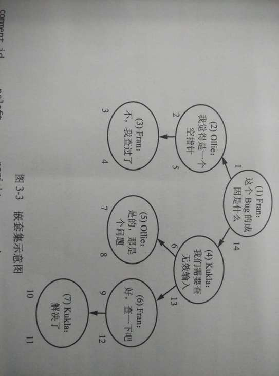

|作者|版本|时间|
|:--|:--|:--|
|Coordinate35|v1.0.0|2016-02-17|

# 背景
然后（story branch）我们最近开发的一块app，一个标题对应一个故事，每个故事由一段一段的故事组成。每一段故事都由用户编写。每个故事看作是一个节点。在故事的创建的时候便有一个节点。随后，用户可以在任意一个节点后面再接一个节点，这样，最终就会形成一棵树。由于关系型数据库并没有一个很好的树形结构设计的解决方案。下面，就以然后这款产品为例，列出几种关系型数据库的解决方案并讨论他们的优势与劣势。

# 解决方案

## 邻接表

邻接表就是把所有的节点都放在一张表中，然后用一个属性来每个节点的父节点记录下来，简化的建表语句如下：

```SQL
CREATE TABLE story (
	story_id INT NOT NULL PRIMARY KET AUTO_INCREMENT,
    father_id INT NOT NULL,
    subject_id INT NOT NULL,
    content VARCHAR(600) NOT NULL,
    FOREIGN KEY (father_id) REFERENCES story(story_id),
    FOREIGN KEY (subject_id) REFERENCES story_subject(subject_id)
)
```

### 优点

维护起来比较方便
增加一个节点只需要：

```SQL
INSERT INTO story (father_id, content)
	VALUE (1, 'blablabla');
```

修改一个节点或者一颗子树的位置：

```SQL
UPDATE story SET father_id = 3 WHERE story_id = 4;
```

### 缺点

#### 查询会变得很恶心：

一次只能查询有限层的节点,而且每查询多一层都要套多一层连接语句：

```SQL
SELECT story1.*, story2.*
	FROM story AS story1
    LEFT OUTER JOIN story AS story2
    	ON story2.father_id = story1.story_id;
```

另外一种查询就是先把整棵树的信息取出来，在外部用程序构造出树再操作，然而这样会变得很低效。

```SQL
SELECT * FROM story WHERE subject_id = 3;
```

#### 删除会变得很恶心

必须写很多额外的代码来进行多次的查询，获得后代节点的信息，然后再进行删除

## 路径枚举

在story表中设置一个属性，来存储从根节点到当前结点的路径，用分隔符隔开

建表SQL：
```SQL
CREATE TABLE story(
	story_id INT NOT NULL PRIMARY KEY AUTO_INCREMENT,
    content VARCHAR(600) NOT NULL,
    subject_id INT NOT NULL,
    path VARCHAR(1000) NOT NULL,
    FOREIGN KEY (subject_id) REFERENCES story_subject(subject_id)
)
```

存储的结果如下：

story_id   |  content   |  subject_id  |   path
-----------|------------|--------------|------------
1          |   blabla   |  2           |   1/
2          |   blabla   |  2           |   1/2/
3          |   blabla   |  2           |   1/2/3/
4          |   blabla   |  2           |   1/4/
5          |   blabla   |  2           |   1/4/5/
6          |   blabla   |  2           |   1/4/6/
7          |   blabla   |  2           |   1/4/6/7/

### 优点

#### 可以比较的查询到一个节点的祖先和后代

可以通过写zheyang的一个比较路径的查询：

```SQL
SELECT *
FROM story
WHERE '1/4/6/7/ LIKE story.path || '%';
```
这个查询语句匹配到1/4/6/%, 1/4/%, 1/%这写恰好为节点7的祖先的节点

同样也可以写这样的一个查询语句来获得他所有的后代：

```SQL
SELECT *
FROM story
WHERE story.path LIKE '/1/4/6/7/' || '%';
```

有了这些祖先和后代，就可以进一步的获得更多的数据，比如说一颗子树所有节点的总和

#### 插入一个节点也比较简单

只需要复制一份父节点的path，加上自己这个节点的就可以了，可以用MySQL的函数LAST_INSERT_ID():

```SQL
INSERT INTO story (content, subject_id)
	VALUES
	('blabla', 2);


UPDATE story
	SET path = (SELECT path
    	FROM story
        WHERE story_id = 7) || LAST_INSERT_ID() || '/'
    WHERE story_id = LAST_INSERT_ID();
```

### 缺点

1. 数据库没有约束来确实保证路径的格式总是正确
2. 也不能保证路径中的节点确实存在
3. 依赖程序的逻辑代码来维护路径的字符串并且验证字符串的正确性的开销比较大
4. VARCHAR的长度有限，因此树不能无限扩展

## 嵌套集

做法是用两个数字来编码每个节点，而不是记录他的直接祖先。这两个数字命名为nsleft, nsright

建表如下：

```SQL
CREATE TABLE story(
	story_id INT NOT NULL PRIMARY KEY,
    content VARCHAR(600) NOT NULL,
    subject_id INT NOT NULL,
    nsleft INT NOT NULL,
    nsright INT NOT NULL,
    FOREIGN KEY (subject) REFERENCES story_subject(subject_id)
);
```

nsleft与nsright的约束规则如下：
1. nsleft 的数值小于该节点的所有后代的nsleft
2. nsright 的数值大于该节点的所有后代nsright
3. 具体的nsleft, nsright和该节点的id并没有直接的关联

要确定这两个值最简单的方法就是，对这棵树进行一次后序遍历，设置一个变量i，每一栋一次就自增1，每次访问一个节点的时候，就把i的值赋给nsleft，每次返回到这个节点的时候就把i的值赋给nsright，结果如图：


图片来自《SQL反模式》

### 优点

#### 可以很方便的找到一个节点的祖先和后代

通过搜索nsleft在节点4的nsleft和nsright范围之间来获取节点4及其所有后代
```SQL
SELECT story2.*
FROM story AS story1
JOIN story AS story2
	ON story2.nsleft BETWEEN story1.nsleft AND story1.nsright
WHERE story1.story_id = 4;
```

通过搜索节点4的nsleft在那些节点的nsleft和nsright范围之内可以获取节点4的所有祖先

```SQL
SELECT story2.*
FROM story AS story1
JOIN story AS story2
	ON story1.nsleft BETWEEN story2.nsleft AND story2.neright
```

#### 可以很方便的删除节点

由于嵌套集是通过大小范围来确定祖先-后代关系的，且不记录具体的层级关系，所以当删除一个节点的时候，他的直接后代就会直接的接到改节点的父节点上，而不用重新分配nsleft,nsright的值

### 缺点

#### 有些很简单的查询（找老爸）就会变得很恶心

在嵌套集中，要这么找老爸：
如果节点p是节点q的老爸，那他必定是q的一个祖先，并且这两个节点之间不会有其他节点。

1. 令y为根节点
2. 不断的去试一个点，使得他既是y的后代，又是q的祖先
3. 令y=x
4. 不断重复2,3直到结果为空

查询结果为空的那一刻的y就是p

```SQL
SELECT father.*
FROM story AS s
JOIN story AS father
	ON s.nsleft BETWEEN father.nsleft AND father.nsright
LEFT OUTER JOIN story AS in_between
	ON s.nsleft BETWEEN in_between.nsleft AND in_between.nsright
WHERE s.story_id = 6 AND in_between.story_id ISNULL;
```

#### 插入和移动节点也会变得很恶心

每次插入和移动节点都需要重新计算节点的nsleft,nsright值

## 闭包表

做法是在story表中不保存任何的关系，而是新开一个表ance_desc表
把所有节点的所有祖先后代关系都保存（包括跨节点的）,再者，可以加多一个属性path_length来存储祖先节点到后代节点的距离

建表如下

```SQL
CREATE TABLE story(
	story_id INT NOT NULL PRIMARY KEY AUTO_INCREMENT,
    subject_id INT NOT NULL,
    content VARCHAR(600) NOT NULL,
    FOREIGN KEY (subject_id) REFERENCES story_subject(subject_id)
);

CREATE TABLE ance_desc(
	ancestor INT NOT NULL,
    descendant INT NOT NULL,
    PRIMARY KEY (ancestor, descendant),
    FOREIGN KEY (ancestor) REFERENCES story(story_id),
    FOREIGN KEY (descendant) REFERENCES story(story_id);
);
```

如嵌套集那张图的树在ance_desc表中就会存储如下
 ancestor  |descendant
-----------|----------
 1         | 2
 1         | 3
 1         | 4
 1         | 5
 1         | 6
 1         | 7
 2         | 2
 2         | 3
 3         | 3
 4         | 4
 4         | 5
 4         | 6
 4         | 7
 5         | 5
 6         | 6
 6         | 7
 7         | 7

### 优点
#### 查询与删除非常方便
如果要找节点4的后代，只需要找ance_desc表中祖先是4的就可以了

要获取节点7的祖先，只需要找ance_desc表中后代为7的就可以了


要删除叶子节点，就删除后代为节点7的的行

要删除结点4的子树，就删除ance_desc表中和4有关的行。特别说明的是，如果仅仅是想删除关系，而不想删除具体数据，这种设计就非常到位。

### 缺点
#### 移动虽不像嵌套那么麻烦，但也不太方便
要插入一个叶子节点，先在ance_desc表中插入自己到自己的关系，然后找后代是节点5的节点，然后再插入表就行了

要移动一棵子树的时候，要先删除它的所有子节点和他所有祖先节点的关系：

```SQL
DELETE FROM ance_desc
WHERE descendant IN (SELECT descendant
					FROM ance_desc
					WHERE ancestor = 6)
    AND ancester IN (SELECT ancestor
    				FROM ance_desc
                    WHERE descendant = 6
                    AND ancestor != descendant)
```

然后，将这个孤立的树和他的祖先建立联系，可以使用CROSS JOIN来实现：

``` SQL
INSERT INTO ance_desc (ancestor, descendant)
	SELECT supertree.ancestor, subtree.descendant
    FROM ance_desc AS supertree
    CROSS JOIN ance_desc AS subtree
    WHERE supertree.descendant = 3
    	AND subtree.ancestor = 6;
```

# 总结
1. 邻接表是比较方便的设计，查询单个节点，插入，删除，比较简单，同时能保证引用完整性，但是查询一颗树比较复杂。如果数据库支持递归查询，那么邻接表查询效率会更高
2. 枚举路径在查询单个节点，查询一个树，插入，删除，都比较见长，但是却不能保证引用完整性，使得设计很脆弱，数据存储也比较荣誉
3. 嵌套集只适用于对于查询性能要求很高的场景
4. 闭包表是一个比较折中的方案，他没有什么是不擅长的，是一种用空间换时间的方案!