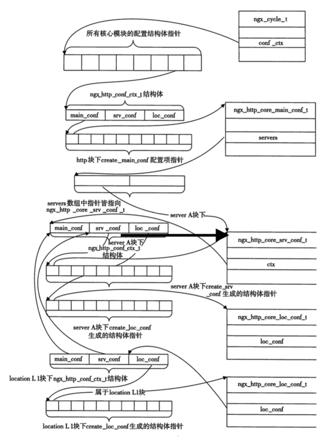

|作者|版本号|时间|
|:-|:-|:-|
|Coordinate35| v1.0.0| 2018-05-20|

## 热身

首先来看下这几个小例子：

第一个例子：

```
server {
    listen 80;
    root /var/www/html;
    index index.html;
    
    location /test {
        root /var/www/demo
    }
}
```

其中，echo指令来源于第三方模块 [echo](https://www.nginx.com/resources/wiki/modules/echo/#echo) ，作用是让 Nginx 在接收到请求的时候将 echo 后面参数作为HTTP报文体进行返回。

第二个例子是：

```
location /test {
    set $a 32;
    echo $a;
    set $a 56;
    echo $a;
}
```

第三个例子是：

```
location /test {
    echo hello;
    content_by_lua 'ngx.say("world")';
}
```

大家可以想一下，假定所有可能需要的资源都存在，如果 Nginx 收到 /test 的请求，这三种情况下 Nginx 分别会返回什么内容。 

## 模块化设计的Nginx

首先我们们尝试一下使用官方的代码构建一次Nginx。从[Nginx官网](nginx.org)下载最新的稳定版本1.14.0。执行：

```
./configure
```

可以发现，这一操作生成了 Makefile 文件和 objs 目录，我们打开生成的其中一个非常关键的文件：objs/ngx_modules.c。可以看到，这个文件定义了两个数组：

1. ngx_modules 数组的成员是 Nginx 所有需要使用的模块的对象的指针。
2. ngx_module_names 数组是上一数组成员一一对应的模块的名字。

从这个文件基本上可以窥探出，除了少量核心代码，其余Nginx的代码是由一个个这样的模块构成的。需要特别说明的是，这个数组里面各个模块的先后顺序特别重要。这个先后顺序代表了在Nginx中模块的优先级，当两个模块的功能有重叠的时候，通过在数组里面的先后顺序来决定使用哪个模块的逻辑。事实上，Nginx有五大类型的模块：核心模块、配置模块、事件模块、HTTP模块、mail模块。

## HTTP模块内与配置相关的关键数据结构

由于HTTP模块是Nginx中数量最多的模块，我们日常写配置文件是用的命令也大多属于HTTP模块，由于篇幅，我们就重点关注HTTP类型的模块。

首先是 ngx_command_t 类型，定义举例：

```c
static ngx_command_t ngx_http_gzip_filter_commands[] = {
    { ngx_string("gzip"),
      NGX_HTTP_MAIN_CONF|NGX_HTTP_SRV_CONF|NGX_HTTP_LOC_CONF|NGX_HTTP_LIF_CONF
                        |NGX_CONF_FLAG,
      ngx_conf_set_flag_slot,
      NGX_HTTP_LOC_CONF_OFFSET,
      offsetof(ngx_http_gzip_conf_t, enable),
      NULL },
	...,
    ngx_null_command
};
```

这是一个数组，存放了这个模块里可用的所有指令。对于数组的每一个元素，

第一个参数是指令的名称

第二个参数是有关于这个指令的类型描述：指令是在http块出现，还是server块出现，还是在location块出现？这个指令之后跟多少个参数？参数的类型是什么，数值还是一个配置块。

第三个参数是一个函数指针，这个函数用于解析指令后的参数。第四个参数是

第四个参数是指配置项所处内存的相对位置。这个描述会在稍后详细说明。

第五个参数是配置项在整个存储配置结构体中的偏移位置。

第六个参数使用较少，不做说明。

然后是 ngx_http_module_t 类型

```c
static ngx_http_module_t  ngx_http_gzip_filter_module_ctx = {
    ngx_http_gzip_add_variables,           /* preconfiguration */
    ngx_http_gzip_filter_init,             /* postconfiguration */

    NULL,                                  /* create_main_conf */
    NULL,                                  /* init_main_conf */

    NULL,                                  /* create_srv_conf */
    NULL,                                  /* merge_srv_conf */

    ngx_http_gzip_create_conf,             /* create_loc_conf */
    ngx_http_gzip_merge_conf               /* merge_srv_conf */
};
```

这个结构体的作用将在稍后说明。

## 配置文件解析

首先要对一些名词进行说明：

1. 直接在 http{} 下的配置叫 main 配置项
2. 直接在 server{} 下的配置叫 srv 配置项
3. 直接在 location{} 下的配置叫 loc 配置项

在Nginx解析配置文件的时候，会调用  ngx_conf_parse 这个函数进行配置文件解析。首先应该清楚地认识到，Nginx 的配置文件实际上就是由指令和指令参数组成的。ngx_conf_parse首先会将配置文件进行词法分析，将配置文件生成一个指令数组，数组的每一个元素也都是一个字符串数组，成员数组的第一个元素是解析出来的指令名字，之后的参数是配置文件里这个指令的参数列表。然后，ngx_conf_parse 会遍历这个指令数组，对于每一个指令，Nginx会遍历一次所有的模块，直到发现第一个，指令出现位置和参数要求都符合要求的模块（也就是之前提到的ngx_command_t数组元素的第二条配置。这也意味着，如果有两个模块都定义了同一个指令的名字，参数和出现的位置都符合要求，Nginx会选择使用在上面提到的 ngx_module_t* 数组排的靠前的那个模块，因为先遍历到）。找到这个模块的指令后，则会调用这个指令的解析回调函数（即 ngx_command_t 结构体的第三个参数）来进行处理。如果该指令是一个用{}包围的配置块，则会递归地调用 ngx_conf_parse 来进行配置文件解析。

解析的过程中，当碰到一个 http 指令的时候(其实一个也只能有一个http指令)，该指令的解析回调函数会创建一个叫 ngx_http_conf_ctx_t 的结构体。这个结构体的定义如下：

```c
typedef struct {
    void **main_conf;
    void **srv_conf;
    void **loc_conf;
} ngx_http_conf_ctx_t;
```

结构体中，两个星代表这个参数是一个指针数组。然后根据HTTP模块的数量，建立长度相匹配 main_conf、srv_conf、loc_conf 数组。接着，依次遍历各个HTTP模块。调用他们 ngx_http_module_t（上面提到的） 中的 create_main_conf、create_srv_conf、create_loc_conf 回调函数来申请和初始化对应模块的配置结构体。也就是说main_conf、srv_conf、loc_conf数组中下标为n的元素，都对应着第 n+1 个HTTP模块配置结构体。需要注意的是，即时当前是直接在 http 块(main级别)，create_main_conf、create_srv_conf、create_loc_conf 这三个回调函数都会被调用。具体原因会稍后说明。

做完上述步骤后，Nginx 会递归地调用 ngx_conf_parse 来解析 之后 {} 中的配置项，在这个过程中，每碰到一个 server 指令的之后，这个指令的解析回调函数又会创建一个属于这个 server 块的 ngx_http_conf_ctx_t 结构体。唯一不同的就是，这个结构体的 main_conf 会指向他的父 http 块的 main_conf 数组（显而易见，在srv 级别的配置里，main级别的配置是不会发生变化的）。在解析 srv 级别的配置中，如果有同一个模块的同一个指令既出现在了 main 级别的块下，又出现在了 srv 级别的块下，应该以哪一个为准呢？这就轮到我们的merge函数大显身手，同时这也解释了为什么不管在什么级别下，都要为每个模块生成 main_conf、srv_conf、loc_conf。这是因为有些配置项可以同时出现在 http{} server{} location{} 中。这样我们就会把只能在 http{} 出现的指令放在各模块的 main_conf 结构体里面，把只能出现在 http{} server{} 的配置项放在 srv_conf 结构体里面，把在 http{} server{} location{} 都能出现的配置项就放在 loc_conf 结构体里面。在我们遍历到 srv 级别这种情况，比如 ssl 指令。这时就会调用 ngx_http_ssl_module 模块的 ngx_http_module_t 结构体（上面有提到） merge_srv_conf 回调函数来进行合并。在 ssl 模块的 merge_srv_conf 函数中的某一段代码如下:

```c
if (conf->enable == NGX_CONF_UNSET) {
    if (prev->enable == NGX_CONF_UNSET) {
        conf->enable = 0;

    } else {
        conf->enable = prev->enable;
        conf->file = prev->file;
        conf->line = prev->line;
    }
}
```

这里， conf 和 prev 的类型都是ngx_http_ssl_srv_conf_t。当遇到 ssl 指令时，由于 ssl 指令的值是 on|off, 这个会被对应的将 ngx_http_ssl_srv_conf_t 的结构体中的 enable成员设置成1|0。conf 是当前级别(srv)下的指针，prev 是父级别（main）的指针。这段代码的意思是，如果当前级别下没有设置，则使用父级别的配置，如果父级别也没有配置，则默认关闭。由此可见，并不一定所有指令的内层块的配置都优先于外层块的，具体采用哪个值取决于 merge 函数的编写。

同理，在解析 srv 级别的配置的时候，每碰到一个 location 块，这个指令的解析回调函数又会创建一个属于这个 location 块的 ngx_http_conf_ctx_t 结构体，他的 main_conf 和 loc_conf 都会指向父级 ngx_http_conf_ctx_t 结构体的 main_conf 和 loc_conf。解析完所有配置项后进行和父级配置的合并。至此，配置的解析完毕，最终会生成一个这样的内存布局：



## HTTP框架的执行流程

配置文件所有解析完了之后 ，Nginx才正式开始fork出 worker 进程，接收请求的处理。

在 Nginx 中，对 HTTP 请求的处理被划分成了11个处理阶段：

1. NGX_HTTP_POST_READ_PHASE
2. NGX_HTTP_SERVER_REWRITE_PHASE
3. NGX_HTTP_FIND_CONF_PHASE
4. NGX_HTTP_REWRITE_PHASE
5. NGX_HTTP_POST_REWRITE_PHASE
6. NGX_HTTP_PREACCESS_PHASE
7. NGX_HTTP_ACCESS_PHASE
8. NGX_HTTP_POST_ACCESS_PHASE
9. NGX_HTTP_TRY_FILES_PHASE
10. NGX_HTTP_CONTENT_PHASE
11. NGX_HTTP_LOG_PHASE

对于每一个请求的处理，都是必须经过这些阶段的。在HTTP核心模块里，有一个 ngx_http_core_main_conf_t 的结构体，里面有个成员是:

```C
ngx_http_phase_t phase[NGX_HTTP_LOG_PHASE + 1];
```

而 ngx_http_phase_t 的定义如下：

```c
typedef struct {
    ngx_array_t handlers;
} ngx_http_phase_t;
```

也就是说，原则上，每个阶段都有一个自己的 handlers 数组，数组的元素来源于各个模块将自己的 handler 放到自己感兴趣的阶段的数组中来介入哥哥执行阶段。通过该阶段的 handlers 数组中 handler 的依次执行，来达到各个模块间相互配合的目的。

但是 NGX_HTTP_CONTENT_PHASE 阶段，也就是响应内容生成的阶段则稍有例外，而这个阶段也是大多数模块介入的阶段。要介入这个阶段，不仅可以通过往 handlers 数组添加 handler 的方式，还可以通过设置 ngx_http_core_loc_conf_t 中的 handler 指针来实现。通过这种方式，handlers数组的handler就会全部被屏蔽掉，而只有这个handler生效。显然，如果有两个模块都尝试去通过这种方式介入 NGX_HTTP_CONTENT_PHASE 阶段，必然只有一个能生效。

## 回看例子

我们回头来看看我们先前的例子，现在有头绪了吗？

对于第一个例子，root 的配置在 merge 的过程中，使用了 loc 级别的配置。不过可能还是得注意不一定永远都会这样。

对于第二个例子，我们可以看到 set 指令是在加载配置的过程中将变量设置好的。在进行 HTTP 请求处理的时候，变量 $a 的值已经被覆盖过一次了，所以返回的结果是两个64.这说明配置通常不是按直觉上的从上而下执行的，一定要结合整个 Nginx 的配置加载-请求处理的原理进行考虑。

对于第三个例子，通过阅读代码，我们知道 echo 指令和 content_by_lua 都是通过设置 ngx_http_core_main_conf_t 的 handler 成员来介入 NGX_HTTP_CONTENT_PHASE 阶段的，所以只有一个会生效，具体哪个指令会生效，取决于这两个指令所在模块的在 ngx_modules 数组的先后位置。

## 结论

Nginx 的配置很多时候会和我们所想的有所出入，同时它又时候也不是那么直观明了。当踩到坑的时候，一定要多查看文档，结合 Nginx 的原理进行分析。甚至是去阅读指令所在模块的代码（主要是配置合并函数和模块介入各个阶段的方式），然后去有理有据的书写配置。拒绝暴力枚举式编写配置文件！