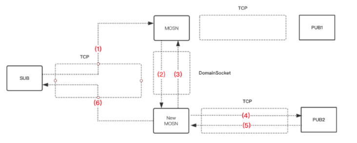
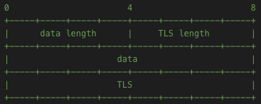
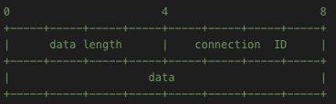

|作者|版本号|时间|
|:-|:-|:-|
|Coordinate35| v1.0.0| 2019-02-17|

说明，本文档基于 [SOFAMosn 0.4.0](https://github.com/alipay/sofa-mosn/tree/0.4.0) 版本编写

## 前言

**SOFAMosn 是一款采用 GoLang 开发的 Service Mesh 数据平面代理，**由蚂蚁金服系统部网络团队、蚂蚁金服中间件团队、UC 大文娱团队共同开发，功能和定位类似 Envoy，旨在提供分布式，模块化，可观察，智能化的代理能力；她通过模块化，分层解耦的设计，提供了可编程，事件机制，扩展性，高吞吐量的能力。

——摘自《 SOFAMosn 的诞生和特性》

## 概述

总体上看，连接迁移的流程如下图：



- MOSN 通过 forkexec 生成 New MOSN
- MOSN 通过 domain socket 把 TCP fd 和请求数据发送给 New MOSN
- New MOSN 转发请求到后端（PUB2）
- 后端 回复响应到 New MOSN
- New MOSN 通过 MOSN 传递来的 TCP fd，回复响应到 client

此后：

- mosn 退出 readloop，不再接受该 TCP 连接上的数据
- New mosn 开始 readloop，接受该 TCP 连接上的数据

——摘自《[SOFAMosn Introduction](https://github.com/alipay/sofa-mosn/blob/master/docs/Introduction.md)》

## 具体实现

### 触发

在 MOSN 启动的时候，会加载包

```
github.com/alipay/sofa-mosn/pkg/server
```

在这个包加载的时候，该里面的 serverkeeper.go 这个文件中的 init() 函数被执行。这个函数会起一个协程在捕获 HUP 信号。

当 Mosn 接收到来自系统的 HUP 信号时，MOSN 首先会调用 stopStoppable 函数先让 Admin Server 中的所有 Listener 都关闭 。然后调用 reconfigure 函数来进行配置重新加载。

### 迁移过程

####  旧进程的退出

触发了 reconfigure 函数后，首先 MOSN 会设置两个环境变量

```
_MOSN_GRACEFUL_RESTART=true
_MOSN_INHERITFD_FD=<number>
```

1. _MOSN_GRACEFUL_RESTART 对应的包 github.com/alipay/sofa-mosn/pkg/types 中的 GracefulRestart 常量，用于告诉新启动的 MOSN（下简称 New MOSN） 这个是一个优雅重启。

2. _MOSN_INHERITFD_FD 对应包 github.com/alipay/sofa-mosn/pkg/types 中的 InheritFd 常量，里面存储的是 ListenerFD 的数量（ListenerFD 就是每个 Listener 调用 listen() 返回的 fd）。

准备好环境变量后，就调用 syscall 包的 ForkExec 按照当前 MOSN 的启动参数进行启动，并将环境变量和标准输入输出错误和 ListenerFD 都和 New MOSN 共享。然后，MOSN 会等 3 秒，让 New MOSN 启动起来。认为 New MOSN 启动完成后，它就会调用 StopAccept() 让所有的 Listener 停止 Accept 新的请求（已经 Accept 的请求不会结束，socket 的监听也不会断），然后调用 WaitConnectionsDone 函数根据 GracefulTimeout（默认是 30秒） 设置的优雅重启的超时时间让所有的连接都完毕。接着 MOSN 就进行 Metrics 的迁移，完成后就会退出进程。

在 WaitConnectionsDone 中，MOSN 设置了一个时间长度为 2 个 GracefulTimeout + 10秒 的时间的定时器。然后首先会 sleep 一个 GracefulTimeout 的时间，等待所有的连接主动关闭。然后关闭所有 server 中 connHandler 的 listeners 成员的 stopChan. 然后再 sleep 一个 GracefulTimeout + 10秒的时间，等待所有连接的迁移。时间过了之后，函数就会返回。此后，上层会调用 TransferMetrics 进行 Metrics 的调用 Exit 进行进程退出。

#### 新进程的启动

##### 继承 Listener 的获取

在 New MOSN 启动的过程中，首先会调用 getInheritListeners。这个函数会从读取 Old MOSN 设置的环境变量 _MOSN_GRACEFUL_RESTART，如果为 true, 说明这是一个优雅重启，就会读取环境变量 _MOSN_INHERITFD_FD。由于 Listener 是最先使用 fd 的，所以 fd 总是从3 开始，那么所有 Listener fd 就是： 3, 4, ... , 3 + _MOSN_INHERITFD_FD。然后利用这些 fd 将 Old MOSN 的 Listener 恢复出来。从而获取到继承过来的 Listener。获取完之后，会对获取的 Listener 和配置文件进行比对，判断其合法性。如果不合法的，或者不能新的配置里面没有以致继承过来的 Listener 不需要复用，就会将其关闭。

完成了所有的初始化之后，就会启动两个 Unix Sock 的Server, 分别用与进行连接的迁移和 metrics 的迁移。用于连接迁移的 Unix Sock Server 会在 2 个 GracefulTimeout + 10 秒后自动关闭。

迁移过程中，New MOSN 对每一个 Unix Sock 请求都会分配一个协程去处理。

##### 连接的迁移

当一个请求进来的时候，如果请求使用的协议不是 HTTP1 且不使用系统提供的事件循环的时候，MOSN 会启动自己的 ConnIo, 调用 startReadLoop 和 startWriteLoop 来开启针对这个请求的的读写循环。

###### 读写数据迁移的协议

在发送请求的过程中，首先会发送一个字节的数据， 这个字节代表了传输的是读数据迁移还是写数据迁移。0 代表是使用读数据迁移协议。1 代表是使用写数据协议。如果是 0, 还会将该连接的 fd 以 out-of-band 的方式也发送出去。

**读数据迁移协议**



首先是头部分：包括 8 个字节，前 4 个字节是 data 部分的长度，后 4 个字节是 TLS 部分的长度。body 部分：接下来 data length 个字节存储的是 readBuffer 数据。最后 TLS length 个字节存储的是 TLS 的数据。

**写数据迁移协议**



头部分也是 8 个字节, 前 4 个字节存储了 data 部分长度，后 4 个字节存储的是 connection ID。body 部分：接下来的 data length 自己存储的是 writeBuffer 数据。

###### 读数据的迁移

**Old MOSN 发送**

在 startReadLoop 中，MOSN 会捕获之前提到的 stopChan 被关闭的事件。捕获到这个事件之后，MOSN 会让这个链接等待一个随机的时间，然后开启连接迁移的过程。

首先 MOSN 会往连接中的 transferChan 发一个 transferNotify(值为1) 消息，告诉这个连接对应的写循环：要开始迁移连接了。然后调用 transferRead 开始迁移读连接，并返回一个connection ID，最后将这个 ID 再次发送给 transferChan。

在函数 transferRead 中：

1. 和 New MOSN 先前提到的负责连接迁移的 transferServer 建立 unix socket 连接。
2. 获取该连接对应的 fd 
3. 调用 transferSendType 将传输数据使用的协议类型（读数据迁移协议还是写数据迁移协议）和连接的 fd 发送给 New MOSN。
4. 调用 transferReadSendData 将 header 部分和 body 部分传输给 New MOSN。如果 TLS 握手还没结束，则 TLS length 为 0。
5. 接收 New MOSN 处理完这些数据之后返回的 connection ID, 并返回

**New MOSN 的接收**

当 New MOSN 接受到来自 Old MOSN 的数据时：

1. New MOSN 会调用 transferRecvType, 首先接受协议的类型（一个字节）, 如果是读数据迁移的协议，还会去接受 oob（out-of-band）中的 fd，并利用个这个 fd 重建出一个连接，恢复监听。
2. 调用 transferReadRecvData 获得本次请求中的 data 部分和 tls 部分的数据。
3. 调用 transferNewConn, 首先根据重建出的连接，找到 NewMOSN 中对应的 Listener。如果这是一个 TLS 连接，还会利用 Old MOSN 传过来的 TLS 信息将连接重建成一个 TLS 连接。
4. 然后该 Listener 从触发 Listener 的 OnAccept 事件开始，处理这个连接的请求。当 MOSN 用于封装连接的 connection 结构体建立完毕后，就标志着这个连接迁移完成，并将这个 connection 结构体存储在一个叫 transferMap 的数据结构中。
5. 利用重建的 connection 的 id 生成一个本次迁移连接的 ID，回传给 Old MOSN。

###### 写数据的迁移

**Old MOSN 的发送**

当写循环收到读循环从 transferChan 发过来的 transferNotify 消息时，会再读一次 transferChan, 获取到这一次连接传输的 ID，如果 ID 合法，则会开始监听两个 channel：

1. internalStopChan: 从这个 channel 收到信号（这个 channel 被 close 了），认为这写数据迁移完成了，会直接退出。
2. writeBufferChan: 这个 channel 传送过来的是需要写的数据，也就是需要传送的数据。收到后就会调用 transferWrite 开始迁移。当 writeLoop 要结束的时候，会 close 掉 internalStopChan  和 writeBufferChan。触发条件1。

在 transferWrite 中：

1. 和 New MOSN 先前提到的负责连接迁移的 transferServer 建立 unix socket 连接。
2. 调用 transferSendType 将传输数据使用的协议类型（读数据迁移协议还是写数据迁移协议，此处是写数据迁移协议）
3. 调用 tranferWriteSendData 将 writeBuffer 里面的内容连同从 New MOSN 返回的连接传输 ID 一起发送给 New MOSN

**New MOSN 的接收**

当 New MOSN 接受到来自 Old MOSN 的数据时：

1. New MOSN 会调用 transferRecvType, 接受协议的类型（一个字节），判断是写数据迁移协议，进入接受写数据迁移的数据流程。
2. 从 unix sock 中读出要写的 buffer, 和连接传输的 ID
3. 根据 ID 从 transferMap 中 取出对应的 connection 结构体。并让将传输过来的数据扔到 connection 结构体中的 writeBufferChan 中，进入新的 writeLoop。


至此，连接迁移的过成就完成了。

##### Metrics 的迁移

Old MOSN 退出前的最后一件事，就是把 Metrics 数据托付给 New MOSN。

###### 协议

Metrics 的传输协议很简单，包括两部分 header 和 body

1. Header 长度为 4 个字节 存放的是 body length
2. Body 的长度为 body length 个字节。存放着要传输的数据，即 Metrics 数据。

###### Old MOSN 的发送

1. 首先他会调 makesTransferData, 将所有的 Metrics 数据都统一收集起来。
2. 和 New MOSN 先前提到的负责 Metrics 迁移的 transferServer 建立 unix socket 连接。
3. 先后把 header 和 body 发送给 New MOSN
4. 如果设置了等待 New MOSN 的响应，会在一个超市时间内等待 New MOSN 1 个字节的返回。

###### New MOSN 的接收

当 New MOSN 接受到来自 Old MOSN 的数据时，会调 serveConn 函数去处理每一个迁移请求：

1. 读取数据中的协议头，并根据协议头读取出报文体。
2. 将报文体的数据恢复成成 go-metrics 的数据，供 New MOSN 使用


至此，所有关于平滑重启的操作就完成了。

原文地址：https://blog.coordinate35.cn/html/article.html?type=3&article_id=16