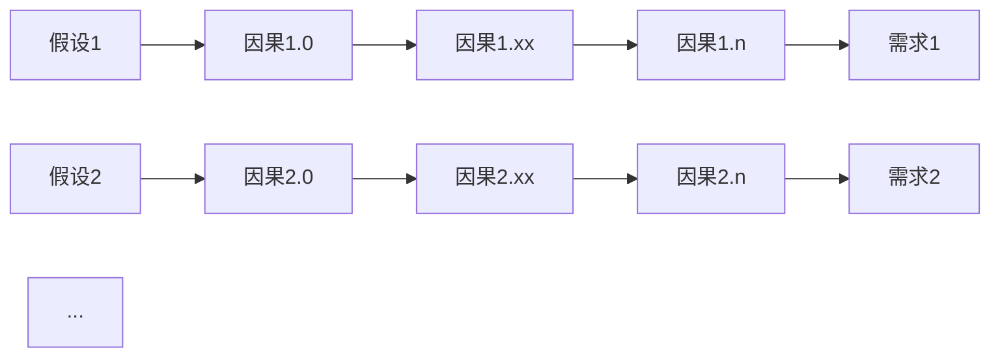
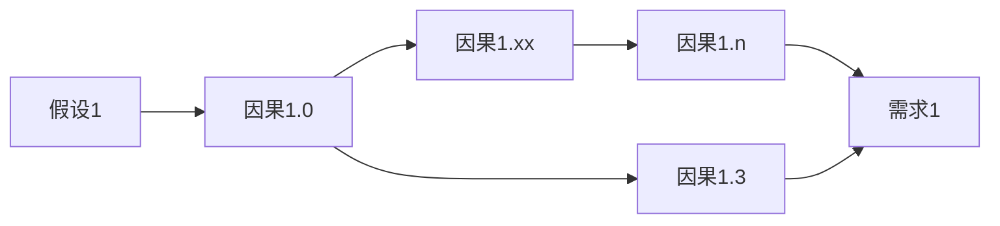

| 作者         | 版本号 | 时间      |
| :----------- | :----- | :-------- |
| Coordinate35 | v1.0.0 | 2021-11-7 |

# 关于项目管理

这个题目起的有点大，后续的相关内容就直接补充到这个文档里面吧

写这个的起因是前段时间在负责一个项目。项目过程中有个节点进度比预期稍满，老板问我：这个怎么办？当时被问的有点蒙，因此重新推演了一下逻辑，记录在这。

项目管理的目的，是在有限的资源（时间，人力等）条件下，保证关键目标的达成。

由于项目里被管理的事情是和设计是强相关的，我们探讨怎么做项目管理，就要先搞清楚先设计是怎么做的。设计的过程就像下面这张图：

所有的这些直接能获得需求利益的逻辑量，组成了我们的顶层设计。需要注意的是，这些逻辑链都工作在同一个最简名称空间。比如需求是明天我要从北京到深圳。假设是明天各交通设置都正常运行，逻辑链就是因为北京到深圳太原，步行不能实现，所以需要通过交通交通工具实现。至于是坐高铁、还是坐飞机。是打车到高铁站，还是坐地铁到高铁站，这些都不关系，我只需要知道做能到就行了。

从这里我们可以看到，其实逻辑链通常还可能是这样的：

可能有不同的方案来达到相同的目的。

同时，由于每条逻辑链都工作在最简名称空间，最终还是得回归真实，还是得坐上高铁才能到深圳。因此，每一个因果下面，因就变成了假设，果变成了需求，递归向下的又是一个逻辑链集合，这些逻辑链工作在下一层名称空间。

有了以上基础，我们就可以讨论怎么进行项目管理了：

首先是甘特图。对每条逻辑链进行耗时评估和依赖梳理，这样能知道当前进展条件下对于目标达成有没有风险。

然后就是风险管理。通过甘特图发现风险之后，进行风险排除：

1. 选择 plan B 的逻辑链，即采用备选方案
2. 删除逻辑链。大概是优先级管理，低优先级的需求不做

如果没有备选方案，同时当前的需求已经是最小集，砍得不能再砍了。那还谈个鬼的管理，风险就只能看着他发生了。