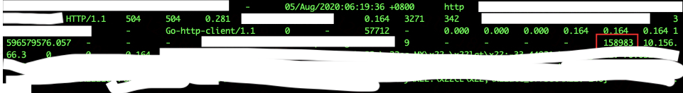

| 作者         | 版本号 | 时间      |
| :----------- | :----- | :-------- |
| Coordinate35 | v1.0.0 | 2022-2-23 |

# 背景

当前接入层团队对外提供的服务主要是 router 与 inrouter, 分别承接了集团南北 http 协议的南北向流量和东西向流量：

作为集团流量的门户，router/inrouter 全集群年度 QPS 峰值达千万，单机 QPS 峰值达 4w。

 

具体部署上，国内同业务线共用集群，国外则是所有业务共用集群。router/inrouter 的核心转发引擎是 Nginx。每台机器上部署一个 Nginx 进程组以及相关的运维类 agent。机器上都开启了超线程，Nginx 的进程数与核心数量相等，并且每个进程都绑定在了相应的核心上。

 

# 问题现象

从 2020 年 6 月份开始，接入层值班同学陆陆续续收到了业务的反馈，流量流经 inrouter 的时候会偶发的出现大量 504、499 等超时状态码。

 

# 解决抖动问题迫在眉睫！

首先，在当前的业务架构下，inrouter 的长尾抖动对业务影响巨大：

1. inrouter 单机承载的请求、业务量本身就多，抖一抖影响面本来就大
2. 服务拆分粒度细，一个原始请求在链路上可能会流经几十成百个服务。其中有一环失败了，整个请求失败了。在当前集中式 inrouter 的架构下，如果 inrouter 单机抖动，会导致上一跳流经正常 inrouter 机器的请求也失败，所以单机抖动影响有放大效应。

当前 inrouter 只需要发生秒级的阻塞，就会直接触发业务的**一级报警**。

 

其次，inrouter 频繁的抖动是对值班同学精神上的折磨：

1. 经常发生半夜凌晨的一级报警
2. “打地鼠”行动（有一段时间发生抖动就需要去机器手动操作重启）
3. 大量的值班客服压力

 

从2020年下半年开始，inrouter 长尾抖动问题越来越突出。因此，我们展开了 inrouter 长尾问题的追查及优化。

 

经过了半年多的持续努力攻坚，我们一共定位并优化了 11 个抖动问题，基本消除了业务可感的抖动！

 

# 分锅是第一生产力

接入层自身的问题这个范围很好确定：业务要使用接入层所引入的依赖出故障，都属于接入层团队要推动解决的问题。

 

最开始的时候，业务反馈过来一个超时问题，我们其实并不太好判断是业务的问题还是接入层自身的问题。这是因为：

1. 接入层的核心业务指标是状态码与延时。而作为一个代理，状态码和延时是接入层和后端业务共同产生的结果。通常情况下，超时都是因为业务处理慢引起的。
2. 业务和我们的概念空间通常都处于应用层。但在真实的世界里，应用层的概念空间过于简单：不仅仅是业务程序本身, 业务程序所处的运行环境也会带来故障（网络、程序所在机器）

 

因此，除了业务指标之外。我们还需要寻找到一些能直接揭示揭示接入层自身状况是否有运行异常。接入层的核心转发引擎是 Nginx ，因此我们需要基于 Nginx 来建模。

 

由于所有业务逻辑都是运行在 cpu 上的，而 cpu 的调度的基本单位是线程，我们首先关注 Nginx 的线程是怎么部署的：

Nginx 是一个多进程，每个进程部署一个线程的模型。大量的逻辑会放在一个线程中进行处理，这些逻辑包括请求和自己内部的定时任务。所以，线程本身必然是运行了一个调度器（后续称为事件循环），由这个调度器进入到各个逻辑中，每个逻辑处理完退回到调度器中。同时为了保证吞吐量这些逻辑不能阻塞，所以必然是分阶段打散的。这些打散之后的逻辑入口就被 Nginx 封装成一个个事件。就像是这样：

（注：每一个黑色箭头代表一个事件触发并处理的过程）

在 Nginx 中，事件被分类为：网络事件、定时器事件、和信号。每段逻辑就绪（比如有请求过来能被处理）之后就会产生一个事件。事件循环中就按照：等待网络事件-->处理 accept 事件 --> 处理网络数据事件 --> 处理定时器事件 --> 处理信号 这么一个顺序，依次将所有事件处理完毕。

从这个模型可以推断：每个事件循环必须是运行的足够快。（参考：https://blog.cloudflare.com/the-problem-with-event-loops/）。如果单个事件循环慢了，那这个线程上所有请求的处理时延都会变慢。进而：

1. 如果等待网络事件耗时 >> 我们期望的等待超时时间
2. 处理网络事件过过长（定时器事件、处理网络事件、处理 accept 事件）

都可以认为 Nginx 自身的运行出问题了。

 

围绕这个这个理论，我们建立了一套事件循环相关的监控，只要发生了长尾，基于这个监控我们就能快速判断是不是我们自身出问题了。

# 时延敏感场景下的困境

有了前面一个基本的的判断是远远不够的，因为我们还需要具体看清楚到底是发生了什么事情导致事件循环慢了，才能对症下药。

 

由于：

1. Nginx 事件循环机制 以及 绑核机制导致在系统计算资源紧张的场景惊吓非常脆弱
2. 业务对时延的要求及其苛刻：有些业务对上游承诺的 sla 就是 20ms, inrouter 稍微抖一抖就超出去了。

因此，在 inrouter 长尾问题场景下看清现场成了一件成本很高的事情，具体体现在：

1. 抖动是 ms 级的事情，要在如此短的时间内感知到抖动的产生马上把现场数据采集下来很困难

1. 通常对于时延问题，可以不断的通过加入打日志的锚点，去缩短故障范围。在 inrouter 场景下，打日志这件事本身就可能引发抖动。

实验组：添加了用于问题定位的日志。

从图中可以看出添加了日志后比没有添加的机器抖动更剧烈了。

1. 常规的问题排查工具也可能产生抖动故障（strace, systemtap）

下图为 2020 年7月份，为了定位线上抖动问题在国际化集群某个 Nginx 进程上挂了 strace，引发了业务 504、499 状态陡增：

 

1. 抖动类的问题线下比较难复现

 

因此，我们还是对基于上述的建模，尝试针对事件循环的各个阶段进行逐个分析。

 

# 看清现场，逐个击破

 

## 等待网络事件耗时长

线上 Nginx 使用的 io 多路复用方式是 epoll，当 Nginx 进入 epoll_wait 的时候，实际上已经把 cpu 让出了；待网络数据包过来产生网络事件之后，epoll_wait 就绪，依赖操作系统再把线程调度回 cpu。

 

这个时候如果别的程序占用 cpu 过高，或者是一些内核的原因导致产生了调度延迟，则会导致等待网络事件耗时长。从经验上看，调度延迟在 5ms 左右还是属于比较正常的现象（经验值。内核参数：sched_min_granularity_ns:3000000, sched_latency_ns:24000000）, 如果远远大于这个了数了，则不太符合预期。如图，epoll 传入的超时事件是 5 ms ，但是实际等了 17 ms：

 

这个问题可能的优化方式：

1. 提升 Nginx 运行的优先级
2. 优化其他程序的性能功能
3. 缩短 cpu 时间片，让长时间消耗 cpu 的进程能尽快的切走
4. 采用资源隔离，把非核心的程序限制在某几个核上执行。Nginx 在其他核上执行

 

正常情况下， Nginx 的优先级其实已经比较高的（内核对于交互线程有优先级提升）。但是在异常场景下(比如单个事件循环内逻辑过重导致 Nginx 不能及时让出 cpu 的场景)，显式提升运算优先级还是有意义的。当前线上 Nginx 的优先级是调成了 -19。

 

对于其他程序，我们首先得找出来是那些程序占用多。常见的方法是用 top 查看占用高的程序；具体问题定位可以用 systemtap/ftrace/kprobe 等追踪工具，查看每个 cpu 在调度的时候都调度到了那些程序上，那些程序占用了多久。通过联合系统部的同学帮忙，这个阶段我们主要是发现了：

1. 监控 agent 在读取/proce/net/tcp 并且系统存在大量tw socket时导致内核软中断下半部短暂不执行（根本原因)
2. 我们的其他运维类 agent 会在瞬时占用大量的 cup。

 

通过升级程序与调整进程优先级，进程调度延迟导致 epoll 等待超过 10 ms 的现象已经不再出现。

 

由于3、4的落地方案暂时还不太成熟，因此尚未执行。

 

## 处理事件耗时长

处理事件耗时长可能的原因有：

1. 单个事件循环中要处理的事件过多
2. 单个事件的逻辑过重
3. 在处理的过程中，线程被操作系统调度器强行调走了

 

### 事件过多场景

针对单个时间循环中要处理的事件过多这种场景，还是首先得对 Nginx 当前可能有哪些逻辑执行，还有就是这些逻辑量是怎么增长的。

当前 Nginx 通过事件去驱动前进的逻辑有：

1. 一个上游连接请求。这个会随着 QPS 与 CPS 增长。
2. 一个 peer 的主动健康检查。这个会随着 Nginx 所负载的后端实例数增长。
3. 定时动态更新感知。这个不会增长。

前两个是有可能大量增加的。

 

对于第一种情况，通过 systemtap 采集 cpu 的情况以及每个进程的 qps 的情况，发现存在进程负载不均匀，负载重的进程（pid：158983）发生了抖动的情况：

因此判断是负载不均匀引起的。在 nginx 场景下，负载均衡的策略有：

1. reuseport
2. epoll with exclusive
3. 惊群
4. accept_mutex
5. accept_mutex with multi_accept (当前使用)

| 方案 | 稳定性风险                                                   | 资源消耗               | 负载均衡度 |
| ---- | ------------------------------------------------------------ | ---------------------- | ---------- |
| 1    | 高。Nginx 进程夯死会导致部分流量永久丢失                     | 中                     | 高         |
| 2    | 高。1. linux 内核 4.5 版本才支持。内核版本没有经过线上稳定性考验2. udp 场景下，进程数发生变化时会有负载错误的风险 | 中                     | 中         |
| 3    | 底                                                           | 高。容易造成容量风险。 | 高         |
| 4    | 低                                                           | 低                     | 中         |
| 5    | 低                                                           | 低                     | 低         |

 

结合业界的分析，出于稳定性和资源消耗考虑，我们最终考虑使用方案4来缓解负载不均匀的情况，效果也比较明显。

 

对于第二种情况，我们发现当发生秒级阻塞的时候，业务状态码增加无法难以恢复： 

同时一直伴随着主动健康检查失败的日志。通过排查线上配置，发现单机后端实例已经达到 2w+。因此判断是主动健康检查发生雪崩。解决思路也比较简单，主动健康检查的间隔时间加入随机因子。上线之后，无法恢复的情况基本不会在出现：

 

### 单个事件逻辑过重

这类的问题是最难排查的。这种问题可能是两个原因：

1. 卡在某个系统调用了
2. 算法的效率过低

 

由于不能直接 strace/日志 等办法去分析，因此我们分两种情况讨论：

1. 所有进程同时都阻塞在了某个事件上
2. 单个、多个进程阻塞在某个事件上

 

针对第一种情况，由于所有进程都发生了阻塞，因此此时一定不能处理新的请求。考虑建立一个外挂服务，周期性的发起一个极简单的请求给 Nginx，用以探测。如果超时失败了，就打印一下当前所有进程的调用栈。这种办法取得了不错的效果：发现卡在了 write 调用中，最终发现是 page_cache 导致内存不足，触发脏页同步回写的问题。

这个问题一度引发多次美东 inrouter 单机假死 ，时间长达 22s，影响非常大。

我们线上调大了内核参数 min_free_kbytes 后（让内核尽可能的主动进行异步内存回收），此类问题不再发生。

 

进一步的，我们也发现 reload 过程中，由于进程的启动需要申请大量的内存，由于此时还有大量的 access.log 在 page_cache 中（inrouter 日志量非常大，高峰单机一个小时日志可达 60-70G）。当进程重启申请内存时内存不足，触发 page_cache 脏页回写导致进程阻塞。

当发生 reload 时，伴随着事件循环 latency 和 499 数量抖动。针对此类情况，我们上线了定时主动清理 page_cache 的策略。

上线后，事件循环 latency 抖动幅度大幅减小，499 状态码不再发生抖动

 

针对第二种情况，只能通过结合日志中发生的事件进行 case by case 推断分析。目前发现的问题：Nginx 后挂 2W+ 实例的场景下，动态更新性能触达瓶颈

代码上:

1. 去除了自旋锁
2. 通过引入红黑树索引的方式优化代码更新效率

效果:

蓝色线为优化后的灰度机器，从图中可以看出动态更新带来的抖动已经被大幅减小。

3. 响应体过大场景下 gzip 压缩耗时过长。

inrouter 场景下关闭 gzip 压缩，透传响应。效果：事件循环处理事件耗时大幅降低

4. 请求体/响应体过大落盘导致阻塞

通过调大 buffer 避免请求体落盘。效果：事件循环处理事件抖动大幅减少 

关闭响应体落盘。效果：事件循环处理事件抖动大幅减少、耗时降低

5. 运维同学 grep 日志导致 io 打满，引发请求长尾超时

6. 尚有少部分未知的抖动。

### 线程被强行切走

这类问题可以直接通过 pidstat 查看进程被强行切走的次数判断是否发生。确认有了，则可以通过 systemtap/ftrace 去 hook cpu 的调度事件，通过对比正常的进程和阻塞的进程，查看被哪个进程占用了。 

通过 systemtap 抓取该故障 Nginx 进程不在 cpu 上运行的情况：

对比其余正常的进程：

此时可以看到，khugepaged 进程在将小内存页整合成内存巨页的时候占用了大量 cpu。根据我们的使用场景，把内核透明巨页关闭，恢复正常。

# 小结与未来规划

我们围绕着 Nginx 的事件循环机制以及所依赖的假设，建立了一套基于事件循环的监控体系。通过这套监控体系，帮助我们能快速划清问题的边界：

1. 一个抖动发生到底是后端业务引起的，还是 inrouter 自身引起的
2. 如果是 inrouter 自身引起的，可能的问题范围

 

同时围绕着事件循环周期做经历的几大阶段，分别制定了相对成套路的分析方法。

这个过程中，也充分意识到：

1. **稳定性警惕**。线上问题定位每个操作都必须充分考虑可能带来的影响
2. **概念空间要准确**。程序运行的结果是程序本身与其运行环境共同作用的结果，分析过程中不宜有疏漏。
3. **测量工具影响**。使用性能问题定位的工具本身可能会引入性能问题
4. **怀疑的态度**。思考每一个测量数据得来的假设与依据，确保信息的可信度，并基于此分析因果关系。（比如日志可能本身就不准了）
5. **程序设计谨慎**。设计的假设与依赖是什么，什么时候会不成立，不成立是否有监控感知

 

当前已经从大面上消除了业务可感的抖动。但是当前还有一些尚未解决的问题：

1. 单进程阻塞场景下，阻塞根因难以查明
2. 当前事件循环监控是基于日志的，是事后的。当感知到时，已经抖完了
3. 程序之间互相影响的情况依旧存在。某些运维类 agent 占用资源高（常态下占用几个核）

 

因此，未来还需要做的方向：

1. **可观察性提升**。期望能在不影响程序性能的前提下，建立常态下 profiling 机制，输出程序的运行情况。确保在事中能感知到程序出问题

2. **问题定位能力提升**。

3. 1. 在1的基础上，能在感知到故障的同时第一时间采集到故障现场的数据，用于定位问题
   2. 提供给用户的问题定位能力建设

4. **程序隔离性建设**。

5. 1. 核心的业务进程与维护类业务进程进行资源隔离。
   2. 核心程序内，业务线程与旁路线程进行分离与资源隔离。

6. **能力输出**。

7. 1. 沉淀出通用于此类事件循环模型问题的产品化定位工具
   2. 对于代码优化的改进，反馈于开源社区

 

# 参考资料

1. 关于事件循环的问题，cloudflare，https://blog.cloudflare.com/the-problem-with-event-loops/
2. linux socket 负载均衡的囧境，cloudflare，https://blog.cloudflare.com/the-sad-state-of-linux-socket-balancing/
3. 重新实现reuseport逻辑，实现一致性哈希，https://blog.csdn.net/dog250/article/details/89268404
4. epoll linux手册，https://man7.org/linux/man-pages/man2/epoll_ctl.2.html