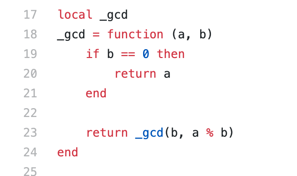

| 作者 | 版本号 | 时间 |
| :--- | :--- | :--- |
| Coordinate35 | v1.0.0 | 2022-07-27 |
 
# 关键时间节点

* 22:52 故障开始，此时整个 B 站不可用。
* 23:23 做了多活的核心服务恢复（多活切流）。
* 01:18 非多活业务开始恢复（剩余流量开始切到新建 slb 集群）。
* 01:50 完全恢复。（剩余流量完全切到新建 slb 集群）
* 01:58 定位到诱因条件
* 12:30 完全规避风险
 

故障持续时间：2小时58分钟
 
# 故障根因

1. 两个月前，slb 对接了服务发现中心，用以动态修改实例列表和权重信息。
2. 某种极其低频使用的业务服务发布方式，会将实例列表的权重设置为 0
3. 服务注册中心下发实例列表的权重信息是以字符串作为载体
4. slb 使用 OpenResty 技术栈，该技术栈使用 Lua 语言。Lua 是一门动态语言，该语言在进行数值判断的时候，唯独字符串的 “0” 不会自动转化成数字 0.
5. 在执行负载均衡时，使用到该函数。在 b 为字符串 “0” 时，"0" == 0 不成功，且 a % b 不会报错（计算结果为 nan），因此永远达不到函数的退出条件，进入死循环，将 cpu 耗尽： 

 
# 其他暴露问题

1. 系统存在循环依赖：要登陆 slb 依赖于 vpn, 但是登陆 vpn 又依赖 slb。
2. 资源投入不足（花多少钱有多少效果）
3. 对故障场景下的流量暴涨模型了解程度不足导致容量准备不足。集群常态下 cpu 使用30%，但是故障场景下流量暴涨，依旧不能支撑。
4. 人员不足。1. 数量: 一个研发一个运维. 2. 多元度: 缺少质量保障等角色. 3. 专业度: 对转发引擎本身的深入了解程度不足
5. 架构设计上写存储仍是单活
6. 预案有效性保障不足。1. 预案场景过于简单不够全面：机器初始化、配置初始化。2. 缺乏全链路的预案演练
7. 多活架构管理失控。哪些业务做了多活、多活的形式是什么这些说不清楚。

# 疑问
1. 定位到诱因是 weight=0，为什么策略是关闭 jit ，而不是优先禁止把 weight 设置为0？
2. 当晚为什么没有验证关闭 jit 是否确实已经规避了风险？
3. slb 移除动态权重能力支持，只是把复杂度转移了，似乎对问题解决没有帮助
4. 如果要实现流量隔离，为什么不是按域名降流量拒绝或者封禁掉，在逐步按域名放开。这样应该要比搭建新集群快很多

# 几点想法

## 1. 故障是不可能被避免的
如果有条件，数据面上的模块，尽可能具备恢复到某个时间点状态的能力（代码+数据）。这是终极大招，能确保大面上不会有问题。 

## 2. 循环依赖可能不可避免，但不能有强循环依赖
比如 vpn 可能可以有针对运维人员常态公开的绿色通道。这个我觉得 B 站在10分钟内能打通我觉得还可以了。

## 3. 回滚的范围该与故障影响的范围相匹配
本次故障本质是由于故障诱因团队判断不出来是自己触发的。该模块在整个故障过程中，都处于发布这么一个中间态，如果他提前回滚，那这个故障也很快恢复了。这个也是一个投入成本的一个考量。

## 4. 投入收益比？
优化项没有看到稳定性要提升到什么效果、以及关于稳定性和投入之间关系的考量。

## 5. 不同时期需要不同的产品
B 站接入层处于从迭代效率至上阶段过来，稳定性尚未引起重视。因此技术栈还是 Lua + 单集群，下一阶段是 C + 多集群。最终，如果配置管理和资源管理的隔离性做的足够好了，又会往 C + 单集群的方向演进

## 6. 工程文化
系统设计的时候，该明确的假设依赖什么，逻辑链需要持久化保存、监控。这样的系统才是可维护的，在演进的过程中才控制得住，这个得从开始的时候就做好。先把水泼出去后续还想收回来是做不到的

## 7. 系统的外部输入是必须做校验和防卫的

## 8. 做产品本质是希望让更多的逻辑流过自己，这需要责任感，甩锅没有意义。
不管是在朋友圈、还是技术交流群中，春哥不仅一次提到是用户使用他们 api 姿势不正确（比如要传入一个数字的 0）,而不是自己的问题。即使真的不是他们的问题，这个态度，只能让用户对 OpenResty 这个产品越来越没信心，选型越来越谨慎，最终没人用。

## 9. 三分人事七分天。架构只能让产品更大可能的走向目标，但是不能阻止产品失败
高以下为基。千里之堤也会溃于蚁穴

# 参考资料
* bilibili 故障复盘：https://mp.weixin.qq.com/s/nGtC5lBX_Iaj57HIdXq3Qg
* bilibili 服务注册发现中心 api 文档：https://github.com/bilibili/discovery/blob/master/doc/api.md
