| 作者 | 版本号 | 时间 |
| :--- | :--- | :--- |
| Coordinate35 | v1.0.0 | 2022-11-23 |

# Nginx 负载均衡算法在动态后端场景下的优化

## 背景
## 团队背景

当前接入层对外提供的服务主要是 router 与 inrouter, 分别承接了 http 协议的南北向流量和东西向流量：

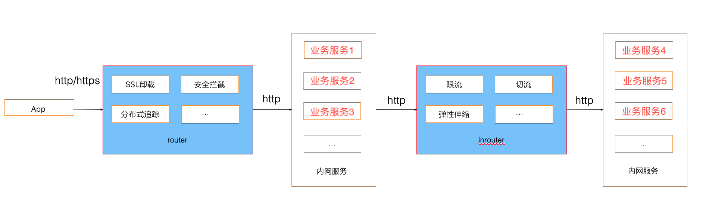

作为流量的门户，router/inrouter 全集群 QPS 峰值达千万，单机 QPS 峰值达 4w。

目前，router/inrouter 常态集群规模从每个集群3个实例到200个实例不等。
## 名字服务引入
统一接入层 router/inrouter 核心转发引擎的具体实现是 Nginx，将接收到的 HTTP/HTTPS 请求通过一定的负载均衡算法，将请求反向代理到业务服务器上。当前:
1. 接入层管理的后端集群（[upstream](http://nginx.org/en/docs/http/ngx_http_upstream_module.html#upstream)）数量有 2W+
2. 业务在接入层广泛使用的负载均衡算法主要有：[SWRR](https://github.com/nginx/nginx/commit/52327e0627f49dbda1e8db695e63a4b0af4448b1), 一致性哈希
 
为了提升云原生场景下 SRE 的变更效率，在 2018 年，接入层自研实现了动态 upstream 能力：通过打通名字服务，达到无需 Nginx 热重启的情况下，就能自动更新下游实例列表的能力，架构如图：
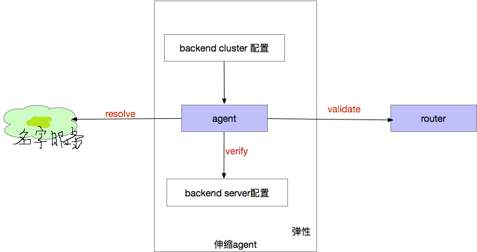

如上图所示，整个架构分为3部分：
1. 名字服务：服务信息管理中心，类似于DNS提供upstream到server实例的映射；
2. 弹性伸缩agent：负责向名字服务 拉取upstream name所对于的server实例，并对其验证，生成相应的变更列表，最后向nginx发起变更请求；
3. nginx：提供轻量级配置变更的 HTTP 接口，动态修改内存中实例列表
 
动态 upstream 能力上线后，大幅提升了 SRE 的变更效率。但是，也对接入层的稳定性保障带来了一系列挑战。

## SWRR 算法的演进
### 原生算法简介

接入层最广泛使用的负载均衡算法是 WRR，具体实现是由 mdounin 提交的 [SWRR](https://github.com/nginx/nginx/commit/52327e0627f49dbda1e8db695e63a4b0af4448b1)(平滑加权轮训，Smooth Weighted Round Robin) 算法。该算法旨在解决传统算法在极端场景下不平滑的问题。具体算法描述如下：
1. 初始化时，将每个实例的 current_weight 设置为0, 并将所有实例权重的总和记为 total_weight
2. 每轮选取：
	1. 从第一个实例开始，依次将每个实例的 current_weight 自增自己的权重
	2. 将 current_weight 最大的实例作为选取结果，并将其 current_weight 自减 total_weight
   
举个例子：有三个实例 A,B,C 权重分别为 5, 1, 1, total_weight 为 7

|初始current_weight|自增结果|选取|
|:--:|:--:|:--:|
|0，0，0|5，1，1|A|
|-2，1，1|3，2，2|A|
|-4，2，2|1，3，3|B|
|1，-4，3|6，-3，4|A|
|-1，-3，4|4，-2，5|C|
|4，-2，-2|9，-1，-1|A|
|2，-1，-1|7，0，0|A|
|0，0，0|||	 	 

原生 SWRR 算法的均衡性与平滑性[数学证明](http://claude-ray.com/2019/08/10/nginx-swrr/)不再展开。

### 名字服务引入业务发布时不均匀的问题

有业务在接入名字服务支持动态扩缩容时，发现一旦有业务发布，流量就会集中在部分机器上，导致部分机器负载过大，严重时 CPU 掉底。

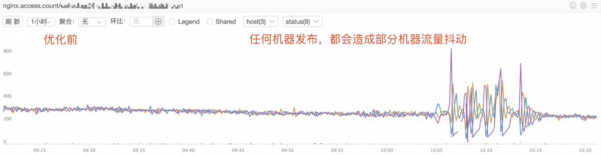 

接入层同学接入排查后，发现现象：配置文件中越靠前的机器，负载越大，运行一段时间之后，能逐渐恢复均匀。

我们通过分析 Nginx 官方的 SWRR 负载均衡算法，结合我们自身的使用发现，定位到了原因：
1. 在权重一致的情况下， Nginx 会按照配置文件的顺序选取实例。比如配置文件中用3台机器 A,B,C, 权重都是100。则选取的顺序也是 A,B,C
2. 物理架构上，接入层使用集群模式部署。每台 Nginx 以 48 个 worker 的形式运行在 48 核心的机器上。每个进程独立运行负载均衡状态机。
3. 在业务发布时，会执行“优雅发布”策略：每次发布之前通过名字服务摘流，完成发布后，通过名字服务接流。每个名字服务变更，都会在 5 秒之内同步到所有接入层机器上，并完成生效。
4. 监控系统 10 秒一个周期进行数据汇聚

5秒内 Nginx 所有进程被同步后，会将状态机进行重置，每个进程都重新开始往配置文件第一台机器发流量。问题 inrouter 集群有 35 台机器，这意味着完成名字服务同步后，会有 35*48 = 1680 个请求往第一台业务实例发流量！
 
解决方案有非常多种，我们一开始参考了业界(Tengine)常用的[随机起点](https://github.com/alibaba/tengine/commit/9629e84ff5f100cbe004904354d0b65b72da5a2c)的方案：
1. 进程启动的生成一个小于机器实例数随机数
2. 在每轮选取的时候，从随机数位置的机器开始选取。

例如，假设业务配置了 3（A,B,C） 台机器，权重都是 100。生成一个 0-2 之间的随机数，假设是 1。则选取的过程为：

|初始 current_weight|自增结果|选取|
|:--:|:--:|:--:|
|0,0,0|100,100,100|B|
|100,-200,100|200,-100,200|C|
|200,-100,-100|300,0,0|A|
|0,0,0|||

通过这种方式，解决了业务发布导致的负载不均匀问题的同时，也解决了在 router/inrouter 集群实例比较少的情况下，配置变更 reload 的时候，Nginx 会将流量打到前几台业务实例的问题。

### 重试的问题

Nginx 原生提供了[异常重试](http://nginx.org/en/docs/http/ngx_http_proxy_module.html#proxy_next_upstream)的能力：当一个流量访问某个下游实例异常时（超时、网络错误、5xx 等），能自动重试业务机器的下一台容器。
 
随机起点方案上线后，取得了不错的效果。但是业务反馈在某台机器（假设为B）瞬间不可用的时候，重试的流量对集中到了下一台机器（C）上。
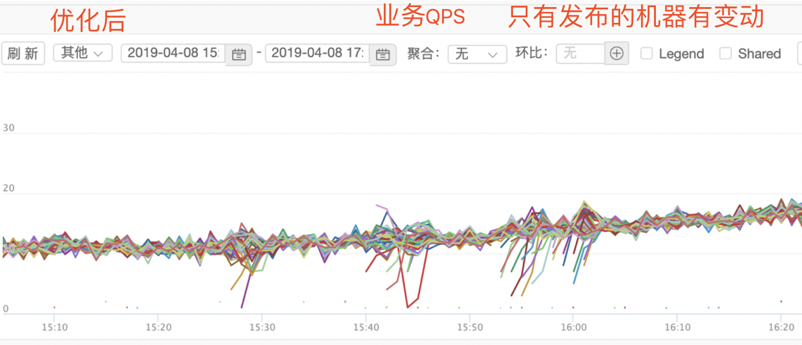 

因此我们在采用随机起点的同时，在进程启动的时候，实现了将后端机器的顺序随机打乱。通过这种策略，业务运行期间某台机器故障导致流量重试到固定机器的问题也得到了解决。
 
### 哨兵压测引入的问题

2019 年，名字服务得到了大面积的覆盖。业务 SRE 也开始大面积得利用名字服务的能力进行哨兵压测。哨兵压测本质是，通过调大单台实例的权重，用线上真实流量验证服务单实例的容量。从 router/inrouter 的视角看，常态下, upstream 中会有一个下游实例权重偏高。
 
刚开始业务使用哨兵压测时，业务发现在调整哨兵机器的权重时，会引发与机器实例权重不符的流量陡增：

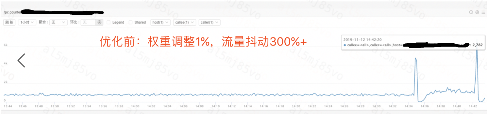
 
通过分析 SWRR 算法，很快能分析出问题的原因，在哨兵场景下，随机起点算法会失效。

假设有3台机器 A,B,C, 权重分别是 101, 100, 100, 初始起点为1，则选取过程为：

|初始 current_weight|自增结果|选取|
|:--:|:--:|:--:|
|0， 0， 0|101，100，100|A|
|-200, 100, 100|||

可以看出，不管随机起点如何，第一台机器总是会选取到 A。

针对这个问题，我们考虑和尝试了非常多的均衡化策略，在这里列举比较典型的3个方案

#### 方案一 Tengine VNSWRR 算法

[VNSWRR](https://blog.csdn.net/weixin_43970890/article/details/95970342) 算法的基本思路是根据后端实例数和权重虚拟出一系列的虚拟节点，构成一个环。环中节点的个数为 total_weight 个。同时随机选取一台后端实例，作为起始实例。后续依次遍历环中的虚拟节点，进行选取。这种算法理论上能解决哨兵节点权重变化引发的抖动，同时也能将负载均衡算法的时间复杂度从原来 SWRR 的O(n) 降低到 O(1)。但是，在我们的实际测试中，这种方式效果并不好：

 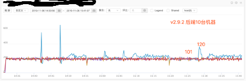

同时在大压力场景下，负载并不均匀：

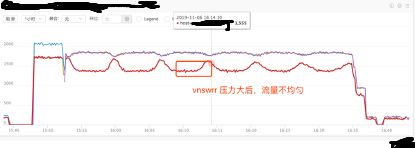

#### 方案二 根据负载均衡周期初始化进程负载均衡器

大体思路如下：假设有 n 个下游实例，权重分别为 w[1], w[2],....,w[3]。整个 SWRR 的负载均衡过程是有周期性的（从上面的过程推演也能看出）。则周期:

T = sum(w[1], w[2],...,w[n]) / gcd(w[1], w[2],...,w[n])

备注：gcd 是指求最大公约数
 
假设 有 Nginx 有 k 个进程，则分别让这个 k 个进程从 T/k 的位置开始。

举个例子：假设有 3 个 后端实例，权重分别为 2,1,1。 total_weight 为 4，周期为 4，每台 Nginx 开启 4 个 worker 进程。则具体的分配策略为：

|current_weight|自增后|分配策略|
|:--:|:--:|:--:|
|0，0，0|2，1，1|1号 worker 从此开始|
|-2，1，1|0，2，2|2号 worker 从此开始|
|0，-2，2|2，-1，3|3号 worker 从此开始|
|2，-1，-1|4，0，0|4号 worker 从此开始|
|0，0，0|||

理论上，如果进程能被均匀初始化在整个负载均衡周期中，就能避免调整哨兵机器权重带来的不均问题。但是实际测试显示，这种方法也不尽人意。
 
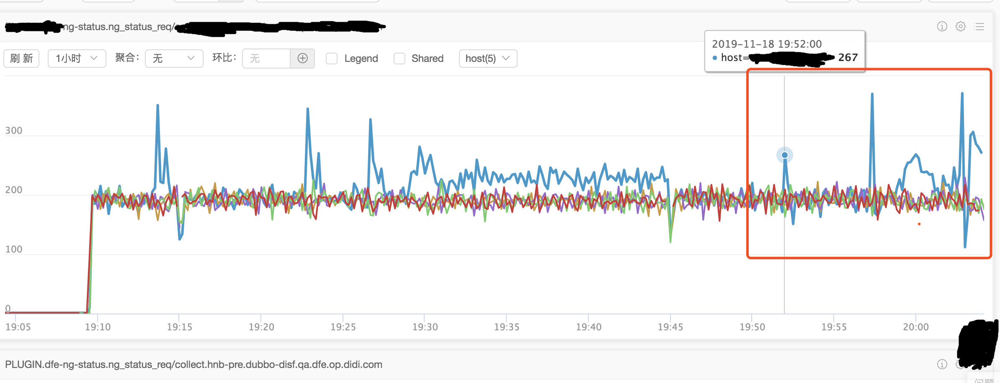

 
#### 方案三 初始化时，随机化实例 current_weight
此方案的基本思路：很明显每次名字服务同步后，由于第一次自增的时候肯定会选权重最大的实例。因此，我们在初始化每个实例的 current_weight 的时候，不再使用 0 作为初始值，而是使用一个 [0, total_weight] 之间的一个随机值。理论上，引入随机化后，就能很大程度上让首次选择避免选择哨兵机器。

此方案缺点在于比较难以从数学上证明引入随机化后，还能保证 SWRR 的均衡性与平滑性。因此，我们在线下进行了大量的测试之后，验证了方案的可行性：
 
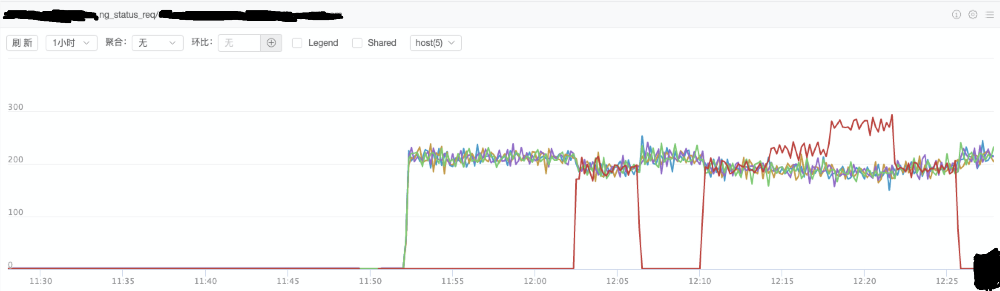
 
最终，我们选择了方案三。修复上线后，在线上也表现良好，也经受住了时间的考验：从 2019 年12 月起，支撑了近3年来所有名字服务实例变更。

## 一致性哈希算法的演进
### 原生算法简介

一致性哈希算法主要是解决：
1. 期望相同特征的请求能落到同一个后端机器
2. 在1的基础上，实现能按照配置的权重对后端进行负载均衡
3. 在 1、2 的基础上，能够比较平滑的实现扩容和缩容

Nginx 的[具体实现](https://www.nginx.org.cn/article/detail/440)是 ketama 算法（假设有 n 个实例，每个实例的权重为 w[i]）：
1. 在进程初始化的时候
	1. 生成 sum(w[1], ..., w[n]) * 160 个虚拟节点
	2. 为每个结点计算该节点在哈希环上的位置（基于server 的 ip, 端口, 虚拟节点序号进行 CRC32哈希）
	3. 将所有的虚拟节点按照位置进行排序
2. 在选取实例的时候
	1. 根据请求的特征生成 CRC32 哈希值，再通过二分查找找到对应的实例

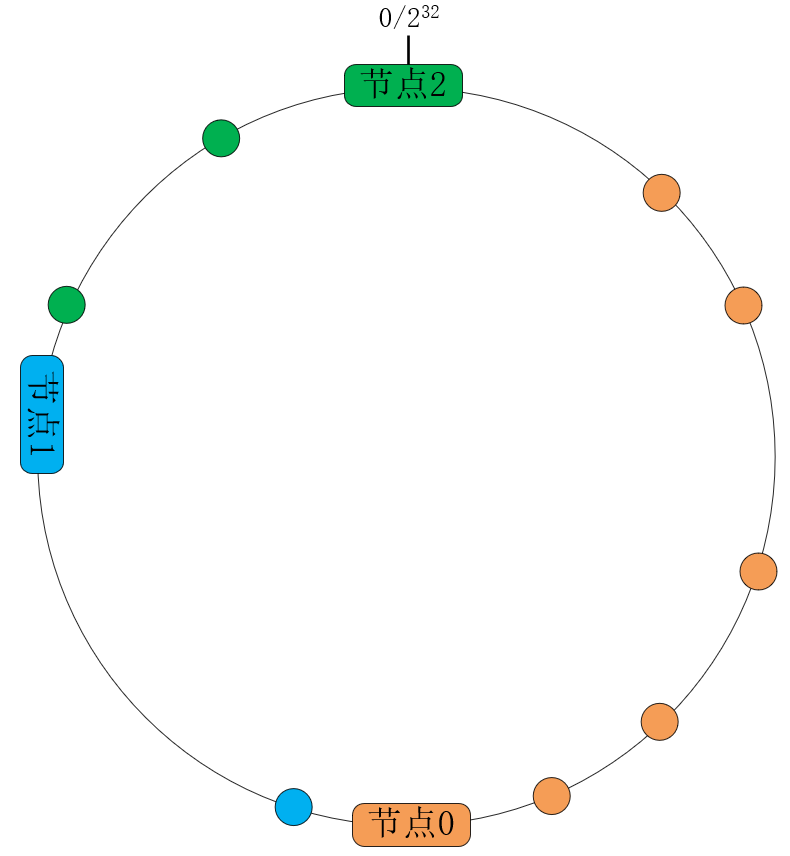

### 名字服务引入的问题
引入名字服务后，接入层实现了动态 upstream 能力。由于 Nginx 是一个多进程，每个进程单线程的[架构](http://tengine.taobao.org/book/chapter_02.html#id1)：

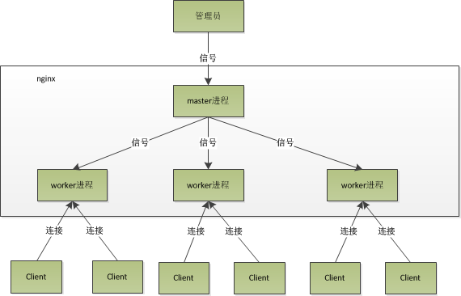 

因此实际上，我们实现的是一个"高速公路上换轮子"的能力：一个线程一边提供服务，一边变更配置。
2019年底， 某个业务服务在做哨兵压测的时候，发现每次变更权重，都会出现抖动。

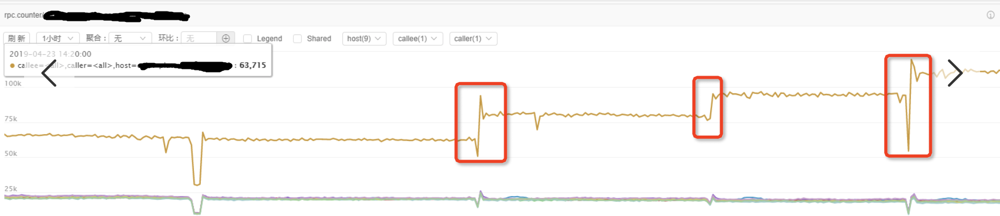 

进过排查，我们定位到是在名字服务实例发生变更时，Nginx 需要重新计算和初始化哈希环。在构建哈希环的时候，创建了 74（业务实例数）*100（每台机器权重）*160=121W 个虚拟节点，单个进程生效实例变更耗费 800ms（主要是消耗在排序） 以上。

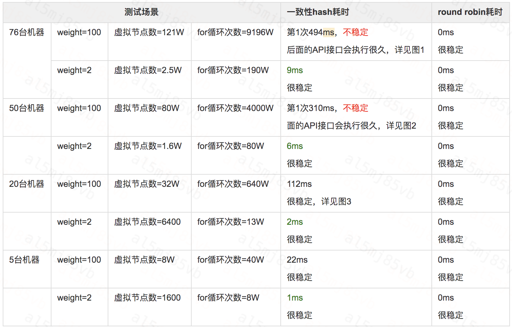

由于：
1.  Nginx 是单线程架构，变更生效时会阻塞[事件循环](https://github.com/Coordinate35/summary/blob/main/2022-02-21%20%E6%97%A0%E9%99%90%E5%BE%AA%E7%8E%AF%E4%B8%AD%E7%9A%84%E7%9C%9F%E7%9B%B8%E2%80%94%E2%80%94Nginx%E9%95%BF%E5%B0%BE%E9%97%AE%E9%A2%98%E5%88%86%E6%9E%90%E5%8F%8A%E4%BC%98%E5%8C%96/%E6%97%A0%E9%99%90%E5%BE%AA%E7%8E%AF%E4%B8%AD%E7%9A%84%E7%9C%9F%E7%9B%B8%E2%80%94%E2%80%94Nginx%E9%95%BF%E5%B0%BE%E9%97%AE%E9%A2%98%E5%88%86%E6%9E%90%E5%8F%8A%E4%BC%98%E5%8C%96.md)
2. 变更 agent 的超时时间为 100ms，超时 agent 会认为变更失败了，会降级为原生 reload
 
针对这个问题，我们测试发现：当虚拟节点超过 1W 时，变更耗时会超过 9ms，会变得不再可接受。
 
针对一致性哈希算法，我们制定了一系列指标，来指导我们进行性能优化：
* **变更延时**（核心考察指标）：通过名字服务添加、删除、更新server时变更延时，如果延时过高，会阻塞router进程，会引发所有业务抖动；
* **负载均衡偏离度**。用于度量均衡性，通常越小越好（核心考察指标）：
  * 比如10000个请求，50台机器，每台机器如果均匀分配的话，可以分到200个请求
  * 但是机器最少收到100个请求，最多收到250，那最大偏离度是(200-100)/200=50%；
* **变更前后数据匹配度**。用于度量算法的单调性，通常越高越好。
  * 比如10个请求，变更前5个到A机器，5个到B机器，变更后4个到A机器，6个到B机器，匹配度=9/10=90%；
  *  该指标主要是业务关心的指标，因为业务之所以用一致性hash算法，就是希望排查过程方便，希望变更前后，匹配度度高。
 
根据上述指标，我们做出了第一版的迭代：
1. 将虚拟节点的上线设置为 1W, 当超过 1W 时，会进行拦截，变更不再生效。
2. 推动业务将权重基线从 100 调整到 10, 减少虚拟节点的同时不改变权重分布
3. 对虚拟节点数量进行监控与预警
 
这个版本上线后，我们在牺牲了一定负载均衡性，保证了变更延时：

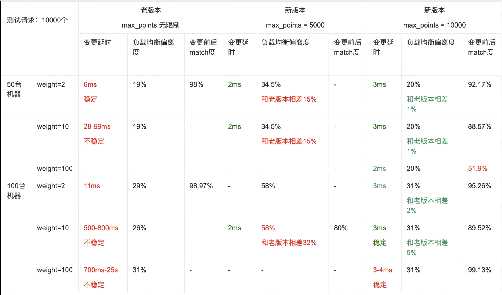

说明：比如当机器数为 50 ，每台机器权重为2时，虚拟节点数量：50*2*160=16000个，由于上限设置为了10000，虚拟节点数量实际上变少了，所以会带来负载均衡偏离度的变化

### 血的教训

该方案运行了近一年后，引发了一个惨痛的故障：某个集群流量掉 0 。

引起故障的其中一个原因就是：

* 由于一致性hash算法下，虚拟节点数量不能超过1w，超过1w会导致新的实例无法被添加进来，但是老的实例可以被禁用掉。业务发布完成后，所有旧实例完全被禁用掉，新实例都无法添加
 
虚拟节点数量超过 1W 变更就拦截的机制必须突破。
 
经过调研，我们找到了两种可能的方案。

#### 方案一： 参考 Envoy 的 Ketama 算法实现

[基本思路](https://github.com/envoyproxy/envoy/blob/main/source/common/upstream/ring_hash_lb.cc)为：
1. 将虚拟节点的总数固定为一个数组，记为 default_max_point
2. 每个权重对应的虚拟节点不再固定为 160 个，而是通过 vpoint_per_weight = default_max_point / total_weight 得出。如果大于 160，则取 160。
3. 每个实例的虚拟节点数通过 vpoint_number[i] = floor(w[i] * vpoint_per_weight) 得出。floor 为向下取整函数

通过这种算法能做到在牺牲一部分负载均衡度的情况下，突破 1w 的虚拟节点数限制。
 
#### 方案二：使用不基于排序的一致性哈希算法

其他一致性哈希算法的实现有：[Jump Consistent Hash](https://arxiv.org/pdf/1406.2294.pdf) 和 [Maglev](https://storage.googleapis.com/pub-tools-public-publication-data/pdf/44824.pdf)

具体算法比较参考： https://cloud.tencent.com/developer/article/1836320
 
考虑到重新实现一个一致性哈希算法有比较高的成本，同时在实例变更场景下不太友好，容易引入新的稳定性风险，我们最终使用了方案一。
 
上线后，用户配置虚拟节点超过1w 就拦截变更的限制得到了突破，保障了在一致性哈希场景下的稳定性。
 
## 总结

经历了两年多的迭代，我们围绕着名字服务，对 SWRR 与一致性哈希负载均衡算法进行了改造与优化，陆续解决了：
1. SWRR 算法：
	1. 业务发布瞬间引发的负载不均匀问题
	2. 常态单实例瞬间不可用导致重试流量集中到某台机器的问题
	3. 哨兵机器调权时负载不均匀问题
2. 一致性哈希算法
	1. 名字服务发生实例变更时由于计算量过大阻塞事件循环的问题
	2. 为了保证性能引入约束导致实例只能被摘除不能被添加的问题
 
在解决问题的过程中，我们切实感受到：
* **架构设计很多时候是在骑墙**。为了能走下去，可能面临妥协。不求最优雅的，但求能持续走的更远的。
* **稳定性保障要贯穿**。在保障自身稳定性的时候，需要留意上下游之间的联动。不管是控制系统的联动，还是数据链路的联动。
* **要敢于突破理论框架限制**，多做尝试。理论上似乎没问题的方案，实际不一定可行；学术上比较难证明的方案，工程实践上也许能接受。
 
当前，我们的负载均衡算法仍然不是非常完美：
1. 当前基础设施在推进云原生架构，未来的自动大规模弹性伸缩可能会给变更系统带来新的挑战
2. SWRR 算法(时间复杂度 O(n))和 Ketama(时间复杂度 O(log(实例数*平均权重))) 算法本身在选取下游实例的时侯消耗了大量 cpu。
3. 当前一致性哈希算法在变更时间和负载均匀性之间取了个平衡。极端场景下存在负载不均匀情况

因此，我们未来方向：
1. 持续优化和打磨变更系统，以应对未来云原生场景下带来的新的挑战
2. 不断提升负载均衡本身的性能
3. 优化负载均衡算法，为业务提供更均衡、更平滑、更稳定的负载均衡能力
 
我们会持续关注负载均衡技术在业界的创新动向，并应用到我们的工程实践中，精益求精，为保障业务稳定性、提供业务价值持续努力！
 
参考资料
1. upstream： http://nginx.org/en/docs/http/ngx_http_upstream_module.html#upstream
2. SWRR: https://github.com/nginx/nginx/commit/52327e0627f49dbda1e8db695e63a4b0af4448b1
3. SWRR 算法均衡性与平滑性数学证明： http://claude-ray.com/2019/08/10/nginx-swrr/
4. Tengine随机起点方案： https://github.com/alibaba/tengine/commit/9629e84ff5f100cbe004904354d0b65b72da5a2c
5. Nginx 异常重试： http://nginx.org/en/docs/http/ngx_http_proxy_module.html#proxy_next_upstream
6. Tengine vnswrr 算法： https://blog.csdn.net/weixin_43970890/article/details/95970342
7. Nginx 一致性哈希算法实现： https://www.nginx.org.cn/article/detail/440
8.  Nginx 架构： http://tengine.taobao.org/book/chapter_02.html#id1
9.  Nginx 事件循环模型： https://github.com/Coordinate35/summary/blob/main/2022-02-21%20%E6%97%A0%E9%99%90%E5%BE%AA%E7%8E%AF%E4%B8%AD%E7%9A%84%E7%9C%9F%E7%9B%B8%E2%80%94%E2%80%94Nginx%E9%95%BF%E5%B0%BE%E9%97%AE%E9%A2%98%E5%88%86%E6%9E%90%E5%8F%8A%E4%BC%98%E5%8C%96/%E6%97%A0%E9%99%90%E5%BE%AA%E7%8E%AF%E4%B8%AD%E7%9A%84%E7%9C%9F%E7%9B%B8%E2%80%94%E2%80%94Nginx%E9%95%BF%E5%B0%BE%E9%97%AE%E9%A2%98%E5%88%86%E6%9E%90%E5%8F%8A%E4%BC%98%E5%8C%96.md
10. envoy 一致性哈希算法 ketama 实现： https://github.com/envoyproxy/envoy/blob/main/source/common/upstream/ring_hash_lb.cc
11. Jump Consistent Hash: https://arxiv.org/pdf/1406.2294.pdf
12. Maglev Consistent Hash: https://storage.googleapis.com/pub-tools-public-publication-data/pdf/44824.pdf
13. 各种一致性哈希算法比较： https://cloud.tencent.com/developer/article/1836320