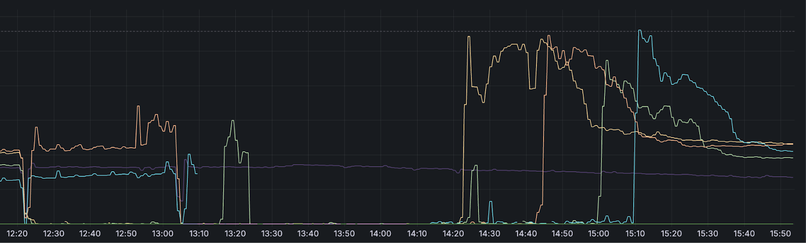

| 作者 | 版本号 | 时间 | 内容 |
| :--- | :--- | :--- | :--- |
| Coordinate35 | v0.1.0 | 2025-05-20 | 故障详情与大纲 |
| Coordinate35 | v1.0.0 | 2025-05-22 | 初稿 |

今天在朋友圈偶然看到这个故障，感觉这个故障非常典型，但是公开出来的资料分析感觉可以更进一步。
同时担心以后我曾经做过的事情就忘记了，因此借这个机会记录下来

# 背景

1. Spotify 是瑞典 06 年创建的一家为全球性的音乐服务公司
2. Spotify 使用 Envoy 作为统一接入层网关. 所有公网流量都通过 Envoy 进入内网各个服务中
3. Spotify 为 Envoy 自研了不少 filter， 比如 rate limit filter. 而 Envoy 提供了更加动态的能力: filter 在整个请求的处理顺序是可以通过配置进行调整的。与之相比较, Nginx 的各个模块的处理顺序在编译期确定.

# 时间线

12:18 UTC Spotify 进行了一次配置发布。配置的内容为：调整了 Envoy filter 的执行顺序。由于 Spotify 的同学评估这个变更风险很小，因此直接就全量了。

12:20 UTC 值班人员收到流量突降的报警

12:28 UTC 情况加重：除了亚洲之外所有地区流量掉底。

14:20 UTC 欧洲的流量开始可以进入，但是此时由于端上大量失败重试，流量为正常流量的 2 倍左右。

15:10 UTC US 区域的流量也恢复进入己方。同样的流量非常高

15:40 UTC 流量完全恢复

故障时效性总结：
1. 故障感知耗时: 2 分钟
2. 定位到止损耗时: 120 分钟
3. 故障恢复耗时：80 分钟

# 根因分析

Envoy filter 实现的有问题，调整顺序后会导致其中一个过滤器出错，进而导致 Envoy 进程崩溃

# 故障分析

故障时的流量表现:

## 为什么流量掉底了这么长时间

Spotify 的同学第一时间就回滚了，问题是回滚之后发现无法恢复。

没有恢复的原因是重试的流量太大，实例一起来就被流量打死了。

crash 掉的实例被 k8s 拉起来后，由于内存占用过高，突破了 k8s 设定的内存限制，导致 k8s 自动关闭实例（可能是故障自愈？）。之后就一直处于此循环往复。

内存占用过高的直接原因定位到是由于 Envoy 的最大堆大小设置的高于允许的内存限制。大量重试流量进来之后，内存马上就到达了上限.

流量的恢复最终是通过扩容完成的。总内存容量的增加降低了单实例的内存需求，最终不再被重复重启

## 为什么亚洲不受影响

从图中可以看出，亚洲的曲线也抖了以下，所以肯定亚洲也受到了配置变更的影响，但是很快就回滚恢复了。

没有受到内存限制的影响是因为时区的原因，亚洲的流量本身比较小

# 复盘todo

1. 修复 Envoy 崩溃的 bug
2. 修复 Envoy 堆大小配置与 K8s 内存限制不匹配的问题
3. 改进边界网关配置更改发布方式
4. 改进监控能力，以便更好的发现问题

# 感受

永远对线上保持一颗**敬畏**的心，永远不要觉得你能评估一个变更的影响面。同时正是因为影响面是不可评估的，所以**变更流程**的非常重要。核心原因: 你很难捋明白你的逻辑依赖了哪些假设，以及这些假设被打破了会引起什么蝴蝶效应。参考：
1. [假设的陷阱](../2022-06-26%20假设的陷阱/假设的陷阱.md)
2. [软件工程的理想主义](../2024-01-02%20软件工程的理想主义/软件工程的理想主义.md)

变更路由顺序属于**非常规变更**。
1. 非常规变更更是需要注重变更流程.
2. 如果这类变更如果没有经过线下测试直接上线，是非常不应该的。常规变更举例：扩容。

事后诸葛亮的视角，其实从曲线图不难分析出来大概率是由于容量导致的问题：
1. 回滚之后，流量特征大概率不会有变化。同时亚洲没问题，只有流量高的集群有问题
2. 内存使用上涨导致的退出
处理故障的事后应该优先考虑减少流量，也不是排查根因。或者至少要两条线并线，

容量的认识与风险管理非常重要。通常接入层最大的**风险**就是容量问题。本次故障中体现的问题:
1. 从流量从监控图恢复的那一刻看，流量只是原来的 2 倍左右。如果流量翻倍就扛不住，这个容量准备是不到位的.这也侧面反应出来缺少一些常态化的压测机制。
2. 从应对的过程看，Spotify 似乎对自己服务的**容量瓶颈**还认知不到位。

自愈或是说自动的调节要有**阈值保护**。这个虽然和本次事故不一定有太大的关系，从事故报告的说法看起来是流量太大导致 oom 了，导致触发了 k8s 的自愈能力。但是全自动的自愈本身是风险的来源：自愈能力通常通过监控的反馈进行调节, 然而监控链路的数据本身不一定准确或者实时。比如最常见的：很多团队为了提高效率，通常会根据各项业务指标配置单实例的故障自愈，一旦监控丢点，就可能触发一次全集群的抖动，甚至引发连带问题。所以建议故障自愈应用于小范围之中，触发阈值报警后，再人工介入进行处理。稳定性相关的工具还是不要做的**太好用**了:)

# 本次事故涉及的稳定性保障方案，有哪些事情需要考虑

本次事故比较容易看出来比较关键的两个问题：
1. 变更管控流程是有比较明显的漏洞的
2. 容量保障能力不足

以下所说的每一句话，都是从血和泪之中趟过来的。

接入层的部署方式通常都是按照集中式的部署方式，以多租户的方式提供服务，便于运维和管理。
虽然这仅仅是薄薄的一层，但是他是所有业务流量的门户，一旦出问题，就是业务归零。因此，集群拆分是做好稳定性的第一步。

集群拆分的原则通常有以下方式：
1. 按业务线的重要程度拆分。比如：
   1. P0: 核心主营业务分到一个集群、中台分到一个集群
   2. P1: 探索性业务分到一个集群。
   3. P2: 边缘业务分一个集群：比如埋点上报
2. 按流量特征进行拆分。比如：
   1. 常规业务 API 接口（请求体小）一个集群. 
   2. CDN、上传文件等能力（请求体大）一个集群

## 变更流程
   
变更的种类按重要程度可以分为：
* upstream 实例配置的变更。这类变更效果固定，变更需求量大，通常由系统控制，直接全量
* 预案配置生效：限流、切流。这类变更需求量虽小，但是情况紧急，通常由 sre 操作，虽可以再集群内分级发布，但会以较快的速度全量发布.
* 业务配置的发布：比如增加一个域名、一个 location. 这种通常由业务 SRE 或业务 RD 操作，集群内需分级发布（比如组间5分钟观察）, 集群之间可以并行发布.
* 核心配置发布（**本次故障相关**）: 比如调整网络事件处理方式、调整每个处理请求的 buffer 大小等。这种通常由接入层 SRE 进行操作。优先重要程度低的集群开始。同优先级的集群可以并行发布。集群内需分级发布（比如组间观察5分钟）.
* 二进制发布。优先重要程度低的集群开始。同优先级的集群可以并行发布。集群内需分级发布（每组需要至少经历一个早晚高峰）.

集群内分级发布时，需同事进行 double check，方可进行下一分组。

在执行变更的过程中，若是发现有线上业务问题，即使变更同学判断不是自己变更影响的，也建议立马执行回滚操作。

在一些极端场景下，由于变更量特别大，已经不好判断到底是哪一个变更影响的；同时，线上的影响非常大，需要立马止损的场景。
对于这种情况接入层需要进行兜底大招建设：一键还原到某个历史时间点的状态。具体实现是在每个实例上进行历史时间点的二进制+配置的全量备份，有需要时通过找到需求时间点最近的那一份配置进行恢复。这种恢复可能是对线上有损的（因为实例列表可能变了），但是能实现保全大部分流量的效果。

## 容量保障

### 容量风险的来源

1. 节假日等关键时刻的流量增长
2. 友商的故障
3. 业务跪了引发重试的流量(通常是2-3倍)
3. 端上的请求未进行打散处理（比如定时刷 httpdns, 或者实验、配置开关）
5. 接入层通常扮演限流器的角色，保护业务服务。但是, 却没人能保护他

### 容量核心指标（小请求体，可能不同的业务有不同的情况）

1. cpu.idle。最重要的指标。大头都花在 ssl 卸载、http 编解码、压缩/解压缩等。同时，其余很多负载指标(比如 io 的使用)，最终也会体现在 cpu.idle 中。
2. qps。每个集群可能不一样，通常会对应到一个 cpu.idle 的水位
3. disk.user.percent。主要关心日志是否能放得下
4. cps。通常还没到 cps 瓶颈时，cpu.idle 就不足了。但是如果你的服务器足够牛逼（比如核心非常多），同时在使用 accept_mutex 的方式处理连接（只能单核处理连接），可能需要注意。
5. 内存。之前没见过内存成为瓶颈，可能不通业务场景下不一样（比如有定制逻辑）。

### 容量保障的常用手段/预案
1. 容量准备。
   * 通常常态下要留下至少 1 倍最好 2 倍的 buffer。主要是前面没人能限流了。
   * 同时由于是多租户的形式提供业务，业务提供给流量模型大概率和接入层的流量模型不一致，所以容量评估实际很难进行。
   * 上云之后，可以建成公共的资源池子。在相同物理机总数的情况下，腾挪空间能力更强、同时也可以实现核心业务抢占非核心业务集群的资源.
2. 预警。非常重要。一方面是赢得提前介入操作的时间，另一方面也是有些水位可能不能体现到当下、缓慢累计到非工作时间(比如半夜)才爆发
3. 双活切流。
4. 扩容。
5. 功能降级：比如 https 降级 http, 日志降级等
6. 自保拒绝流量。被拒绝的流量仍然会消耗至少原本处理这个请求所需要的 1/4 的计算资源
7. 流量黑洞。前提是域名有拆分。通常流量符合 2/8 原则. 将不重要的流量通过 DNS 进行黑洞，保全核心流量.

# 参考资料

1. [事故报告原文](https://engineering.atspotify.com/2025/05/incident-report-spotify-outage-on-april-16-2025)
2. [Envoy filter 加载顺序配置](https://www.envoyproxy.io/docs/envoy/latest/intro/arch_overview/http/http_filters)
