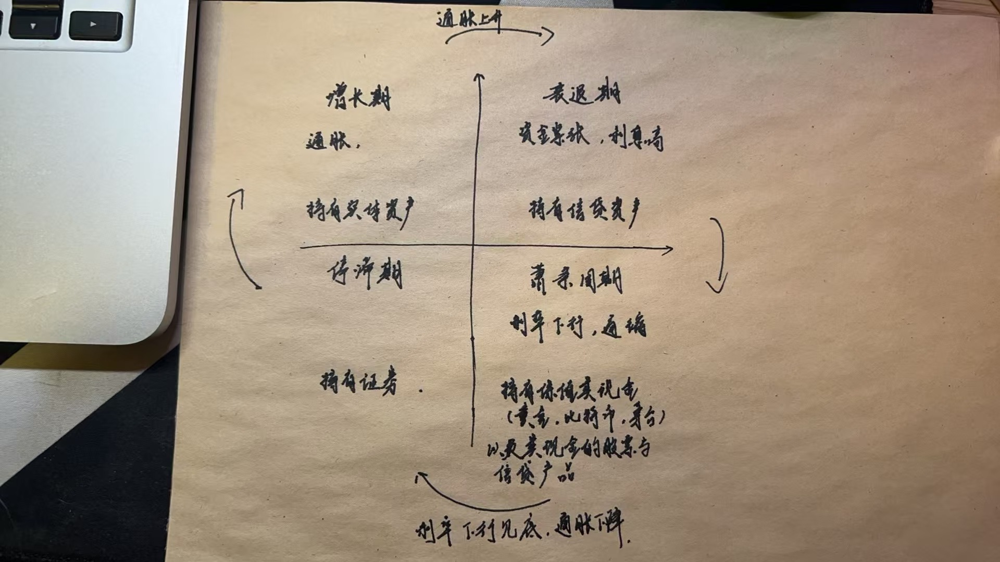

| 作者 | 版本号 | 时间 | 内容 |
| :--- | :--- | :--- | :--- |
| Coordinate35 | v0.1.0 | 2025-05-27 | 创建 |

# 背景

最近几个月一直在了解经济政策相关的内容，目标是能看清世界之“道”，晓当下、知未来，最终乘上东风。

在这过程中遇到了比较明显的问题：概念太多，难以捋明白整体的架构。因此尝试在这里开一个问题，持续往这更新概念以及逻辑关系，有朝一日终能串联。

# 概念空间

## 价值

价值客观结构基本由3个因素决定：
1. 凝结的平均社会必要劳动时间
2. 稀缺性
3. 主权性

价值的主观结构；
1. 需求的迫切性。越迫越有价值
2. 需求的难度。
3. 价值尺度。

比如房子：
1. 居住
2. 投资需求
3. 虚荣心

综合评估：
1. 懂周期.一切价值由时间决定，看5-10 年
2. 懂制度。制度和政策的合理性
3. 懂共识。共识度的认同，了解大众心理，社会舆论。预期管理有非常严重的共识度问题。如果被引导，可能会发生严重的误判。

价值回归：价格泡沫的成因和分析。 因为有了价格泡沫，破灭的时候就是价值回归。 低估的时候涨上去也是价值回归。
价格泡沫引发：
1. 是价值变迁的历史趋势中出现的认知错觉导致的。 
2. 制度性恐慌和政策性恐慌，由认为制造
3. 不可控灾难。

大的历史周期和人关系不大。这里可以通过阅读张载的气论感受。小的周期可能有人的因素

价值回归的方式和路径：
1. 价格严重低于价值时，通过经济增长的周期。
2. 当价格高于价值是，通过经济危机。经济危机可能会被人为的延长：被推迟，被延长。

经济学家提出来的供给和需求往往有重大的问题：
1. 因为供给和需求很大程度是被主管构成所误导。
2. 从历史上看，供给学派解决问题的效果不好

2025:美元计价的商品价值回归的逻辑和过程（卢麒元）：
1. 目前以美元计价资产的劳动和估值全部被严重高估。高估的表达在汇率；高估的量：美元总资产价格被高估200%，美元计价的劳动价格被高估300%
2. 美元和人民币的合理汇率（价值角度）：1:3。

美元汇率高估的美国视角的解决方案：
1. 关税战（扭曲商品价格）
2. 贬值美元

必须仔细考虑。美元贬值的方式和进程（时间节点）。一种可能的方式：中心坍塌。中心是美元，其他资产会随着中心坍塌引发坍塌

### 价值回归的空间属性

价值回归指的是在特定的空间中，价值是流动的，价格的变动会是的价格脱离价值，然后再回归。
西梅尔的逻辑：价值与资本有联系，资本与货币有联系，在特定空间中，由于货币的总量是一定的，在特定的时间节点和空间内，资本的总量是一定的，则由资本的总量来决定的资产和商品的价值的总量也是一定的。空间的结构性变化，会导致价格价值的分离，时间长了又回去了。讨论空间的问题，就是讨论资本（流通中的货币 ）和货币空间分布的问题。

价值的能量特征问题：由于总体上是得守恒的，所以价值回归是一个自然过程，必然结果，不以人的意志为转移。

价值回归的过程分类：
1. 自然回归：随着自然因素的变动，最终流回来
2. 人为回归： 主要是制度与政策的控制。作为一个经济问题，最终会回归到政治问题。例子：劳动价值的回归，美国（曾经的伟大、苏联压力、国内税收，对比大漂亮法案）

均值回归的时间属性：一个商品、一个东西在漫长的时间里的平均值、均值回归。
时间属性周期：大部分时间价格是偏离价值的，有时候偏离极高。特定的周期中，特定的东西会表达出不同的价值，有一个周期性的回归过程。例子：黄金，两根金条一个房子。
研究周期就需要研究：
1. 偏离度。
2. 偏离原因。

均值的意义：均值回归的中间点。寻找均值就是投资的全部含义：计算均值点，计算偏离度，计算回归速度，寻找偏离原因，确定回归时间（能不能熬过周期）

## 主权货币的评估逻辑

1. 是否具备法律约束。需要立法控制货币发行的条件。这里其实是决定货币的定价逻辑：货币的价值应该和什么东西锚定。
2. 中央银行的独立性。货币在一定程度上，是国债的记账符号。为什么：因为政府通常发行国债借钱，来满足财政支出。而国债的购买人，除了国民之外，很重要的一方就是中央银行（美国的国债的购买方还有其他国家）。中央银行通过购买国债，发的钱就流入了市场。如果中央银行受到了财政的主导，很容易会因为人性的原因（比如赢得选民）、短期的原因等，导致无限制的发债发货币，迅速进入不健康的状态。
3. 财政的纪律性和管理水平。这里主要要解决钱:
   1. 钱从哪来。政府的钱主要来自于税收、金融（融资）。如果金融的部分过多，就表明不健康。
   2. 都去哪了？黑白灰三色的比例是否健康？国民居住型支出收入占比？纳税占收入占比？
4. 经济的基本面。常用指标：GDP/CPI
5. 国外势力扰动。
6. 战争

为什么经济欠发达的地区货币面值都非常小：因为在这种地方，货币的用于促进交换功能性用途要源源大于其价值。这些地方由于消费要超过生产，如果他们的货币价值大的话，会不可避免的流出本国和地区

## 日本金融系统性风险相关：
* 发生：
  1. 极端的乐观预期
  2. 信贷的显著增加
* 发展：
  1. 长期宽松的货币政策
  2. 金融与紧急活动形成顺周期效应
  3. 促进地价上涨的土地税制
* 补充说明：
  1. 缺少信用正反馈崩坏的监控。举例说明：有钱的人通过资产抵押的方式获得信用，使用信用获得贷款（贷款通常比抵押物更多钱），使用贷款可以买地、房产等资产，再使用这些资产变可以获得更多的信用、贷款，形成一种正反馈效应，迅速积累泡沫。回头想来，我们房地产也是走了这条路，只能说一切都是早就设计好的。

## 关于债

定义上，债代表着：
1. 需要承担的经济责任
2. 代表信用
3. 代表经济能力

是以信用的方式参与社会再分配。

按负债的凭借划分：
1. 集资型负债。凭借情感：比如向几个朋友凑点钱
2. 融资型负债。凭借股权
3. 信贷型负债。凭借信用

按观测角度：
1. 微观的负债：个人、个人所属机构
2. 宏观的负债：国家层面。包括金融机构或非金融机构、居民整体。要关注负债在国家总债务中的比例关系、以及总负债的规模，是判断国家的汇率、经济、资产价格的主要矛盾

### 宏观负债

观测角度的数据整体层面会公开。问题的发现可以通过再细化：因为不同国家、机构、个人负债的目的不同。比如国家、公司高负债，可能代表他在高速蓬勃发展：因为有很好的前景才有人借钱给他；有些机构资产负债很健康，但是市场也不买账：因为没有未来。因此负债背后的原因很重要，用来判断负债的合理性.

公司的选择：负债和业务成长正相关、行业龙头垄断地位。

居民总负债太高是大问题：次贷危机的形成。居民总负债太高是社会治理问题，也代表了社会的消费力、未来经济的潜力。

当负债达到临界点或边界点，意味着：
1. 遭遇运营危机。当收不抵支，则会资金断链。如果国家没有以下：税收有结余、或有信用、或者有稀缺资源贮备（资产型货币比如黄金），则可能动乱
2. 效益危机。

### 微观负债

技术要求：
1. 想清楚目的。如何最有效的赚钱 
2. 可承受的规模边际
3. 时间边际：准备抗多久 
4. 风险管理。持有的资产可能出事。是否有预案

### 其他总结

负债的原则：
1. 负债的规模必须是收入可以覆盖其利息
2. 负债后持有的资产必须要有相当程度的增值能力
3. 负债后买的资产必须要有随时套现的能力

私人负债的规律和原则：
1. 第一原则：考虑汇率。尽量借一个贬值中的货币
2. 实际利率的考虑。如果实际利率是负的，可以借。实际利率为负的时候，需要负债前行；否则不能负债。
3. 边际划定。主要考虑时间边际和规模边际。比如观察企业：借钱规模大到扛不住，就会倒下
4. 风险管理。需要有预案

负债的规模=所得+利得+信用。不能超越

债意味着先机。有钱才能发展
1. 比如美国利用自己的主权信用借钱（主权信用可能主要也来自军事实力），集资提前发展技术生产力，从而赢得售卖高附加值产品的先机。这也是一种正反馈循环。
2. 正反馈循环的终结：科学技术发展并无法做到稳定的投入产出。一旦产出停滞，就是崩溃的开始。

关于大公司股票回购：
正常情况下，科技公司应把收入投入到技术发展，以达到赢得先机的目的。然后如果收入用于股票回购，则这是正反馈崩溃的前置信号。为什么会出现股票回购的情况：股票回购带来股价上升，受益人是股票持有人（高管）。

债的健康评估：
债需要通过政府的收入来进行偿还。政府的白色收入主要来源于：
1. 税收。
2. 投资回报。

如果这两大来源未来不可期，则债务风险就比较大。

如果经济不好，政府就会收不来税，这个时候就会大规模增加赤字

## 关于民主

通常情况下，我们认知的民主主要是：参与选举的程度、言论自由的程度等等。但是这种民主有一种非常大的弊端：民众通常是看不懂、也想不明白政策的。这就导致一种情况：当下谁能更明显的有利于我，就选谁。同时，由俭入奢易，由奢入俭难。这就会导致正循环失控。明显的例子：欧债危机。很多时候领导人知道必须削减政府支出，但是只要削减社会福利，你就选不上去。无解。

今天接受到一种新的观念输入：真正的民主，是体现在公民是否有议税权。公民有权参与决定交税的多少。从这个角度出发，国家治理是否能自动进入一种良性自动平衡中呢。（待推倒）

## 关于自己是赚了还是亏了

首先这里需要破除一个观念：我们通常使用持有货币变多了还是变少了，来衡量自己是赚了还是亏了。这个是不对的：因为货币的购买力实际上是一直在变的（取决于货币的锚）。
相对不变的是一般等价物（根据稀有性、稳定性等来确定）：比如当前是黄金，未来可能是数字货币。
所以国外也有所谓的黄金还原法：比如国外一套房子如果以黄金克数来定价，那他的价格大体上是稳定的。但是使用货币来定价，那很多时候价格不稳定。

因此在评估是否赚了，得把购买力计入。这里涉及两个概念：
1. 名义利率：就是银行告诉你的存款利率
2. 实际利率：名义利率 - CPI。 cpi 用于衡量通胀情况。比如老外喜欢用巨无霸指数（经济学人报刊提出，因为巨无霸基本在全国都有售卖，作为购买力标的）

实际利率是正的，才能认为大体是赚了。
举例：比如评估买房的合理性，需要考虑三个因素：
1. 租售比
2. 租息比
3. 租税比
4. 除此之外，还需要考虑买入房子的其他费用。

核心要素就是在衡量自己的买房收入时，除了租金收入，还要将通胀水平和额外引入的支出纳入折算。折算之后在和银行利率比：如果多了才值得买，少了就得卖。

## 费雪定律

定律内容：mv=pt
1. m: 货币总量. 流通中的货币种类：
   * m0: 流通中的货币
   * m1(m0+, 狭义货币): M0+单位活期存款+个人活期存款+非银行支付机构客户备付金. 备付金的理解：比如微信钱包的钱，支付宝的钱
   * m2(m1+, 广义货币): M1+单位定期存款、个人定期存款，等等，几乎涵盖了一切可能成为现实购买力的货币形式
2. v：货币流通速度
3. p: 通胀程度
4. t: 商品总量

举例分析（待数据求证真实性以及比例结构）：
我国的 m2 是欧美之和，是GDP 两倍。美国的 m2 是GDP 67%。为什么我国 m2 这么大，本币没有大幅贬值：
1. 我国总资产被误判了，GDP 也误判了，被少说了（统计不充分）。实质 GDP 应该是现在的两倍: 大量劳动没有记录，但是实际需要完成交易
2. m2 进入到了房地产
3. 大量僵尸公司（比如有很多地方国企 ）
4. 黑灰

我们考虑费雪定律，不仅要考虑每个变量的组成部分，还要考虑时间区间，以及当前时间区间对后续时间区间的影响。

债务暴雷其实也是流速控制能力不足的表达。流量控制不足，就不敢增加总量。流量控制不力，则要么就是选择资产价格上涨，要不就是货币贬值。

流量控制举例：2020年11月9日，美国财政部部长姆努钦要求美联储归还4500亿。给美联储一笔钱，用于购买债券，主要是买企业债，给市场注入资金。债券市场稳住，股票市场开始涨。由财政部，大量国家资本进入。流量为选举而生。从普通人视角：疫情如此严重，经济近乎崩溃，美股创新高。老百姓其实没有钱买，就是国家定向投放了流量。为什么要收回：因为选举结束了，这笔钱是为了特朗普选举释放。如果再释放流量，就会造成明年的恶性通胀。需要注意：资金拿出来的表面理由是用于刺激经济。最终结果上看，特朗普落选了，拜登上来就需要收拾这个摊子。

## LPR

基础利率：贷款市场报价利率（Loan Prime Rate，简称LPR。也叫 Base Rate）。是商业银行对外执行的贷款利率基准，其他贷款利率可在此基础上进行加减。发布代表了银行的利益，通产不会站在贷款人角度.
基准利率：Benchmark Interest Rate。央行发布的，用作指导商业银行贷款和存款利率的利率，是货币政策工具之一。其制定相对代表人民的利益, 理论上更具可信度.

## 内生货币与外生货币

外生货币：就是实际拥有价值的货币，也叫实物货币。举例：金、银。这类货币既是货币、也是资产。
内生货币：就是法币。本身没有价值，代表了价值。基于一个契约发行，契约后面有个背书：税。发行收到法律约束。

内生货币资本化的时候，意味这税收增加。税收货币资产化（比如变成了技术），会促进经济的发展，同时也会很快形成税收的增长。税收和货币互相为因果。
新货币主义（史蒂芬妮）：如果财政赤字由内生货币资本化形成，则是好的赤字。
但是如果内生货币没有形成资产，而是税收化、或者变成了财政金融化，就会有很大问题。

内生货币资本化的条件：
1. 把钱花在研发上的企业，要有利润。利润从哪来：廉价的土地、劳动力、资源、市场稀缺性（宽阔的市场）

以下是个人理解：
先将模型简化：不考虑货币固化的问题（比如变成了房地产）。
正常来说：发多少钱，税收回来多少，市面上流通的钱没有变化，那货币的价值没有发生变化。
货币还是发行了这么多，税收减少了。市面上流通的钱多了，钱就不值钱了。但是钱变不值钱的这个过程，不是实时的。
所以就让人有了可乘之机，完成转移与外逃（中等收入陷阱）。
如果钱没有在用于促进交易的用途上，就会有问题。如何审视：供给侧改革

美国和中国就有点像是反身性原理的两方

## 如何理解便宜、收入高低

便宜：无风险套利的程度

收入高低：除去了支出之外还剩下多少的程度。

核心就是别看绝对值

## 四化

私有化、市场化、资本化、国际化（开始涉及内外争斗、可能出问题的点）

## 资产的形态

资产主要的形态：
1. 现金。比如房地产高危，应该现金化. 全球货币开始通缩时。
2. 实体（比如公司）。比如社会需要产品，短缺经济的时候，经济在迅速发展，应该实体化
3. 信贷。比如市场严重缺少现金时，应该信贷话。资产通胀的时期
4. 证券。比如市场高度资本化时.

资产运作：是资产形态变化。

在进行资产运作的时候 -> 必须考虑汇率：本币的升值与贬值 -> 必须考虑总负债、负债分布

资本流动对价格的影响是投资视角非常重要的观测点。

资产的时间价值和空间价值的比较。
1. 时间的价值以利率表达。有名利利率和实际利率
2. 空间的价值以汇率表达。有官方汇率和地下汇率（黑市汇率）

资本的流动，决定了资产形态的总量的膨胀和收缩

现金不一定是指美元，现金是指一类可保值的价值储藏手段。

资产4矩阵转移图:

要求：
1. 周期的理解需要保持敏锐。不同国家和地区出于不同的周期. 比如2020年底
   1. 中国：增长 -> 衰退
   2. 美国：萧条 -> 停滞。(虽然美国股票一直在涨，但是由于美元对黄金在贬值，实际也在贬值。要注意潜移默化的变化)
   3. 印度、东盟：停滞 -> 增长
   4. 日本、欧洲：衰退 -> 萧条
2. 同时对资本的流动和资产的形态有清晰的认识
3. 甚至同一个国家的不同产业也处于不同的周期，对产业要保持高度的警觉。比如数字信息这部分，中国和美国同步。

### 资产形态变异

资本通常是在资产的不同形态中流动。

在不同的地方，处在不同的发展阶段，处在不同的状态，会有不同的需求。

如果加上时间轴，资产4矩阵会变成三维的。

## 背驰

背驰指价格指标与技术指标（如 MACD, RSI）出现相反的信号。表明趋势力度减弱，可能即将出现反转。
背驰的出现通常是由错误的财政政策和金融政策导致的资本过剩引发了剧烈的资本流动

## 清算

清算很多时候是指经济进入衰退、萧条。这个时候资产价格会下降。我们需要在清算之前，清除所有的资产、变为现金，偿还所有负债。

## 缺钱的术语

机构缺钱：流动性不足
国家和个人缺钱：需要区分流动性总量不足还是分布不均。如果是分布不均，总量宽松的政策可能无法解决问题：因为无法进入到需要的地方；反而可能会引发恶性通胀。

直接税是活化 m2 的手段。

## 收益率

收益率=收益/本金。
微观层面：企业。
宏观层面：行业/产业/国家/地区

### 宏观层面

观测收益率：
1. 静态横向比较各种不同领域的收益率。比如股市、楼市、债市
2. 动态比较单一品类收益率曲线历史的时点。如果在峰值，则应该退出

决定美国股市收益率的因素：
1. 企业基本面（核心，权重最大）
2. 宏观经济状况和政策
3. 参与者心理因素（虽然权重最小，但是短期影响最大）

考虑在收益率曲线波顶建仓，波谷底退出。

即使是在收益率的底部，有上升的预期，也要考虑实际通货膨胀的水平。如果通货膨胀大于 10%，即便处于上升的周期，也不应该进入股市。

是否进入股票市场还有一个因素是考虑汇率。当货币增发到一定程度，会触发货币价值重置，这个时候不管收益率或者通胀率，都应该进入 b 线：购入避险资产（金）

## 现金殖利率

是收益率的一种。

现金殖利率=现金股利（股息）*股价。

当现金殖利率 > 定期存款利率时，这类股票叫**定存概念股**。举例：通常是养老保险、社保机构要投资的东西

原则：当现金殖利率 < 实际通胀，则必须退出。

## 现金红利

收益中表达为现金的权益部分

## 结算系统

美元: swift. 200 多个国家正在使用，覆盖全球的架构. 中东国家很多向反抗 swift，则被制裁了
欧元: instex. 

这两个系统是决定资本流动的系统性工具。
除了关注概念和含义，还要关注容量和速度。

## 人民币和美元结算黄金的差异

确定的是美元对黄金肯定会贬值。
人民币的行为不好说，因为当前人民币没有定价逻辑。如果人民币进入升值周期，则可以退出黄金。如何判断：当前人民币虽然名义上与美元取消了联会，实际上仍然是跟随，上价格一直稳定与美元 1:7.2 的关系。如果人民币折算美元开始小于 1:7, 则需要重新观察判定

重要的观测因素：人民币有可能会因为为了保证房价明面上不降而进行贬值。

## 基金

公募金金：
1. 开放：银行可以买。
2. 封闭：股票市场可以买。

对普通人的含义：
1. （公募）一般性投资工具：如果没有太多的尽力对股票等进行观测、挑选和操盘，基金是一种选择
2. （私募）是一个生态体系。收益率一般要比公募的大，影响力更大。更多是的参与到一种新的状态
3. 解决家庭问题。家庭财产基金化、信托化。

ETF: 交易型开放式指数基金。将基金股票化，代表了特定行业、产业、类型的指数型基金。
类型：
1. 政府强制性。比如社保，这个必须买
2. 保险公司各类型的保险、产品。人民币重置期间坚决不买；实际负利率 > 10% 时尤其不买 ，若干年后相当于归零。寄生性的东西
3. 投资型的（包括 ETF）。涵盖了方方面面：比如货币型、行业型、跨境型。如果要碰，买本书了解里面的规则。买股票风险太高，则可以买 ETF。短股长金后，我们进入市场可能是全球性的布局：1. 关注国内两化型的基金 2. 关注不同币种计价的 ETF. 两类国内 20-30 个，国外 30-50 个。提前1-2年作准备，长时间观察价格变动，寻找手感。
4. 管理型

ETF 中特别要关注创业板，其中特别是深成指。反而上证可以化时间少一些（因为是旧经济）。要做功课的原因是两化、创业板是高风险的。如果长金之后回归资本市场，可以关注这个。港股的ETF也可以认真考虑。把握未来10年甚至20年。

影响A股更大的一个因素是中国经济的结构性。 如果创造利润的持续是金融机构，那么股市依旧不行。

基金买卖的方法：
1. 专业的投资人士，通常直接上基金公司的网站或者和基金公司联系，做直接买卖。（非公开发行的只能这样）
2. 在证券行。在开户的地方。
3. 在银行 

“买卖股票只能算是沙滩上游泳，买卖基金才算是游向深海，买卖债券就是横渡海峡。必须走向深海，才能理解沙滩 ”
你需要水品高于银行基金经理，和银行基金经理的交流方式：你提筛选条件，他帮你执行、并做出投资组合。

怎么买：
1. 对于储蓄型的 ETF, 如果认为质量可以，可以小额有钱就买，长期以往可以形成可观的财富
2. 平衡型的：低买高卖。自己有价格区间，低过就买、高过就卖
3. 投机型：普通人接触少

对冲基金：由金融期货和金融期权等金融衍生工具与金融组织结合后形成的金融型基金。是高杠杆对赌的特殊工具。因为现在货币脱离金本位后，汇率的波动剧烈，衍生工具和汇率的关系开始夸张，才开始快速产生。从风险对冲变成了一夜暴富的工具（20-100倍的杠杆）。常见：索罗斯老虎基金
以前通常是专业的对冲组织运行，现在有很对非专业的组织也在运行（高盛银行），甚至是对冲业务的主导者、或者是对冲盘的创立者。是赌场的开立者，甚至是其中的赌徒、是对赌的操纵者。因为美国90后的孩子没钱，所以大量买期权赌。当很多人看多、很多人看空的时候，会形成比较大的影响。
中国的对冲业务正在快速发展，因此有比较大的机会，提前熟悉操作逻辑。

## 净值增长率

用于估算开放型基金的价值。

净值增长率=（末期净值-初期净值）/ 初期净值。

净值：每份基金单位的净资产价值。净值=（总资产-总负债）/ 基金份额

单位净值：每份基金的价值（用于申购/赎回）

累计净值：单位净值+历史分红。

可以使用 macd 寻找基金。

## 定投

最稳定的投资方式：基金定投。

了解了净值增长率时候开始考虑。当经济增长进入稳定有效的进程之后开始。

定投主要是稳定收入者进行，有钱就放进去。

## 内需

建立国内循环的出发点要扩大内需。扩大内需的方法：
1. 财政扩张。增加财政支出：房地产大跃进。
2. 解决再分配的问题。意味着既得利益者要让利：
   * 金融领域。2020年A股一般的利润是金融机构创造的：银行、保险、投资银行、证券。
   * 房地产领域：导致了去工业化。
3. 管住通胀。

## 财政结算年度

美国：每年9月30日

## 2020年中国经济死穴

1. 超级地租
2. 马六甲。能源的主要通道，也是过半商品出口的通道。是中美关系良好的红利。能卡脖子的国家：印度
3. 美元结算

高端（高附加值）不意味着高科技。

美国的问题：
1. 资本利得过高
2. 阶级矛盾

## 债券

* 政府债券。分
  1. 国库国债
  2. 公债。包括了中央政府、美国政府发行的公债，已经政府有关部门发行的债务。
  公债 > 国债
* 机构债
* 个人债

债券可能会成为我们投资的两级：中长期的稳定收入可能来自可转换债。短期的高额收入来自垃圾债。

### 可转换债

实际上是比股票空间更大、更安全的选择（因为股票对于大多数人来说拿不住）。

比如：茅台。
可转换债相对与股市的价格是有折让的。对战略性投资者，时间不是问题。

一些龙头进行大规模融资的时候，可能会考虑。

案例：2020 年底，2021左右，某矿
上市企业有资格能发可转换债的，大概 10% - 20%。
上市企业发可转换债的原因：
1. 未来预期非常好。可转换债也是相关利益方（发债公司，股东）的一个赚钱方法。
2. 审核也非常严格，标准高

注意到发债信息的时候要做什么：最简单的是持有股票。按比例配售，剩余的在市场上收集

长途的选择：
1. 无论是债券还是基金还是股票都需要分类。首先按产业（数字经济、大宗、不动产...）
2. 类别划分完了之后，细分企业。主要考虑企业的业绩、业务进展情况（资产负债表、业绩报告），得搞清楚他是否在上升期。
3. 最后看价格：
   1. 基本定价
   2. 市场现在的价格
   
选择完之后可以买，主要考虑：
1. 时间目标
2. 价格目标
两个只要有一个到了，就退场。

### 垃圾债（高息债券）

发达靠他。
在经济危机结束（有时候不是大的经济危机，而是产业遭受重创：比如冠状病毒导致的航运）的谷底向上的时候，会存在大量并不垃圾的垃圾债券。因为这个时候他们的价格会被抛的很低。

高息、高风险、垃圾里寻宝。

关注原因：
1. 中国已经成为美国之外最大的债券市场
2. 中国能上市的企业不多。没上市的企业，能发行债券和可流转债券的企业不多。优秀的企业会有债券在市面上流通
3. 由于内部环境和外部环境的原因，一些优秀的企业，在特定时期会出现极地的价格。

垃圾债券关键点：
1. 选择：不能光看行业、产业，必须看企业，甚至要看企业的管理者，要深刻理解。不能买到像乐视这样的。要买处在逆境的优秀企业。可以看巴菲特的等美国投资者的选择
2. 多选少量。一定要分散和多元化。
3. 目标：取改取的部分走人。

### 债券市场

发行和买卖债券的场所。在国外会比股票市场还大。

一级市场：发行
二级市场：交易

二级市场的交易类型：
1. 银行。不主张买产品，不管回报多高。原因：1. 当前实际负利率高企。回报率高覆盖不了。 2. 高风险。用活钱买短期的可以
2. 证券
3. 柜台 

### 债券收益率计算

## 交易平台

* 国内：建议是两个。证券行+银行
* 国外：可以有一个（汇丰、花旗），银证通

平台存在了，信息就有了。

**待补充**

## 投资

时间尺度
* 战略（十年），举例：土地、房地产、黄金、产业转型过程中的股票和债券。我们需要成为这个。回报量级：百倍、千倍
  * 特征（同时具备）：
	* 瞄准最稀缺的东西。
	* 瞄准有垄断能力和特征的企业。
	* 无限扩张的空间
  * 举例：
	* 房地产：人的一生大概会经历3个。大概二三十年一周期。
	* 黄金：不像房地产会有比较均衡的波动。近一百年来，曾经与英镑密切相关，后来是美元。最具冲击力的时间阶段：1971-1981
	* 产业转型周期：中国开始建立股票市场、香港70年代和80年代的汇丰。长江实业、中移动这样的股票 
  * 好处：在一个比较长的时间内，给予远超出劳动所得的回报
  * 误区：不能使用战术级别的眼光，来审视战略级别的投资。结果：经常拿不住
  * 时间跨度的辩证（核心）：
	* 通常对于不动产的终结点有两个可以确认信号：
		* 本币的相对稳定，会导致时间延续
		* 政府的财政政策：房产税出台 
	  如果这两个事情未确认，那大概还有空间。但是如果已经认识到这个问题，应当提前退出。因为如果晚了，另外一个投资节点就错过了。
	面对时间，很多的学问和技巧就很苍白。所有的投资，都在时间中表达意义，价格才能回归价值。
  * 价格 高度的辩证（核心）：对终点的认知是有要素框定的，而不是价格。如果要素条件还没到，终点不能提前吹哨。有时候价格会远远背离价值。对介入的起点不是太在意，只要上车就行。
  * 对人的要求：
	* 耐心。要认识有高度，有胸襟
	* 只需要考虑止损。什么时候错了，错了就转身。
	* 建立起战略的思维方法，并一次指导战役和战术
	* 是否处理波动：顶级的高手可以处理比如疫情、比如股灾。反而言之一般人就别动了。
  * 工具：资本的流动的认识：
	* 空间的流动：地域，从某个国家到某个国家
	* 结构性流动框架：资产4矩阵
* 战役（年）。通常是政策导向决定。比如股光伏、电动车、5G。两化的超级部分属于战役级别。回报：3-5成
  * 工具：基金、可转债，股票。
  * 对介入时间点的考量很在意，比如通胀来了就需要抗通胀 。比特币、特斯拉、茅台都是政策导向的。
* 战术（天、月）。通常是突发性事件决定。
  * 举例：2019年的美国制裁俄铝
  * 对人的要求：对市场的敏锐。新闻不能只看新闻，比如美国对俄铝的制裁，需要思考：
	* 跌了90%，是否会导致这家企业倒闭
	* 如果确认不会死，是否会导致他的业务出现萎缩？萎缩多少？是否也是90%？肯定不会，因为他是卖给中国的，制裁他不会影响中国市场。而且铝材是现在经济发展最需要的东西。
	* 确认是美国给的机会后，再考虑：90%是否是底？是否需要等反弹了再进去？这种时候可以看买卖盘的量：多数时间是斩仓盘，能看到斩仓的进度，斩仓结束就是最后的机会。 
  * 三番制就是为了能随时应对突发事件 
  
三句话：
1. 努力建立战略思维，按10年来考虑。这是投资的根本
2. 必须以战略思维，统御战役选择和战术行动
3. 随着年龄增长，不断扩大战略投资的比重

空间尺度：
1. 投资对你来说是什么。第一收入，第二职业
2. 你在投资中的角色、位置。
由结构性思维->系统性思维。要注意到所有要素对系统的影响。

### 战略选择和战术调整

同时进行。

战略选择的决定依据：资本流向决定一切。确定资本流向之后：精选、打钉、上车
区域间：流向美国还是流向中国
区域内：结构性问题，是房地产还是股票，实际负利率是什么水平。需要对资本结构性流量、流速、流向的认识。
比如2021年：
1. 舆论场整体导向是流回美国。
2. 流量：可能会导致发展中国家美元荒。
3. 流速：好像确实有外汇离境走，速度也比较快，流速在加速。是人为还是可观？对中国房地产有啥影响？是短期的还是长期的？
4. 观点：由于美元超发，美元本土累积的美元量足够大，如果不能转化为优质非美元资产，那将造成灾难。

合理情况下，优质资产：资本市场上优质的股权。主要方向应该是大中华地区，一个原因是人民币、港币、台币都不是主权货币。

战略选择之后，要考虑波段的问题。三三四原则。

战略选择之后，也要进行战术调整，什么时候：
1. 股市发生深度的变化，战略选择要调整
2. 要注意行业的周期性。
3. 汇率风险。跨国的投资需要注意。一种是境外投资，一种是涉及进出口
4. 通胀风险。

切入时间点的选择（尤为重要）。技术就是培养手感。不悔不怨不等。

1. 战术选择通常面临两个困难：
   1. 坚决止损
   2. 临时撤出。要有第二次获利
2. 进入和回补：战略调整的四要素消失
3. 必须提前做好规划和预案. 比如赢利点、止损点、事件、时机。不要相信直觉。多数的直觉是舆论导向

### 避免投资失误的原则

1. 圣人明势。比如：资本流量、流向、流速。
   1. 决定资本流向的因素：
	  1. 经济基本面：本地所在地经济的情况（决定性）。但不一定只看它，比如当美元是一个帝国的工具的时候，并且它强大到以至于可以通过某种技术手段进行认为操控的时候，在短时间内表达的方向有可能并非如大家对经济的判断那样精准。美国的金融资产、金融衍生资产大概是600W亿的规模，如此庞大的资产在操作流量、流速、流向的时候，他们拥有充足的工具和方法，使他表达出来有欺骗性，尤其是没有对手盘的时候。
	  2. 基本面之外还要考虑技术面（人为、政治操控）。比如2021年的美元走强。
   2. 资本流向就看两个：
	  1. 区域
	  2. 四矩阵
	  判断区域流向和四矩阵流向，根据实际利率判断：资本会跑向实际利率为正且更大的地方。如果实际利率为负，则一定是避险（黄金）
2. 君子知止。需要理解线性波动：macd 的月线、周线、日线，找到撤出的点。
3. 大师度危。高手都是在危机中获利的。我们主要是想到别人来收割你了，理解大师。
4. 高手从权。低手一遇到事就痴呆了。高手依照原则和规则进行操作。

一切通货膨胀都是货币现象。当看到通货膨胀的时候，那已经是结果了。因此要提前预判。 

### 态势感知（一）

破除审美，重塑逻辑：
1. 破所知障
2. 以心观之，而非以知观之

知道的内容：
1. 你在哪里
2. 你的环境是什么
3. 要知道价值洼地在哪里，什么时间出现在哪里。

态势感知的三个层次：
1. 周期的时间问题。通常划分为三个部分：
   1. 长周期：康德拉季耶夫周期（长度大于50-60年）。具有广普性，全世界都在这个周期里，是由生产力决定的。2023年处于什么样的周期？
	  1. 80年代初到本世纪初是康德拉季耶夫周期的第一段。起点我们没有追上，起始点在美国，表达为计算机技术（主要）和互联网
	  2. 本世纪初到现在是康德拉季耶夫周期的第二段。第二段我们迅速的追上了，表达为互联网
	  3. 第三算估计可以定义为现在开始，到2040年。第三个阶段表达为AI人工智能。我们预计要在第三个阶段的后半部分完成超越（科技部的重组和数据局的建立），
   2. 中周期：朱格拉周期（通常10年）。中国的和美国的不一样，我们的走完了。朱格拉周期通常分为：
	  1. 上升期
	  2. 爆发期
	  3. 清算期。2023年，我们完成了上一个朱格拉周期的清算期，刚好在疫情3年期间。清算的特点就是去杠杆。我们是双重清算：
		  1. 对地租经济有个清算
		  2. 对杠杆有清算
		  因此更愿意认为我国二十大之后进入了一个新的上升期。2023年美国处于朱格拉周期的爆发结束开始清算的时期。特征：硅谷银行破产。 总体来说，中国和美国差了3-4年。差不多也是一个基建周期。中国者十年新的朱格拉周期，是AI的周期
   3. 短周期：基线周期（通常40个月）。2023 美国进入下降基线周期，中国估计进入上升基线周期（回过头来看是否有偏差？）。中国是疫情+特朗普的政策提前完成了清算。美国由于特朗普的激进政策和拜登的延续，使得清算期延迟了一个基线周期。
2. 空间的问题。资本是在空间中流动，全球是在越来越在形成一个统一的大的环流。当下资本主要是以美元为主。美元流动的因素：
   1. 利率，因为利率会扰动汇率。举例：由于加息缩表，全球资本回流美国。缩表一般称为量化紧缩，加息称为质化紧缩。导致存在银行里的利息要大于买债券的利息。债券的资息率上升，意味着债券的实际交易价格在反复下降。由于硅谷银行把储户的钱拿来买了大量的美国国债，而美国国债在迅速贬值。 硅谷银行主要给高科技企业贷款，高可以意味高风险，他大比重买美国国债主要是考虑流动性的问题：现金支付。一旦加息，高科技企业都是高杠杆的，硅谷银行不管是投资还是借给高科技企业，会出现严重的流动性问题，此时需要套现美国国债去弥补流动性 。债券一卖就会亏损，亏损股票就会被抛售，则进入停牌破产。
   2. 生态友好。
      举例：拜登预算案：承诺未来十年却见3万亿美元赤字，向家庭资产超过1亿美元的富豪，设最低25%的收入税。对收入超过40万美元的人士，最高边际税率从37%提高到39.6%。公司税率由7.8提升至28.跨国公司收入税从10.5提升之21。投资收益100万美元需要缴的资本利得税从20%提升到 39.6。虽不一定能通过，但这意味着会有极大的压力驱赶资本离开美国 
   3. 资产价格洼地。
3. 结构的问题。区域内有四矩阵。

### 蛛丝马迹（二）

资本区域间流动的因素：基本积累率。所有的其他因素（利率、汇率、产业升级、政治生态、企业家），最后都会转化成资本积累率。类似cpu.idl
1. 广义资本积累率：包括国家在教育、学术、科研方面的投入。考虑：广义资本积累旅如何计算？
2. 狭义资本积累率：套用公司的基本积累率=（年终的股东权益-年初的股东权益）/年初的股东权益

假设是一个封闭矩阵：资本走不出去。这时候资本就会在四矩阵中流动。流动的底层逻辑，是实质负利率。
官方给出的实质负利率=名义利率-通胀水平。这个计算方式是不对的。还需要加入 GDP 与 M2 的关系。原因：
1. CPI 统计没有充分覆盖资产价格（比如房价、股价）
2. 货币超发的影响没有纳入：M2增发远高于 GDP 增速时，货币实际购买力下降更快。
真正的通胀率应该考虑资产价格（如房地产）和货币超发（M2-GDP增速差)。修正之后真实通胀水平：

> 真实通胀率=CPI+α×(资产价格涨幅)+β×(M2增速 - GDP增速)

说明：
* 资产价格涨幅：主要指房地产、股票等资产的价格增长（如全国房价年均涨幅）。
* M2增速 - GDP增速：反映货币超发程度（货币供给超过实体经济需求）。
* α、β：权重系数（卢麒元未明确给出，但强调资产价格和货币超发的影响）。

修正之后的实际利率：

> 实际利率=名义利率-真实通胀率

每次流动都会有阈值，突破阈值就会产生流动。阈值待测定。

四矩阵和经济4周期吻合：
1. 繁荣期（增长期）：GDP高增长，低通胀
2. 衰退期：GDP高增长，高通胀
3. 萧条期：GDP底增长，高通胀
4. 复苏期：GDP底增长，低通胀

产业轮动：
1. 两化周期
2. 新能源周期
3. 生物制药周期
4. 传统产业周期
5. 房地产周期
6. 金融周期

就如股票即使在股灾的时候，也会有一两支股票逆势上涨，在四矩阵的同一个矩阵中，也会发生产业轮动。
产业轮动涉及：
1. 对产业的理解
2. 对产业价值的判断
3. 对企业家的判断
4. 对政治生态的判断

### 起于暗淡（三）

暗淡的三重含义：
1. 能否找到要找的那匹黑马。比如 chatgpt 发布后，的商汤科技。如何寻找：
   1. 企业是否具有领先的理念，是否有超前的科技，是否有优势的站位。切入的角度、时间点和位置是否最佳
   2. 看黑马的条件：是否有机会成为行业的龙头
   3. 是否有一个优秀的统帅和团队
   4. 是否具有无限膨胀的空间
2. 周期的弃子。上一个周期被抛弃，下个周期成为网红。因为资本是在区域间流动，在区域的产业内流动，他去的地方要提前进去等着。一定先打钉再观察：买几股进去。
3. 政策宠儿。政策总会不停的制造风口。还是要尽量提前进去。制度可能等不到，政策是很短线的。比如2023年4月注意到的：1. 绿电环保 2. 高科技竞争主要是芯片

思维逻辑与行为习惯
1. 粉碎在投资逻辑和行为上的本能。自省->自律->自主->自生->自化
2. 必须回到分析框架中。
3. 每一个季度必须回答一次周期问题。看资本流转在矩阵的那几个点，不断细化。培养对事实的认知能力。
4. 每一年年初要做功课，因为要腾出很长时间寻找黑马，把整个市场梳理完。
5. 必须熟知主要国家的政策走向。终点在财政和金融政策。

信息化的问题。
处理信息的能力要加强，本质上是处理时间。处理信息是做选择，选择必须要框架和结构。

## 大宗商品

分类：
1. 能源类：石油天然气。受地缘政治影响比较大。
   * 战略眼光：比如2001年，美国意识到的石油美元开始要出现问题，因此开启了新能源政策。小布什开始启动，奥巴马完成。美国的石油天然气不仅可以自给自足，还成为全世界最大的出口国。导致整个能源类的大宗出现剧烈变化
2. 基本材料：铁、铜。受经济发展速度影响比较大
   * 战略眼光：如果我们断定美国开始大基建、不会有大规模战争爆发，那2021年东盟会出现快速的增长，非洲南亚可能也会，这样也会有比较大的空间。
3. 农副产品：黄豆小麦玉米。价格受天气影响 比较大
   * 战略眼光：2020的自然灾害，可能导致2021年的价格增长。
   
处理的方法：建立一个十字形的函数图表。函数图形的中值就是合理估值。做期货的原因就是价格严重背离合理估值，程度分6类，中轴线：常态。
1. 向下分三档：低估、超级低估、极其低估。极其低估的时候才考虑做多
2. 向上同样分3档。

大宗的不能凭直觉和听消息跟着别人走。大宗打得是伏击战，不需要回到常态就可以走了。难点在合理估值。

## 对冲基金做空的两个条件

1. 有做空工具：认估权，可以估空的工具
2. 需要能借到贷，提前预买了货

其外就是做空的分析和操控舆论的能力。

比如：
a公司的股票，抵押给了b投行，并且从B借了钱。之后，运营出了问题，这时候b投行把抵押的股票借给了c（对冲机构），c拿到这些股票之后，做了估空安排，然后开始放出消息说a公司存在严重的问题，然后将b借给他的股票在市场上抛出，抛到一个低点之后再买回来，再还给b。对于b公司来说没有损失：还有追讨a公司的权利。前提：a公司没有还手的能力：因为如果有人知道了这件事情，就可以做埋伏。比如抛到中间的时候再把价格炒上去。

2021年美国 资本市场的状况总结
1. 在信息技术的联合之下，韭菜可以联合
2. 资本市场洪水泛滥的时候，对冲基金单纯做空风险会很高
3. 新生代入场（90后），这部分虽然资金量少，但是以投机为主（不再是老一辈价值投资），更喜欢期权。

后续中国可能也会进入这种状态，有机构做的操盘有可能会被韭菜组织起来

# 举例分析

## 2020 年鲍威尔新规

美联储的目标从**维持通胀 2% ** 的目标调整为 **维持通常长期 2%**

背景：有可能预见到民主党拜登的上台，提前做一些适应性准备。民主党有桑德斯的民粹思想。

目标的调整意味着：短期的目标可能不再是维持通胀，而是保就业：利率的调整不在追随通胀。之前是提前通胀，提前加息遏制；后续有可能变为事后加息。
首先控制基准利率。控制基准利率其实就是质化宽松。在质化宽松的情况下，利率水平接近于0，才能用现在的方法量化宽松，因为成本低，从而多发赤字多印钱，扩充美元储备资产负债表。
这个新规是向资本的妥协 ，因为意味资产价格可以进一步上涨，其实代表着美国金融人士、高端人士的选择。也意味着美联储接受美元的持续贬值，也意味着中央银行的独立性不再。维护了债务人：美国政府，因为减少了偿还压力；伤害了债权人的利益，债权人就是：
1. 全世界使用美元进行交易的人。
2. 大量囤积美元资产的人。总的积累最高的是华人、香港人、台湾人、大陆人（因为联汇？）
3. 未来的美国纳税人。赤字其实是政府的预征税赋，即由未来的人补缴

资本市场的看法：新规出来之后，黄金有一段上涨，美元指数下降。

在美国没法削减支出，也没有办法增加税收的情况下，只能：
1. 向外举债（没人买）
2. 增发货币

背后：宪政的崩解。立法权在向执政当局妥协

影响：
1. 美元贬值，持续增加资本利得，减少劳动所得（工资追不上通胀水平），继续扩大K 型分化，矛盾进一步激化
2. 资产价格进一步上涨。体现在房地产和股市上
3. 加速中产阶级消亡（因为价格上涨？）。

最本质的内容：增发的货币没有用于提升生产力水平。

国家长远健康发展的重要条件：持续的税政革命。

## 2020 年中国资本市场的观察

在进行较长的箱型整理。
原理：原先看好的两化股票已经价格极高。由于没有新的资金进入，那只能轮动。制约的两重因素：
1. 央行在执行有克制的量化宽松，只够资本市场维持在较高的阶段，资金量不构成牛市。
2. 注册制、放松上市的规则，资本市场在扩容，资本增量与扩容规模相当，没有上升的动力

由于美国的宽松，美元在持续的大幅贬值。
人民币由于没有完成定价，与美元维持汇率的情况下，也会追随美元进行贬值：
1. 没有形成主体性（根本）
2. 管理人民币、港币的人没有进行转变，还在买美债
3. 金融体系对提升生产力、构建内循环的消极

未来：
1. 总量的增加
2. 结构的改变
会随着货币重置加速。（从2025的视角来看，这个速度要比之前预言的要慢很多 ）

短股长金的策略就是：由于货币重置没有完成，市场格局还没有发生质变的时候，优先追求避险，追求的平稳的度过。

质变的风向标：税政改革，增加直接税。

## 2021 后特朗普时代分析

结论：带入了帝国的黄昏。

问题表现在4个方面：
1. 立法精神沦丧。 美国的立法变成了私相授受的交易（麦康奈尔变脸）：体现在参议院不允许奥巴马因为大法官趋势提名一个新的法官。原则上，根据美国的案例法，先前的决策需要成为后续总统行为的一句。然而后续允许特朗普这么做。
2. 总统沦丧。表明美国集体审美出现了问题。
3. 税政荒废。进入了以债代税的死亡螺旋：货币失去了背书。意味着美元进入贬值周期。
4. 民粹主义（内部）和民族主义（外部）的兴起。导致全体国民的集体审美出现严重扭曲
   1. 纵切：依照宗教、主义、族群划分。比如美国第一、白人至上。纵切者以前是既得利益集团，因为他害怕横切。纵切用于破坏横切。有些地方纵切可能更厉害，比如男女独立、香港的蓝黄、台湾的蓝绿？如果是纵切的所谓爱国主义者出现，那可能是在维护既得利益集团。
   2. 横切：按阶级划分。

## 2021 年情况分析。

美元的支撑在亚洲：因为美债的最大购买者是中国和日本。还有香港的外汇储备是4533亿美元，差不多是中国的一半。整体上，中日韩港台占据了70%。对于弱美元，欧洲人和东盟做好了准备。但是我国没有做好准备：
1. 人民币定价立法。由人大说了算，而不是央行
2. 直接税立法。

预判2021年经济走向，研究政府的团队成员的简历非常重要。基于他们的立场、倾向做判断。

## 蚂蚁花呗的评价：

正面： 解决了小微企业贷款难的问题，解决个人征信 体系的建立问题。为什么小微企业接不到钱：因为银行的垄断地位就已经赚到足够的钱了，所以他不愿意做。
负面： 因为有意义所以做的很大，大到无法管理。

## 日本广场协议的教训（1985.9.22），殖民地的恒定命运

相关国家：美日德法英。主要针对日德。日本是最主要的目标。

实际上是通过货币定价，导致资本流向的改变

协议签下的时刻：美元：日元=1:250。三个月后：1:200。三年后：1:120。

日元在国际上升值，导致变得非常有钱，导致疯狂进行全球收购（最主要是美国）。
经济学含义：
1. 资本净流出。
2. 本国资本积累率狂降
3. 供给侧彻底坍塌
日本失落30年，政治家负主要责任。

中国在零八年之后，人民币疯狂升值到。美元：人民币=1:6，导致资本大幅外逃。可能是3-5万亿美元。结果与日本相似。
当时中国实际上进入了没有广场的广场协议，出主意的人是美国的世界银行。
本国货币升值会带来本国资产的升值(主要是房地产)。18年开始逐渐阻止了资本外逃 。

广场协议实际上也是香港故事的日本版本（超级地租2.0版本）。英国人做的事情：
1. 80年代撒切尔夫人执政。
2. 82年打马岛之战
3. 83年中英谈判
4. 84年12月中英联合声明。香港超级地租开始登场
5. 一直到97年，英国从香港拿走近一亿英镑。

德国没有像日本一样剧烈，主要是：
1. 没有大规模购买任何美元计价的资产，而是将投资重点转向欧洲和东方
2. 完成了资本储备（是实际上第二大黄金储备）

## 2020年12月中央经济工作会议

最主要的主题：大循环（内循环），建立中国人自己主导的经济生态

2020年的经济其实很想1985年的日本：没有内外循环，实际上是美国经济的配套设施，没有主体性。

内因：中国本土的思想家在迅速成长
外因：特朗普的毫无章法的提醒

内容：
1. 自主生态：
   1. 必须是全产业链。
   2. 科技的重视
2. 强调需求侧。人民在需求侧，老板在供给侧。强调供给侧其实是不要人民。需求侧其实意味着再分配，意味着横切。横切，即税政改革。本次只提到压缩财政支出，没有提到直接税。
3. 种子和耕地。原来在放弃低端的时候，实际上是放弃了第一产业，同时也是放弃三农、放弃农村。
4. 遏制资本。金融资本不能一家独大，需要金融资本、国家资本、社会资本三家斗地主。我国的特点是社会资本迅速与金融资本（特别是境外金融资本）融合， 是危险的倾向。需要描述：
   1. 境外金融资本金融中国之后的总量控制和总量管理（不能无限量进入）
   2. 国家资本为主导，社会资本为主题，境外资本仅仅只能为补充。遏制资本需要控制量和质。
5. 住房。超级地租和资本外逃（资本积累率下降）是一体两面，必然导致产业空心化 。我们经历了超过10年以上的实际负利率超过个位数，终于逐渐开始扭转。不过目前还得保持 5 左右的实际负利率，不然房价会蹦（不能低过利息）。实际负利率对制造业等创造价值的人是不公平的。实际上是通过制度给部分人送利 
6. 碳中和。未来的潜在价值尺度和价值载体。如果全世界有统一的共识：最多只能排多少碳，那实际上这个排放权就是黄金储备。（黄金的总量有10万亿美元，比特币有4000亿美元，碳排放权肯定超过100万亿美元，可能足以成为世界货币的背对支付基础）。原本美国人的设计 2035年可能变成碳美元，或者环保美元（实际上被川普搞没了？）。两个问题：
   1. 老百姓该如何存储碳排放权。碳排放权的选择
   2. 数字资产的选择

后续希望：
1. 教育科研的投入非常重要
2. 战略资源的储备（金和碳排放权）

直接税是财政主权，人民币发行是金融主权。

## 2021年的保6分析

为什么远低于国外的预计？

中国经济的拉动：
1. 基建（尾部）
2. 房地产（不能动）

如果把资本放到工业升级中，所有人都不乐意，因为大家的利益都被绑在基建和房地产上了。这导致了财政政策和金融政策是反对工业升级的：
1. 国企在宏改。
2. 民企在投入新经济。
都是数字化的东西，好讲故事， 对传统工业升级没有兴趣。即使做，好处也不大。

如果不能进行工业化升级，那经济增长的动能在哪？
由于制度成本的攀升、金融成本的攀升、劳动力成本的攀升（受土地成本约束），导致中国的低端产业在加速退出（转向东南亚）。

本次两会没有系统性关注低端产业。

## 2023年3月国际资本流转的观点

美国在做：加息扩表。

费雪定律：mv=pq

美联储要解决的是 p 的问题。m 就是扩表，提供 memoy。v 就是利息，所谓质化宽松、质化紧缩就是在 v 上。一加息 v 就下降。v 下降， p 就会下来.
缩表就是 m 也会下降，p 也会下来。由于现在 m 不能减少，流动性没有了，所以还得印钱，要保持价格不变，需要 v 下降。
这里表是指美国政府的资产负载表。增发货币就是增加国债发行。

如果要保持 p，要不大动作加息，要不大动作缩表，或者同时收缩。如果要挽救当前的银行体系，美国的负债会上9万亿；即使是加息。v 也接近极限。因此美元重置不可避免。美国为了避免重置期间出现大问题，采取美欧日英瑞加捆绑（联会），结果将过的变得极为缓慢。

## 2025年伊朗的革命、堕落与复兴

巴列维国王的白色革命：构成伊朗的工业化、城市化、现代化。缺陷：由于其贵族属性，没有能很好的处理好政治与经济的关系，发生严重的社会分化、贫富分化、城乡严重对立。
因此，上世纪70年代，出现了广泛的群众运动。由于巴列维国王对历史不理解，导致措施全错，被霍梅尼教士集团联合群众发动的伊斯兰革命推翻了。然而，伊斯兰革命本来是个阶级革命，霍梅尼作为宗教领袖，革命没有导向资产阶级革命，也没导向社会主义革命。他以伊斯兰教原教旨（包含一定共产主义成分，但与社会主义相去很远，也与基督教相去甚远）为立法基础，形成了一个政教合一的政治体系，形成了阿塞拜疆教士团为主导，伊斯兰革命卫士军作为党卫军的结构。同时，庞大的教会资产由革命卫队来经营。

即便是革命家，一旦接触到了资本，即便是国家资本，原来的革命者就会堕落。"资产阶级不是胎生、不是卵生，合适化生"，被资本异化为资产阶级。行动：
1. 教员：文化大革命。度过国家资本主义最危险的阶段
2. 小平：国有资本、社会资本、外来资本三方制衡。

伊朗没有这样站在历史高度的领导者。因此他们的教士集团和革命卫军组成的体系，由官僚垄断资本主义，变为金融垄断资本主义，或被金融资本垄断控制，或官僚资本与金融资本媾和。形成非常糟糕的结果。
伊朗的经济状况非常糟糕，国家的主要收入来源被教士集团和革命卫队垄断。国家没有没有能力进行比较好的基础建设和工业化。通货膨胀水平 40%。处于政治结构破碎、经济结构崩溃的边缘。

可能的解决方式：外部的压力有时候是解决内部问题最好的契机。例子：
1. 1895年日本打醒我国
2. 1931年日本再次进攻中国，激发全部中国人。
开始了均值回归的过程。

以色列这次会是相似的例子嘛？

以色利和美国认为重击之下，伊朗亲西方的文士派和旧贵族知识分子会结合推翻当前教士集团和革命卫队组成的政权
另一种可能是：伊朗开始思考，可能从已有的两次革命有总结，辐射到中东发生巨变。

# 历史的事件：

* 2018.12: 马哈蒂尔（东盟）提出，石油、大宗商品在讨论重新恢复黄金定价。出于自保的考虑。
* 2021.10. 全球货币使用量的占比，欧元（37.8%）的占比超过了美元（37.6%）。日元、英镑：各10%。
* 2021.11. 基辛格提出当前出于第一次世界大战前的情况

# 不确定的结论

1. 机会来源于：不可控的正反馈。已知的例子：房地产、美债。发展和崩溃时都有机会，关键在于拐点的识别。国内的尚有可能性监管，国际是否还有监管和强制执行的可能性？

# 后续可能的方向

练习不一定是实际投资，而是长期观察做功课。收集、看书、制作图表

## 观察世界范围内的资金流量

基于一个投资逻辑：需要看各个范围内的资金都去哪里了（世界范围内、国内等）。世界的资本，跟着上车就好了。
因此，需要建立一种方式方法，能观测到资本的三流：流量、流向、流速。此外，还需要观测到总量。流量够，流入了这个地方，价格就会涨。分析资产价格四矩阵。
比如：
1. 世界范围内：世界资本进入哪国
2. 国内：新印了多少钱，这些钱去了哪里，出去了多少钱，进来了多少钱。现有的钱有多少固化在了哪里（储蓄、房地产），又从这些地方出来了多少。

需注意：货币发行的总量不代表流量。因为美国人除了正规资产之外，还有很多虚拟资产。有时候实体流量多了，会通过增加虚拟资产，来抑制通货膨胀

跨越简单的地理空间约束，站在全球的的视角下，形成系统性的思维。

考虑如何计算国家广义的资本积累率

测定各个矩阵之间转移实际负利率的阈值

## 观察日本的情况

根据前日本央行行长白川方明的阐述：日本经济不行的原因很大一部分是由于老龄化导致的。日本的在职人员的人均 GDP 其实是世界最高的，但是人均 GDP 就不行了。然而日本已经失去了30多年了，老龄化的问题也差不多过去了。据付鹏的调研：日本已经开始有年轻人接替老人的工作。

## 建立定量的分析能力

定性的东西谁说都有道理，经济金融的东西，得定量计算才看的到问题

## 系统工具了解

swift 和 instex

## 了解 etf，寻找 etf； 了解债券。

书

## 了解国内对冲基金的操作逻辑

## 补全事件线

# 其他

## 年终总结

### 虚的部分

主要是精神层面，知道今年在这一方面收获了多少，有多少提高。仔细思考自己在内观看自己，外观看世界有哪些进展和不足。根据不足做规划。
有价值的阅读和交际有多少，是否足够。
比如重新看一遍今年的阅读量、和发表的文章，和思考的东西

### 实的方面

做了多少工作，份内的分外的。
比如做了多少投资，获得了怎样的收获。付出的努力是否足够，是否还有余力。还可以在哪些方向试试，投资上还可以有哪些改进
重新评估当前所处的状态和周期
