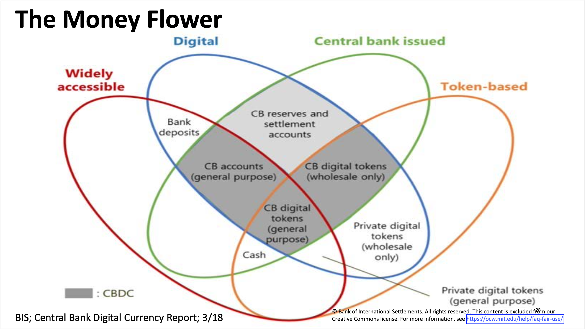
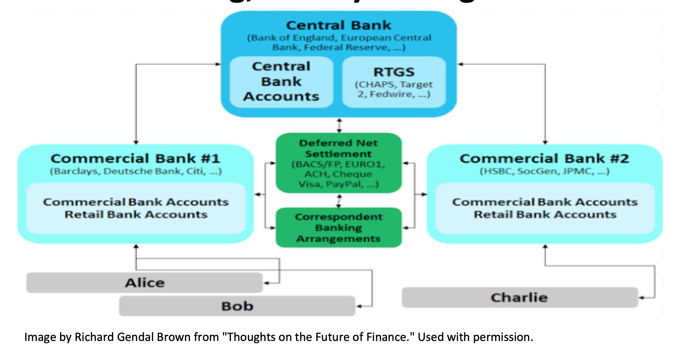
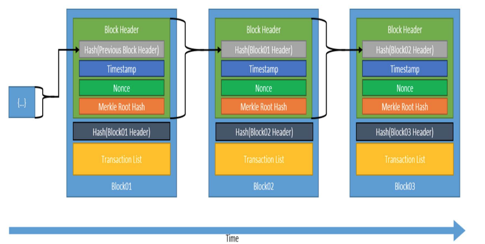
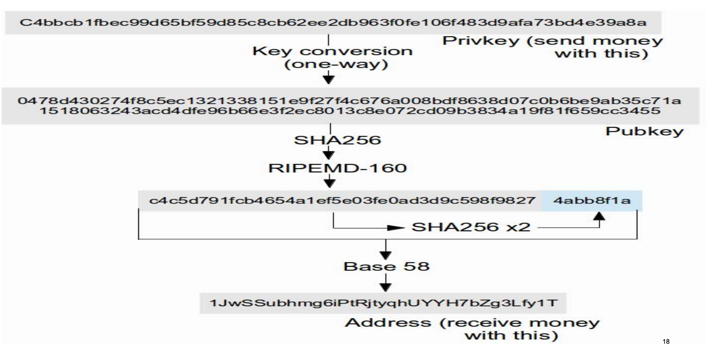

| 作者 | 版本号 | 时间 | 内容 |
| :--- | :--- | :--- | :--- |
| Coordinate35 | v1.0.0 | 2025-06-29 | 创建 |

# 区块链与货币架构总结

在这这篇文档中，会记录区块链与货币之间的概念与关系。

内容来自于 MIT 课程《[区块链与货币](https://ocw.mit.edu/courses/15-s12-blockchain-and-money-fall-2018/download/)》的总结。

# 概念

## 分类账(ledgers)

会计系统中的核心账簿(principal recordings of accounts)，用于分类记录所有经济业务引起的财务变动。它按照会计科目（如现金、应收账款、应付账款等）分类汇总，是生成财务报表的基础. 

分类账记录了：
* 经济活动
* 财务关系

在区块链的世界中，有：
* 余额分类账(balance ledgers)
* 交易分类账(transaction ledgers)

其他分类:
* 按层级结构分：
  * 总分类账(general ledgers)。比如记录应收账款总账有多少
  * 辅助分类账(supporting ledgers)。比如记录应收账款的明细
  * 单分类账(single ledgers). 对应单式记账法，仅记录资金流向（收入或支出）
  * 双分类账(double ledgers). 对应复式记账法。每笔交易同时记录借方和贷方，保持平衡。

好的分类账的特征
* 一致性、不可变性
* 标有确切时间戳
* 明确的所有者
* 准确性
* 带有交易的描述，可理解
* 完整性，没有遗漏。
	
## 支付系统

其实就是追加和记录分类账变化的一种方式。两方账本，一方上升，一方下降。

## 法定货币

* 有社会和经济的共识
* 表现为中央银行负债和商业银行存款
* 依赖集成了分类账体系的部分银行准备金体系运行。
* 可以用来交税
* 不管是公共债务还是私人债务，债权人都需要接受纸币和硬币作为债务偿还的合法手段
* 存在特殊的税收待遇

备注：
* 准备金制度：
  * 银行只需保留部分存款作为准备金（如10%），其余可贷出。
  * 贷款会创造新存款，形成货币乘数效应。

货币的功能
1. 交易媒介
2. 价值存储
3. 价值尺度

货币的特征：
1. 耐久
2. 可移动
3. 可分割
4. 均一性（同面额货币的物理/数字形态完全一致）以及可替代性（任意单位货币可相互替换且价值等同）。
5. 可接受
6. 稳定性（有限的供给，难造假）

货币的设计：
1. Token vs Acount Based
2. 物理 vs 数字
3. 私人发行 vs 中央银行发行
4. widely accessible vs wholesale(批发货币最大的形式是中央银行的准备金)

货币花：

早期数字货币失败的原因：
1. 商户接受度不足
2. 依赖中央权威（中心化）
3. 被重复使用(双重消费)的问题 
4. 没有形成对什么是分类账的共识

当前数字应用遗留的问题：如何在没有中央授权的情况下资金同等转移

## 中央银行，钱，分类账的关系

## 区块链

是一个标有时间戳的，只能追加的日志。每一条日志其实就是区块链上的一个块。

这些日志构成了一个可审计的数据库。安全性通过加密保证：
1. 哈希函数保证了完整性和防篡改
2. 数字签名保证许可
最终达成共识

通过分布式共识协议，用于决定谁可以修改数据库（追加日志）。

## 加密哈希函数

通用属性：
1. 一个输入对应一个固定大小的输出
2. 同样的数据有同样的输出
3. 计算成本低

加密属性：
1. 原相抵抗：从输出反向得到输入是不可行的（不是不可能，比如 md5）
2. 碰撞抵抗：找到两个输入得到相同的输出是不可行的
3. 雪崩效应：稍微改动一小部分输入，得到的输出会大幅度不同
4. 拼图不友好：知道输出和一部分输入依然很难得到剩余的输入

比特币使用的哈希函数：
1. 块头部 和 Merkle 树：SHA256
2. 地址：SHA256 和 RIPEMD160

## 非对成加密和数字签名

数字签名算法：
1. 密钥对：通过随机数，生成一个私钥，再根据私钥生成一个公钥，形成密钥对。用户保留私钥，公开公钥匙
2. 签名：使用私钥以及要加密的数据生成一个签名
3. 验证：通过公钥，可以验证一条消息是不是从密钥对的私钥加密出来的

特性：
1. 从公钥得到私钥是基本不可行的
2. 所有的有效的签名都可以被验证
3. 伪造签名是不可行的

比特币使用的数字签名函数： Elliptic Curve Digital Signature Algorithm(EDCSA).. y2=x3+7

## 比特币

比特币其实就是一个使用区块链的记账系统。结构如下:

他是一条区块链，链上每一个节点都按时间顺序进行链接，每一个区块上都记录了交易记录。因此从头开始计算到结尾就是当前的所有交易结果。
每一个区块分为三部分：
1. 头部。记录内容：
   1. 前一个节点的头部哈希结果
   2. 时间戳
   3. 随机数（nonce）
   4. Merkle Root Hash。
2. 当前节点头部的哈希结果
3. 数据：存储的是一个交易列表。

### 节点间如何串起来的

当前节点记录了上一个节点的头部哈希结果，而每个节点也记录了自己头部的哈希结果，就能对应起来

### Merkle Root Hash 是什么

当前节点的所有交易详情的摘要。通过 merkle tree 生成。merkle tree 是一颗二叉树，生成规则如下：

每一个 Data 其实就是一笔交易。不断的将子节点哈希合并，最终得到整个节点的哈希

### 每一笔交易是怎么确定的

交易总是两个账号进行交易(转账)。在区块链中，地址（Bitcoin Address） 就是账号。

每一个用户都会生成一个公私钥对，Bitcoin Address 是通过共钥哈希生成的。私钥、公钥、账号关系如图：

一个用户要发起转账时，用自己的私钥，将自己的转账内容加密并生成一个数字签名。因为私钥自己保存，所以没有人能伪造他的支出。所有人都可以使用共钥来验证这个交易的合法性，并解密得到数值。

# 关系

# 一些结论：

1. 钱只是一种社会和经济的共识，主权货币是发展至今主流的一种。
2. 主权货币同样有挑战与不稳定性(货币政策导致的贬值)
3. 分类账是记录经济活动和金融关系的一种方法
4. 中央银行和金融机构是建立在一系列分类账的基础上的
5. 我们当前处于数字货币时代，在加密数字货币上已经做了很多努力
6. 中本聪的比特币：是一个点对点的电子现金系统。相关的区块链技术是建立在长历史的钱和分类账基础上的。[原始论文](https://bitcoin.org/bitcoin.pdf)
