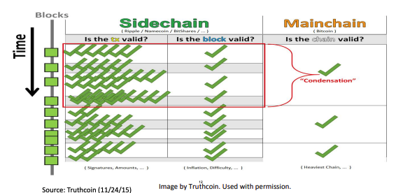
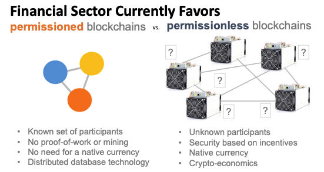

| 作者 | 版本号 | 时间 | 内容 |
| :--- | :--- | :--- | :--- |
| Coordinate35 | v1.0.0 | 2025-06-29 | 创建 |

# 区块链与货币架构总结

在这这篇文档中，会记录区块链与货币之间的概念与关系。

内容来自于 MIT 课程《[区块链与货币](https://ocw.mit.edu/courses/15-s12-blockchain-and-money-fall-2018/download/)》的总结。

# 概念

## 分类账(ledgers)

会计系统中的核心账簿(principal recordings of accounts)，用于分类记录所有经济业务引起的财务变动。它按照会计科目（如现金、应收账款、应付账款等）分类汇总，是生成财务报表的基础. 

分类账记录了：
* 经济活动
* 财务关系

在区块链的世界中，有：
* 余额分类账(balance ledgers).记录结果不记录过程
* 交易分类账(transaction ledgers). 记录过程不记录结果

其他分类:
* 按层级结构分：
  * 总分类账(general ledgers)。比如记录应收账款总账有多少
  * 辅助分类账(supporting ledgers)。比如记录应收账款的明细
  * 单分类账(single ledgers). 对应单式记账法，仅记录资金流向（收入或支出）
  * 双分类账(double ledgers). 对应复式记账法。每笔交易同时记录借方和贷方，保持平衡。

好的分类账的特征
* 一致性、不可变性
* 标有确切时间戳
* 明确的所有者
* 准确性
* 带有交易的描述，可理解
* 完整性，没有遗漏。
	
## 支付系统

其实就是追加和记录分类账变化的一种方式。两方账本，一方上升，一方下降。

## 法定货币

* 有社会和经济的共识
* 表现为中央银行负债和商业银行存款
* 依赖集成了分类账体系的部分银行准备金体系运行。
* 可以用来交税
* 不管是公共债务还是私人债务，债权人都需要接受纸币和硬币作为债务偿还的合法手段
* 存在特殊的税收待遇

备注：
* 准备金制度：
  * 银行只需保留部分存款作为准备金（如10%），其余可贷出。
  * 贷款会创造新存款，形成货币乘数效应。

货币的功能
1. 交易媒介
2. 价值存储
3. 价值尺度

货币的特征：
1. 耐久
2. 可移动
3. 可分割
4. 均一性（同面额货币的物理/数字形态完全一致）以及可替代性（任意单位货币可相互替换且价值等同）。
5. 可接受
6. 稳定性（有限的供给，难造假）

货币的设计：
1. Token vs Acount Based
2. 物理 vs 数字
3. 私人发行 vs 中央银行发行
4. widely accessible vs wholesale(批发货币最大的形式是中央银行的准备金)

货币花：

早期数字货币失败的原因：
1. 商户接受度不足
2. 依赖中央权威（中心化）
3. 被重复使用(双重消费)的问题 
4. 没有形成对什么是分类账的共识

当前数字应用遗留的问题：如何在没有中央授权的情况下资金同等转移

## 中央银行，钱，分类账的关系

## 区块链

是一个标有时间戳的，只能追加的日志。每一条日志其实就是区块链上的一个块。

这些日志构成了一个可审计的数据库。安全性通过加密保证：
1. 哈希函数保证了完整性和防篡改
2. 数字签名保证许可
最终达成共识

通过分布式共识协议，用于决定谁可以修改数据库（追加日志）。

## 加密哈希函数

通用属性：
1. 一个输入对应一个固定大小的输出
2. 同样的数据有同样的输出
3. 计算成本低

加密属性：
1. 原相抵抗：从输出反向得到输入是不可行的（不是不可能，比如 md5）
2. 碰撞抵抗：找到两个输入得到相同的输出是不可行的
3. 雪崩效应：稍微改动一小部分输入，得到的输出会大幅度不同
4. 拼图不友好：知道输出和一部分输入依然很难得到剩余的输入

比特币使用的哈希函数：
1. 块头部 和 Merkle 树：SHA256
2. 地址：SHA256 和 RIPEMD160

## 非对成加密和数字签名

数字签名算法：
1. 密钥对：通过随机数，生成一个私钥，再根据私钥生成一个公钥，形成密钥对。用户保留私钥，公开公钥匙
2. 签名：使用私钥以及要加密的数据生成一个签名
3. 验证：通过公钥，可以验证一条消息是不是从密钥对的私钥加密出来的

特性：
1. 从公钥得到私钥是基本不可行的
2. 所有的有效的签名都可以被验证
3. 伪造签名是不可行的

比特币使用的数字签名函数： Elliptic Curve Digital Signature Algorithm(EDCSA).. y2=x3+7

## 比特币

比特币其实就是一个使用区块链的记账系统。结构如下:

他是一条区块链，链上每一个区块都按时间顺序进行链接，每一个区块上都记录了交易记录。因此从头开始计算到结尾就是当前的所有交易结果。
每一个区块分为三部分：
1. 头部。记录内容：
   1. 前一个节点的头部哈希结果
   2. 时间戳
   3. 随机数（nonce）
   4. Merkle Root Hash。
2. 当前节点头部的哈希结果
3. 数据：存储的是一个交易列表。

### 区块间如何串起来的

当前区块记录了上一个节点的头部哈希结果，而每个区块也记录了自己头部的哈希结果，就能对应起来

### Merkle Root Hash 是什么

当前区块的所有交易详情的摘要。通过 merkle tree 生成。merkle tree 是一颗二叉树，生成规则如下：

每一个 Data 其实就是一笔交易。不断的将子节点哈希合并，最终得到整个节点的哈希

### 每一笔交易是怎么确定的

交易总是两个账号进行交易(转账)。在区块链中，地址（Bitcoin Address） 就是账号。

每一个用户都会生成一个公私钥对，Bitcoin Address 是通过共钥哈希生成的。私钥、公钥、账号关系如图：

一个用户要发起转账时，用自己的私钥，将自己的转账内容加密并生成一个数字签名。因为私钥自己保存，所以没有人能伪造他的支出。所有人都可以使用共钥来验证这个交易的合法性，并解密得到数值。

### 节点（矿工）是什么

节点和矿工是用来写入记账的计算机服务器。每一个节点存有完整的区块链（即全量的交易细节）。

### 交易记录是怎么被写入的

每一个比特币持有者会发起一次转账，这个转账请求会被广播到所有矿工中。

每一个矿工会尝试将他收到的交易请求打包在一个新的区块中。打包过程其实就是一直计算知道达到“工作量证明”的要求。打包完成后，会把这个区块广播到所有矿工中。

所有矿工接受到别的矿工同步过来的链后，会对新过来的链进行合法性校验，并和本地的进行一次比较，选择“工作量证明”最大的那个链（也就是交易数量最多的）。然后基于新的链重新打包转账。

当一笔交易被大多数节点采纳的时候，这笔交易就真正成真了.

需要注意的是，被大多数节点采纳，需要时间。此时如果有攻击者，就需要考虑这段时间攻击节点最上他的可能性。当追上他的可能行非常小的时候，就是他被大多数节点采纳的时候。

为了保证每一笔交易都是合法的（转出方确实有这么多钱），当前交易需要账号的上一笔交易的 id， 这样才能完全串起来。一笔实际的交易如下：

 ------------------------- --------------------------
| input                   | output                   |
 ------------------------- --------------------------
| previous transaction id | value                    |
| index                   | public key(bitcoin addr) |
| signature               |                          |
 ------------------------- --------------------------
|                    lock time                       |
 ----------------------------------------------------

说明：
1. previous transaction id  和 index 唯一标识了上一次的 output
2. lock time 就是预期交易的时间

### UTXO

UTXO 是（unspent transaction output） 的缩写，就是当前还没被花出去的币。
基于我们上述交易记录的写入过程，可以知道当前的 UTXO(还没花出去的货币)都分散在整个链条的各个部分。为了能加速找到这些记录（用于验证），比特币把这些节点的索引都存在了中心化地存在了一个 level db 中， 叫 "chainstate"。

### "工作量证明"是什么

每个矿工在生产出一个区块的前提，就是达到一定的计算量要求。
矿工每一次计算会首先生成一个随机数，基于这个随机数做哈希.
系统整体会提出一个要求：计算出来的哈希值必须以 n 个零开头。
可见：如果 n 的数值越大，计算的次数要求就越多，计算量（工作量）要求就越大。

n 的数值如何确定：
1. 系统整体希望是每 10 分钟产出一个区块:
   1. 如果矿工越来越多，算力越来越强，找到有效哈希的速度就会变快，出块时间会缩短。
   2. 如果矿工离开，算力下降，找到有效哈希的速度就会变慢，出块时间会延长。
2. 系统根据当前产出区块的速度，来平衡区块链网络中矿工算力的增减。具体机制是每产生 2016 个区块，调整一次 n 的大小。新难度目标 = 旧难度目标 * (实际花费时间 / 20160分钟)。为什么是 20169 分钟：如果 10 分钟产出一个区块，则 2016 个区块理论要 20160 分钟

矿工是如何获得 n 的大小：矿工会获取得到其他矿工所持有的链，并取最长的链作为基准。得到基准链之后，用上一个 2016 个区块周期进行计算 n 值的大小。这样所有矿工的工作量难度是必然一样的。

推测：为了避免被攻击，网络多数矿工必须是官方的实现？否则就会有最长的链被攻击者写入。

### 为什么矿工愿意工作(货币的发行机制与中介费)

为了做记账的工作，矿工的所有者要交服务器费或者电费。之所以他愿意干这个活，主要是有两个收入来源：
在区块链中，一个区块是可以记录多笔交易的。

1. 每当产生一个新的区块的时候，会触发货币的发行机制。新发行的货币归属于矿工。
2. 没产生新的区块的时候，转账的发起者可以承诺过给矿工一定的手续费，矿工会优先接受手续费高的交易，也可以拒绝手续费低的交易。

每一个发行多少货币：
1. 一开始会约定货币的总量。比如 n。这保证了货币不会通货膨胀
2. 第 k 个区块被发觉出来的时候，会发行 n/2^k 枚货币，通过等比数列求和我们知道总量极限就是 n

矿工越少，工作量证明越小，计算成本越低。投入的临界点在于计算成本和收入的平衡。

考虑对于小额的交易，可能会由于小费过低而没有矿工愿意投入，矿工可以将多笔交易合并到一次计算（可以认为多个输入和输出）

疑问：
1. 可以预见：随着时间的推移，发行货币所得到的收入可以忽略不计了。矿工唯一的收入来源于小费。如果收入过低，即使有利润，可能也懒得干这个事情？是这样
2. 货币早期，是否对于对于小额交易非常不友好？是这样，通过市场平衡
3. 如果后期只有部分大佬拥有矿工，是否已经不再是去中心化，是否攻击会很容易。实际上机房特别多。控制机房的人呢？

推论:
1. 还有一个可能的点是：对于持有该币多的持有者，为了保证以下方面他愿意投入矿工
   1. 他自己的钱能花出去
   2. 让别人相信这个钱能被花出去，愿意接受他的钱

### 记账系统当前的状况依赖全量历史记录，怎么存的下？（无限记录假设）

思路：
1. 明细只需要存最近的。
2. 只需要能有数据证明最近的明细是对的就行。

实现： 区块链的每一个区块只需要记录当前区块的: 前一个节点的地址，随机数，和当前节点所有交易记录的 merkle tree.

最近明细的正确性通过前面提到的 merkle tree 来记录，merkle tree 的消耗本身不大：
1. 每一个区块的头大概是 80 字节, 假设每 10 分钟产生一个区块，那么一年大概使用 4.2M。
2. 2008 年普遍销售 2C4G 的机器，按照摩尔定律，每年的内存可以增长 1.2G。
2. 这个增长速率远超 4.2M, 所以一台机器上承载所有交易记录是可行的。

疑问：
1. 这个推理过程依赖了不可靠的摩尔定律，是否靠谱。其实现在存的就非常大了
2. 如果区块的产生是通过时间约束，如果交易量大，则必然导致一个区块的空间使用大，单机是否能存下(需要测算)？几十 TB 级别
3. 链表是无限延长的，每一笔交易都需要验证当前区块链全链的合法性，是否到了某个时间点验证工作本身的计算量过大而无法接受？

### 比特币的安全性假设

论文观点：

> 一个攻击者必须要用比所有诚实的节点更高的算力，才能区块链的头部开始逐个节点开始修改所有的交易记录。当他他拥有比所有诚实的节点更高的算力，那他有两种选择：
> 1. 修改所有交易记录
> 2. 挖出来一个新的区块，获得增量比特币。
> 这个时候，他会发现途径二会更划算。这保证了所有算力都是诚实的。

疑问：
1. 这个观点给予供给者的目的是为了获取更多的钱。如果一个攻击者的目的不是为了钱，就是为了修改交易记录，那这个是否就是可能的？是的，前提就是超过全网 51% 的算力
2. 怎么从数学上证明这个结论？随着时间推移，挖出来一个新的区块可能根本不赚钱，是否这个推论还成立？

### 攻击者追上诚实节点的可能性

根据前面的推论，算力越多，得到下一个区块的概率越大。可分为两个阵营：
1. 诚实节点得到下一个区块的概率为 p
2. 攻击节点得到下一个区块的概率为 q

则攻击者从落后第 z 个区块开始赶上的概率为：
qz = (q/p)^z

为什么可以类比为赌徒破产问题：
1. 网络中一直都会有诚实链陪攻击者玩下去，相当于拥有无限本金的庄家
2. 攻击者的算力有限（要投入成本？）本金就是落后的数量。

攻击者的挖矿特征：
1. 独立性。每次挖矿互不干扰
2. 随机性。算出来的概率只取决于算力
3. 低概率性。任意一个计算时间算出工作量证明的可能性极地
4. 恒定速率。攻击者的算力稳定，即攻击者挖出来一个区块的速度 lambda 是恒定
因此攻击者进展服从泊松分布。期望值：
lambda = z*q/p

则赶上的概率=可能获得每一次的进展的泊松密度*从他那一点上赶上的概率.

具体计算与数值见论文，结论是概率随着 z 的增加指数递减。

### 交易都是公开的，怎么保证隐私

1. 转账的对象是一个地址，这个地址与个人信息的对应关系不是公开的。
2. 没完成一笔转账就，生成一个新的密钥对，方式通过相同的公钥进行信息串联。

有一些信息是不可避免公开：一次交易涉及多个输入和输出合并的时候

## 智能合约

智能合约是数字形式的一系列承诺。它包含了参与者应该如何行动的协议.
他可能不智能(只是一系列自动化)，也可能不是合约。

智能合约属于余额分类账。（对应的，比特币是交易分类账）.

以太坊是其中一个智能合约平台:
1. 允许编写图灵完备的程序(可以支持多语言)
2. Merkle 树上记录了交易、状态、存储、收据.
3. 由于是余额分类账，因此记录了以账号为基础的余额
4. 14秒产生一个区块
5. 使用 pow 进行共识。
6. 哈希函数： Ethash 
7. 发行的是以太币
8. 使用 GPU 进行挖矿
9. 一个区块发行3个以太币.有机制更新，可以实现发行数量的修改. 导致通货膨胀会更快.

其他类似的智能合约平台有： EOS, NEO, Ethereum Classic, LISK, Stratis

### 法律相关

合约（contract）: promise or performance given in exchange for promise or performance。使用承诺或行为换取承诺或行为。

举例：自动售货机。把1块钱硬币投进去，换取吐出来一瓶饮料。
智能合约的价值在于自动化（不需要人去执行），更低的交易成本.

关于智能合约的四点:
1. 合同中会有隐含条款：比如自动售货机出来的饮料能安全引用
2. 隐藏条款所在的背景。 如果隐藏条款是在法律系统的范围内生效的，这意味着法律系统要从你的合约执行过程中获得收益：因为合约的执行是强依赖法律系统中的暴力机关保证执行的，这些机制需要赚取利润才有动力执行。具体的说，法律系统会关注
   1. 合约的类型
   2. 合约的条款
   3. 合约的效果
   4. 合约的状态
3. 合同法的目的不在于消除风险，而是在于分配风险。
4. 合同需要清晰，但是这个很难。因为在攥写合约条款的时候，你必须分配风险：比如考虑清楚某种情况可能会有百分之多少的概率发生，从何确定如果发生了要赔付多少（风险溢价）。但是把这个定义清楚的成本可能会比合同本身的价值更高。制定合同的双方其实就是在这种模糊地带利用信息查做博弈。这种类型的合同区块链并不能带来价值.这部分是人的价值。

区块链的价值在于：
1. 可以利用区块链的不可篡改行，使用代码把合约的条款写死（比如各种情况下如果发生了，要做什么），并且一旦发生了自动化执行。比如航班延误的自动赔款。
2. 发达的国家和地区可以通过完善的基础设置建设（法律系统），来保证合约的执行。但是如果是在欠发达地区，基础设施本身不完善，合同没有外部的强制力保证执行，那么区块链是一个比较好的方式。
3. 第二点虽然很理想，现实中很多场景并没有完成技术化，能自动化的场景会比较有限。

## 区块链相关的技术挑战

权衡和取舍的关键点：
1. 越是中心化：安全性越低，有单点故障
2. 越是分布式：安全性和扩展性越高，但是调整和治理的难度会越高。注意：扩展性的含义与可伸缩性相似：规模的扩大难度。

### 性能、扩展性与效率

不可能三角：扩展性、去中心化、安全性。
几个常见的数字：
1. 吞吐量
   1. 比特币：7-10 交易/秒
   2. 以太坊：20 交易/秒
   3. Visa: 24000 交易/秒
   4. DTCC：1000000 交易/秒
2. 工作量证明的能量消耗。比特币的能量消耗估计是 200000000 Kwh/天，相当于 680 万美国家庭的用电量，0.33%全世界能量消耗，奥地利的国家电力

可能的解决电力问题的方案：
1. 主旁链分离。旁链记录大量细节，只有少量汇总到主链。
2. 分片。类比中央银行，并不是所有的记录都直接记录到中央银行中， 比如不同的银行记录各自的再汇总
3. 分层。比如"闪电网络（lightning network）"：把大量高频、小额的交易从主链搬到链下进行。从而解决比特币的记账成本比交易总额还高的问题。
4. 支付信道

可能的共识协议替代方案：
* 思路：对下一个区块的节点增加随机选择或者代理选择机制。也许可以引入一些其他机制来验证节点的有效性。
* 随机选择有可能有以下几种做法：
  * Proof of Stake(POS). 通过抵押现金的方式
  * Proof of Activity. 混合 POW 和 POS
  * Proof of Burn. 通过销毁一部分加密货币来获得记账权。
  * Proof of Capacity(Storage or Space) 通过硬件空间来决定记账权
* 代理选择可能的做法：
  * DASH. 基于 POW 建立的分层主节点网络
  * NEO. 使用 Professional Nodes 的代理协议

### 隐私和安全性

相关的问题：
* 加密地址带来的矛盾：
  * 监管需要交易更透明
  * 金融机构和使用者需要更多的隐私
* 隐私货币可能会助长非法活动
  * Coin: Dash, Monero, Zcash
  * Mechanisms: Mixers, Tumblers
* 私钥的托管、生成和存储的网络安全挑战。
  * 传统银行忘记密码会有后门让你更换密码。但是私钥丢了就真丢了
  
可能的解决方案：
1. 零知识证明
2. 佩德森承诺

### 可交互性

问题：
* 区块链应用和现存数据库、基础设施和技术交互
* 提高了将资产和信息迁移到区块链是的"信任成本"

可能的解决方案：
1. 启用去中心化机制（包括旁链或"第0层"）来实现数据传输

同时，还需要更多的工作解决从老的区块链到新的区块链技术的无缝迁移

### 治理和集体行为（最困难的部分）

治理：主要是在分布式的场景下，很难解决软件的升级（特别是哈希函数的更新，比如某个哈希函数被证明不再安全。）的兼容性问题，会带来数据的硬分叉: 没有更新的部分没办法验证新的区块，意味着这部分没办法更新到最长的链

集体行为：主要就是冷启动的问题。需要很多人用，区块链才有价值；但是得有价值人们才会用. 

同时关于价值，不同的群体有不同的诉求。所以不同的场景会使用不同的链：

### 商业用例

如何真正赚到钱

### 公共政策和法律框架

总体思路：需要确定应该把加密资产以及相关的行为活动与现有的体系进行隔离(isolate)还是调整(regulate)、亦或是融入(integrate)

#### 抵御违法行为

当前的状态（2020）： 
1. 世界各国有对于政策制定有一定的共识要抵御违法行为。
2. 但是具体操作上，表现出很大不同（比较差）。

问题：
1. 从税收目的视角看，如何看待比特币？
   1. 比如应该是定义为货币还是财产。美国财政部分为两派，一派称比特币为"财产"（property）, 一派称为"虚拟货币"(virtual currency), 其中的区别就在于，是否希望它需要受到 《银行保密法(Bank Secrecy Act)》的约束。
   2. 不同的场景下，应该怎么收税？比如挖矿、交易、以及发生分叉
   3. 怎么上报大笔交易？个人？中介、交易所、代笔发行机构？赚钱了要交多少税（境内）？把钱放了哪里有没有依法申报（境外）？
2. 如何将比特币相关的内容适配当前的法律。比如银行保密法中的 金钱转移法（Money Transmission Laws），怎么反洗钱和切断恐怖主义资金链（AML, CTF）
3. 挑战：
   1. 匿名地址带来的追踪问题
   2. 隐私币和混币器（Privacy Coins, Mixers/Tumblers）带来的追踪问题
   3. 合规和上报。
   4. 加密货币与加密货币之间的交易会更难监管（没有类似商业银行的中介，意味着加密货币独立于现有的系统）
   5. 去中心化交易。
   6. 暗网交易
   7. 国家竞争带来的相关行为

#### 维护金融稳定

当前的状态（2020）：
1. 世界各国对于监督的诉求达成了共识。
2. 但是对于风险级别的认知有比较大的不同

挑战：
1. 金融稳定委员会（FSB, Financial Stability Board）规模还比较小。主要是因为总体金融规模还不够大
2. 资本管制的国家更专注维持稳定（保证法定货币的价值）。比如我国为什么禁止挖矿：因为挖矿其实是把人民币转换成电力，再把电力转成加密货币，再把加密货币转成美元，从而实现资本绕开管制外逃（所以有些地方官员允许）。
3. 其他国家的不同问题：
   1. 加密杠杆加速系统性风险。
   2. 区块链基础设施要保证稳定运行。澳大利亚用于股票清算和结算。
   3. 中央银行数字货币(CBDC)&稳定币. 关注点：
	  1. 经济动荡时，资金从商业银行到 CBDC 转移带来的挤兑风险
	  2. 商业银行存款和融资模式的改变
	  3. 对信贷分配和整体经济造成影响：银行没钱向企业和个人发放贷款
	  4. 对货币政策的实施和传导有影响
	  5. 新的支付基础设施的稳定性成熟度有挑战。
	  6. 需要防范非法活动（能监管）

#### 保护大众投资者

当前的状态（2020）：
1. 世界各国的观点百花齐放。比如美国认为加密货币是需要被保护的证券，而其他很多国家是倾向于让子弹飞一下。主要还是应该根据对经济体量的影响进行决策。
2. 日本正在持续的迭代其交易规范，主要是为了避免黑客事件发生。
3. 美国和加拿大寻求将 ICO（首次发行货币，Initial Coin Offering） 带入安全法律

挑战：
* 加密市场极易受到欺诈、骗局和市场操纵的影响。比如托管安排——交易所与钱包，可能会被利用。
* 定义——证券、商品还是衍生品？
* 追踪加密资产的实益所有权
* 对不合规的ICO（首次代币发行）及交易所的整改
* 个人数据隐私

保护投资者有益于夯实资本市场信心，从而经济发展，这样不管是投资者还是消费者都获益。
在加密货币领域的监管难题在于：无法界定参与者是投资者还是消费者。加密货币的发行方认为这是商品，不是证券，因此不适用于证券法。最终美国的监管机构还是认为加密货币是属于证券，因此对于加密货币的购买方需要看作为投资者进行处理。

对投资者的保障主要还是需要基于：
* 投资者能从发行方处获得充分、公正的信息披露
* 禁止欺诈及欺骗性销售行为
* 促进二级市场发展，确保价格透明与反操纵
* 顾问的利益冲突需被披露并最小化

以美国为例：如何判断一笔交易是否构成投资合同？使用"豪威测试(Howey Test)"。内容：
1. 投资者是否投入了现金或其他资产？
2. 投资者的资金是否汇集在一起，命运与发行方或其他投资者捆绑？
3. 投资者是否期望通过投资获得回报？
4. 这些利润是否主要来自发行方或第三方的管理和努力？
如果某个安排同时满足以上四个条件，它就会被认定为“投资合同”，从而被纳入证券的范畴，受到美国证券交易委员会（SEC）的严格监管

注意点：
1. 动态变化的可能性：一个代币的法律身份并非一成不变。例如，一个项目在初期高度依赖团队努力，满足豪威测试，是证券。但如果未来网络变得足够去中心化（如以太坊），持有者的收益不再主要依赖某个核心团队，它可能就不再是证券了
2. 由于存在边界的模糊性，因此法律的适用性，服从"鸭子测试"

加密货币发行的豪森测试具像化：
发行加密货币是用于投资与消费的众筹
* 募资用于构建网络
* 代币通常在具备实际功能前发行
* 开发过程虽开源，但高度中心化
* 发起方为自己分配"预挖"代币
* 代币具备可互换性与可转让性
* 通过预设"货币政策"制造稀缺性
* 购买者预期通过代币增值获利

政策制定的过程: 收集消息(准确的描述信息) -> 形成足够的团体（政治联盟，平衡各方的利益） -> 分析问题 -> 形成政策

补充一些关于现实的描述：
* 首次代币发行（ICO）——需要投资者保护的投资计划
  * "投资型"与"实用型"代币的虚假区分
  * 多数ICO目前游离于投资者保护法之外
  * ICO欺诈与骗局猖獗——估计比例高达25%甚至81%
  * 超70%的ICO代币已贬值
  * 投资者保护框架超越消费者保护法
  * 经济增长与发行方均受益于投资者信心
* 加密货币交易所
  * 是实施公共政策和灌输信心的关键门户
  * 承担了绝大多数加密二级市场交易
  * 拥有超过3000万直接会员
  * 缺乏经纪接入或有意义的市场诚信规则
  * 托管钱包是黑客的蜜罐
  * 去中心化交易所带来新机遇与政策风险
* 国际监管套利。Malta 和 Belize、Seychelles 是现在交易资本量最雄厚的地方，但这不是真的，都是从韩国、香港等亚洲地方跑过去重建的.

# 关系

# 一些结论：

1. 钱只是一种社会和经济的共识，主权货币是发展至今主流的一种。
2. 主权货币同样有挑战与不稳定性(货币政策导致的贬值)
3. 分类账是记录经济活动和金融关系的一种方法
4. 中央银行和金融机构是建立在一系列分类账的基础上的
5. 我们当前处于数字货币时代，在加密数字货币上已经做了很多努力
6. 中本聪的比特币：是一个点对点的电子现金系统。相关的区块链技术是建立在长历史的钱和分类账基础上的。[原始论文](https://bitcoin.org/bitcoin.pdf)
