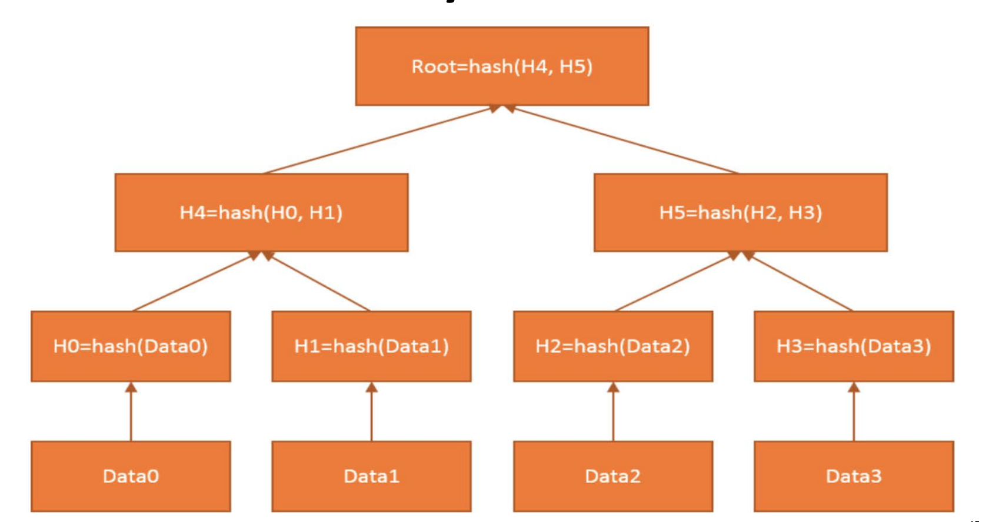

| 作者 | 版本号 | 时间 | 内容 |
| :--- | :--- | :--- | :--- |
| Coordinate35 | v1.0.0 | 2025-06-29 | 创建 |

# 区块链与货币架构总结

在这这篇文档中，会记录区块链与货币之间的概念与关系。

内容来自于 MIT 课程《[区块链与货币](https://ocw.mit.edu/courses/15-s12-blockchain-and-money-fall-2018/download/)》的总结。

# 概念

## 分类账(ledgers)

会计系统中的核心账簿(principal recordings of accounts)，用于分类记录所有经济业务引起的财务变动。它按照会计科目（如现金、应收账款、应付账款等）分类汇总，是生成财务报表的基础. 

分类账记录了：
* 经济活动
* 财务关系

在区块链的世界中，有：
* 余额分类账(balance ledgers)
* 交易分类账(transaction ledgers)

其他分类:
* 按层级结构分：
  * 总分类账(general ledgers)。比如记录应收账款总账有多少
  * 辅助分类账(supporting ledgers)。比如记录应收账款的明细
  * 单分类账(single ledgers). 对应单式记账法，仅记录资金流向（收入或支出）
  * 双分类账(double ledgers). 对应复式记账法。每笔交易同时记录借方和贷方，保持平衡。

好的分类账的特征
* 一致性、不可变性
* 标有确切时间戳
* 明确的所有者
* 准确性
* 带有交易的描述，可理解
* 完整性，没有遗漏。
	
## 支付系统

其实就是追加和记录分类账变化的一种方式。两方账本，一方上升，一方下降。

## 法定货币

* 有社会和经济的共识
* 表现为中央银行负债和商业银行存款
* 依赖集成了分类账体系的部分银行准备金体系运行。
* 可以用来交税
* 不管是公共债务还是私人债务，债权人都需要接受纸币和硬币作为债务偿还的合法手段
* 存在特殊的税收待遇

备注：
* 准备金制度：
  * 银行只需保留部分存款作为准备金（如10%），其余可贷出。
  * 贷款会创造新存款，形成货币乘数效应。

货币的功能
1. 交易媒介
2. 价值存储
3. 价值尺度

货币的特征：
1. 耐久
2. 可移动
3. 可分割
4. 均一性（同面额货币的物理/数字形态完全一致）以及可替代性（任意单位货币可相互替换且价值等同）。
5. 可接受
6. 稳定性（有限的供给，难造假）

货币的设计：
1. Token vs Acount Based
2. 物理 vs 数字
3. 私人发行 vs 中央银行发行
4. widely accessible vs wholesale(批发货币最大的形式是中央银行的准备金)

货币花：

早期数字货币失败的原因：
1. 商户接受度不足
2. 依赖中央权威（中心化）
3. 被重复使用(双重消费)的问题 
4. 没有形成对什么是分类账的共识

当前数字应用遗留的问题：如何在没有中央授权的情况下资金同等转移

## 中央银行，钱，分类账的关系

## 区块链

是一个标有时间戳的，只能追加的日志。每一条日志其实就是区块链上的一个块。

这些日志构成了一个可审计的数据库。安全性通过加密保证：
1. 哈希函数保证了完整性和防篡改
2. 数字签名保证许可
最终达成共识

通过分布式共识协议，用于决定谁可以修改数据库（追加日志）。

## 加密哈希函数

通用属性：
1. 一个输入对应一个固定大小的输出
2. 同样的数据有同样的输出
3. 计算成本低

加密属性：
1. 原相抵抗：从输出反向得到输入是不可行的（不是不可能，比如 md5）
2. 碰撞抵抗：找到两个输入得到相同的输出是不可行的
3. 雪崩效应：稍微改动一小部分输入，得到的输出会大幅度不同
4. 拼图不友好：知道输出和一部分输入依然很难得到剩余的输入

比特币使用的哈希函数：
1. 块头部 和 Merkle 树：SHA256
2. 地址：SHA256 和 RIPEMD160

## 非对成加密和数字签名

数字签名算法：
1. 密钥对：通过随机数，生成一个私钥，再根据私钥生成一个公钥，形成密钥对。用户保留私钥，公开公钥匙
2. 签名：使用私钥以及要加密的数据生成一个签名
3. 验证：通过公钥，可以验证一条消息是不是从密钥对的私钥加密出来的

特性：
1. 从公钥得到私钥是基本不可行的
2. 所有的有效的签名都可以被验证
3. 伪造签名是不可行的

比特币使用的数字签名函数： Elliptic Curve Digital Signature Algorithm(EDCSA).. y2=x3+7

## 比特币

比特币其实就是一个使用区块链的记账系统。结构如下:

他是一条区块链，链上每一个区块都按时间顺序进行链接，每一个区块上都记录了交易记录。因此从头开始计算到结尾就是当前的所有交易结果。
每一个区块分为三部分：
1. 头部。记录内容：
   1. 前一个节点的头部哈希结果
   2. 时间戳
   3. 随机数（nonce）
   4. Merkle Root Hash。
2. 当前节点头部的哈希结果
3. 数据：存储的是一个交易列表。

### 区块间如何串起来的

当前区块记录了上一个节点的头部哈希结果，而每个区块也记录了自己头部的哈希结果，就能对应起来

### Merkle Root Hash 是什么

当前区块的所有交易详情的摘要。通过 merkle tree 生成。merkle tree 是一颗二叉树，生成规则如下：

每一个 Data 其实就是一笔交易。不断的将子节点哈希合并，最终得到整个节点的哈希

### 每一笔交易是怎么确定的

交易总是两个账号进行交易(转账)。在区块链中，地址（Bitcoin Address） 就是账号。

每一个用户都会生成一个公私钥对，Bitcoin Address 是通过共钥哈希生成的。私钥、公钥、账号关系如图：

一个用户要发起转账时，用自己的私钥，将自己的转账内容加密并生成一个数字签名。因为私钥自己保存，所以没有人能伪造他的支出。所有人都可以使用共钥来验证这个交易的合法性，并解密得到数值。

### 节点（矿工）是什么

节点和矿工是用来写入记账的计算机服务器。每一个节点存有完整的区块链（即全量的交易细节）。

### 交易记录是怎么被写入的

每一个比特币持有者会发起一次转账，这个转账请求会被广播到所有矿工中。

每一个矿工会尝试将他收到的交易请求打包在一个新的区块中。打包过程其实就是一直计算知道达到“工作量证明”的要求。打包完成后，会把这个区块广播到所有矿工中。

所有矿工接受到别的矿工同步过来的链后，会对新过来的链进行合法性校验，并和本地的进行一次比较，选择“工作量证明”最大的那个链（也就是交易数量最多的）。然后基于新的链重新打包转账。

当一笔交易被大多数节点采纳的时候，这笔交易就真正成真了.

需要注意的是，被大多数节点采纳，需要时间。此时如果有攻击者，就需要考虑这段时间攻击节点最上他的可能性。当追上他的可能行非常小的时候，就是他被大多数节点采纳的时候。

### "工作量证明"是什么

每个矿工在生产出一个区块的前提，就是达到一定的计算量要求。
矿工每一次计算会首先生成一个随机数，基于这个随机数做哈希.
系统整体会提出一个要求：计算出来的哈希值必须以 n 个零开头。
可见：如果 n 的数值越大，计算的次数要求就越多，计算量（工作量）要求就越大。

n 的数值如何确定：
1. 系统整体希望是每 10 分钟产出一个区块:
   1. 如果矿工越来越多，算力越来越强，找到有效哈希的速度就会变快，出块时间会缩短。
   2. 如果矿工离开，算力下降，找到有效哈希的速度就会变慢，出块时间会延长。
2. 系统根据当前产出区块的速度，来平衡区块链网络中矿工算力的增减。具体机制是每产生 2016 个区块，调整一次 n 的大小。新难度目标 = 旧难度目标 * (实际花费时间 / 20160分钟)。为什么是 20169 分钟：如果 10 分钟产出一个区块，则 2016 个区块理论要 20160 分钟

矿工是如何获得 n 的大小：矿工会获取得到其他矿工所持有的链，并取最长的链作为基准。得到基准链之后，用上一个 2016 个区块周期进行计算 n 值的大小。这样所有矿工的工作量难度是必然一样的。

推测：为了避免被攻击，网络多数矿工必须是官方的实现？否则就会有最长的链被攻击者写入。

### 为什么矿工愿意工作(货币的发行机制与中介费)

为了做记账的工作，矿工的所有者要交服务器费或者电费。之所以他愿意干这个活，主要是有两个收入来源：
在区块链中，一个区块是可以记录多笔交易的。

1. 每当产生一个新的区块的时候，会触发货币的发行机制。新发行的货币归属于矿工。
2. 没产生新的区块的时候，转账的发起者可以承诺过给矿工一定的手续费，矿工会优先接受手续费高的交易，也可以拒绝手续费低的交易。

每一个发行多少货币：
1. 一开始会约定货币的总量。比如 n。这保证了货币不会通货膨胀
2. 第 k 个区块被发觉出来的时候，会发行 n/2^k 枚货币，通过等比数列求和我们知道总量极限就是 n

矿工越少，工作量证明越小，计算成本越低。投入的临界点在于计算成本和收入的平衡。

考虑对于小额的交易，可能会由于小费过低而没有矿工愿意投入，矿工可以将多笔交易合并到一次计算（可以认为多个输入和输出）

疑问：
1. 可以预见：随着时间的推移，发行货币所得到的收入可以忽略不计了。矿工唯一的收入来源于小费。如果收入过低，即使有利润，可能也懒得干这个事情？
2. 货币早期，是否对于对于小额交易非常不友好？
3. 如果后期只有部分大佬拥有矿工，是否已经不再是去中心化，是否攻击会很容易。

推论:
1. 还有一个可能的点是：对于持有该币多的持有者，为了保证以下方面他愿意投入矿工
   1. 他自己的钱能花出去
   2. 让别人相信这个钱能被花出去，愿意接受他的钱

### 记账系统当前的状况依赖全量历史记录，怎么存的下？（无限记录假设）

思路：
1. 明细只需要存最近的。
2. 只需要能有数据证明最近的明细是对的就行。

实现： 区块链的每一个区块只需要记录当前区块的: 前一个节点的地址，随机数，和当前节点所有交易记录的 merkle tree.

最近明细的正确性通过前面提到的 merkle tree 来记录，merkle tree 的消耗本身不大：
1. 每一个区块的头大概是 80 字节, 假设每 10 分钟产生一个区块，那么一年大概使用 4.2M。
2. 2008 年普遍销售 2C4G 的机器，按照摩尔定律，每年的内存可以增长 1.2G。
2. 这个增长速率远超 4.2M, 所以一台机器上承载所有交易记录是可行的。

疑问：
1. 这个推理过程依赖了不可靠的摩尔定律，是否靠谱
2. 如果区块的产生是通过时间约束，如果交易量大，则必然导致一个区块的空间使用大，单机是否能存下(需要测算)？
3. 链表是无限延长的，每一笔交易都需要验证当前区块链全链的合法性，是否到了某个时间点验证工作本身的计算量过大而无法接受？

### 比特币的安全性假设

论文观点：

> 一个攻击者必须要用比所有诚实的节点更高的算力，才能区块链的头部开始逐个节点开始修改所有的交易记录。当他他拥有比所有诚实的节点更高的算力，那他有两种选择：
> 1. 修改所有交易记录
> 2. 挖出来一个新的区块，获得增量比特币。
> 这个时候，他会发现途径二会更划算。这保证了所有算力都是诚实的。

疑问：
1. 这个观点给予供给者的目的是为了获取更多的钱。如果一个攻击者的目的不是为了钱，就是为了修改交易记录，那这个是否就是可能的？
2. 怎么从数学上证明这个结论？随着时间推移，挖出来一个新的区块可能根本不赚钱，是否这个推论还成立？

### 攻击者追上诚实节点的可能性

根据前面的推论，算力越多，得到下一个区块的概率越大。可分为两个阵营：
1. 诚实节点得到下一个区块的概率为 p
2. 攻击节点得到下一个区块的概率为 q

则攻击者从落后第 z 个区块开始赶上的概率为：
qz = (q/p)^z

为什么可以类比为赌徒破产问题：
1. 网络中一直都会有诚实链陪攻击者玩下去，相当于拥有无限本金的庄家
2. 攻击者的算力有限（要投入成本？）本金就是落后的数量。

攻击者的挖矿特征：
1. 独立性。每次挖矿互不干扰
2. 随机性。算出来的概率只取决于算力
3. 低概率性。任意一个计算时间算出工作量证明的可能性极地
4. 恒定速率。攻击者的算力稳定，即攻击者挖出来一个区块的速度 lambda 是恒定
因此攻击者进展服从泊松分布。期望值：
lambda = z*q/p

则赶上的概率=可能获得每一次的进展的泊松密度*从他那一点上赶上的概率.

具体计算与数值见论文，结论是概率随着 z 的增加指数递减。

### 交易都是公开的，怎么保证隐私

1. 转账的对象是一个地址，这个地址与个人信息的对应关系不是公开的。
2. 没完成一笔转账就，生成一个新的密钥对，方式通过相同的公钥进行信息串联。

有一些信息是不可避免公开：一次交易涉及多个输入和输出合并的时候

# 关系

# 一些结论：

1. 钱只是一种社会和经济的共识，主权货币是发展至今主流的一种。
2. 主权货币同样有挑战与不稳定性(货币政策导致的贬值)
3. 分类账是记录经济活动和金融关系的一种方法
4. 中央银行和金融机构是建立在一系列分类账的基础上的
5. 我们当前处于数字货币时代，在加密数字货币上已经做了很多努力
6. 中本聪的比特币：是一个点对点的电子现金系统。相关的区块链技术是建立在长历史的钱和分类账基础上的。[原始论文](https://bitcoin.org/bitcoin.pdf)
