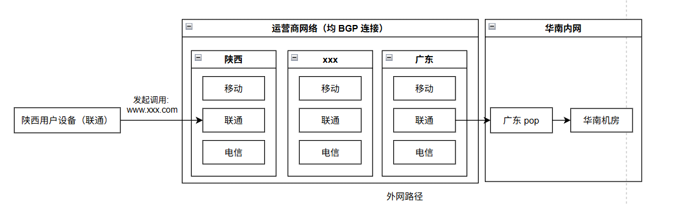
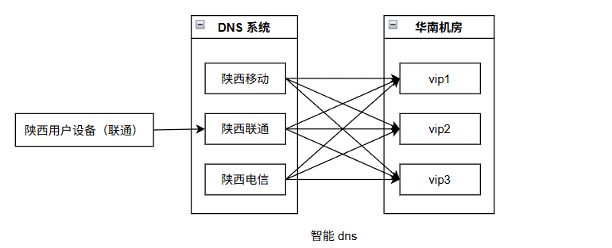
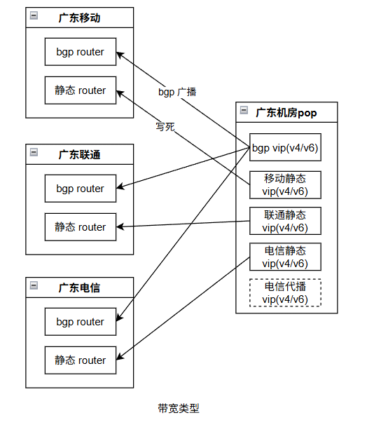
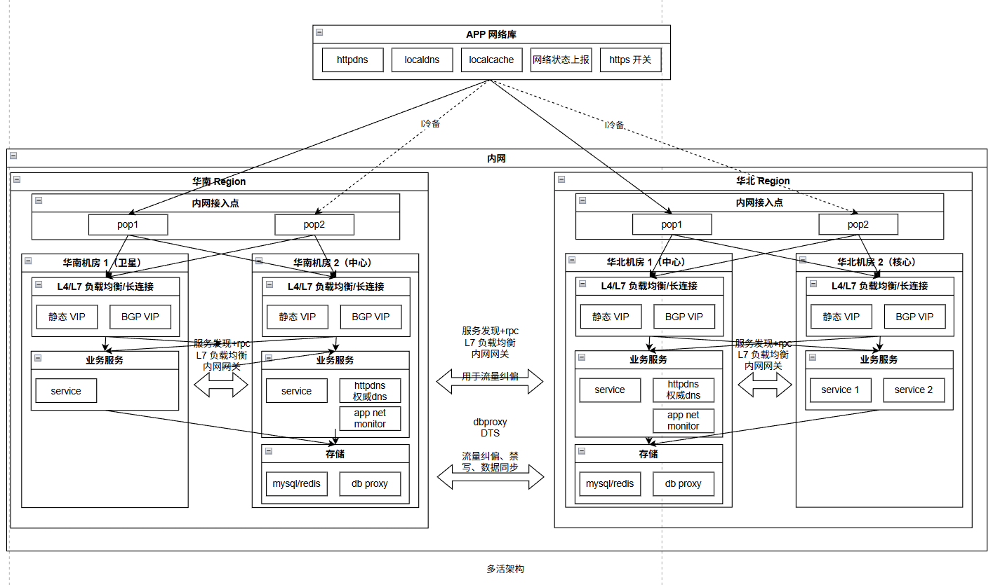
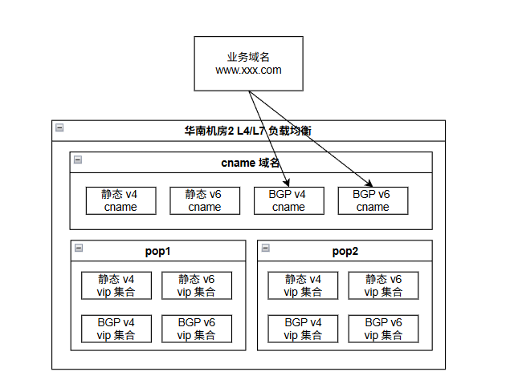

| 作者 | 版本号 | 时间 | 内容 |
| :--- | :--- | :--- | :--- |
| Coordinate35 | v1.0.0 | 2026-04-06 | 整体接入架构图|

# 背景

最近和同事聊到机房故障切流止损的事情，因此想借此机会总结一下之前相关的经验。

# 流量调度的目的

流量调度的主要目的无非两个：
1. 故障止损。距离：单机房故障，将流量调度到另一个工作状态正常的机房进行业务止损。
2. 机房负载均衡。举例：中心自建机房承担低谷流量，云上卫星机房承担潮汐流量，高峰期的时候将一部分流量调度到卫星机房，低峰期的时候在调度回来。

其中，故障止损场景的时效性要求比较高、场景比较复杂。因此，主要围绕着故障止损的视角进行展开。

# 流量接入架构

流量从端上发起到进入机房的路径如图：

对于域名解析的部分，一般会使用 smartdns, 可以精确到省份+营运商进行 dns 配置。

具体到机房与运营商网络的通信，会有不同的带宽类型：

从应用层面看，整体多活架构如下：

说明：
1. 为什么是冷备：因为运营商通常是按带宽峰值的 95 分位收费，同时运营商的带宽收费通常都很贵。如果是热备的话，成本会翻倍。当然，这个冷备是业务维度的，常态下的考量点：
   1. 一般和运营商的合同有最低消费，即使不用也要用这么多钱。
   2. 需要有一定流量来确认冷备链路是可用的
   3. 通常为了简化运维复杂度，机房和 pop 点的配置会保持一个对应关系，不同的业务部署在不同的机房，常态下就从不同的 pop 进来。
   4. 不同机房的服务部署是不一样的：核心业务、核心服务通常是双活的; 非核心的部分主力机房不同，这样常态下他们的入口 pop 也不一样。
2. 端上的 httpdns 会访问部署在机房的 httpdns 服务（如有）。网络状态上报模块会访问机房内的 app net monitor 服务（如有）。

关于域名解析的管理架构如下：

说明：
1. 域名解析通常分为两级架构：业务域名先 cname 解析到特定 L4/L7 负载均衡的集群的域名上，然后在解析到具体的该集群的 vip 上。通常，负责网络运维的同学都会把网段划分好：区分机房、带宽类型、运营商。
2. 中间的过渡态可能会针对 v4 单开一个 cname 域名（实际是建设 v6 为了方便单开一个 v6 的域名，其实可以没有 v4 的域名）

# 可能的故障点以及切流方案

# 运维过程中比较容易遇到的坑

1. 网络状态上报依赖网络
2. httpdns 依赖网络
3 ...
