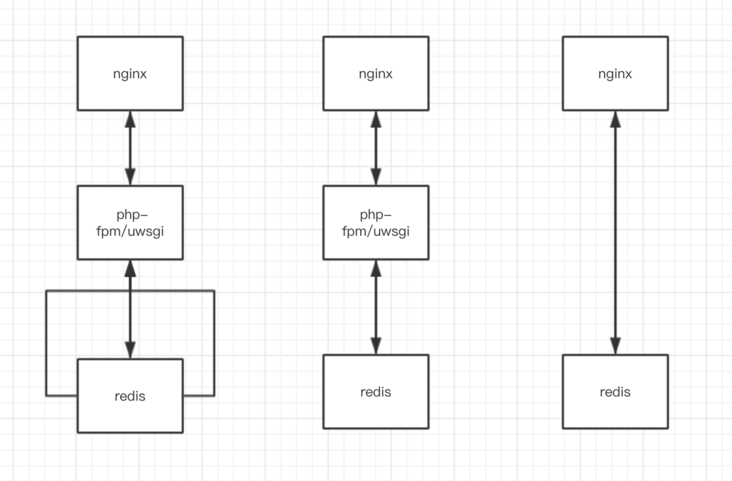
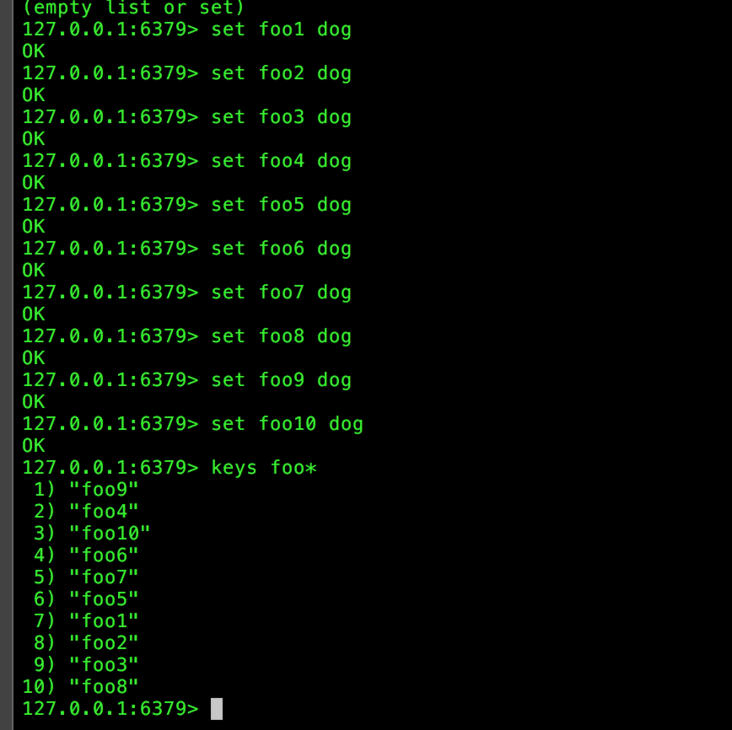
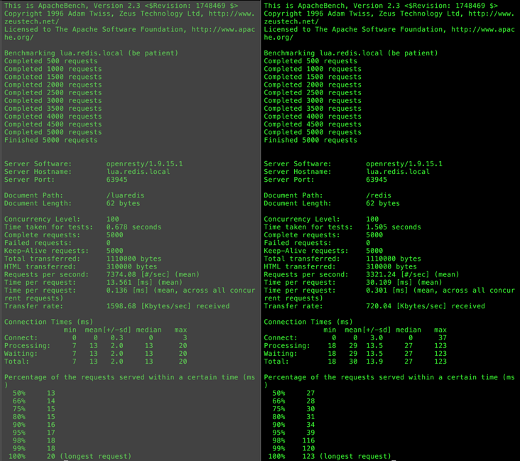
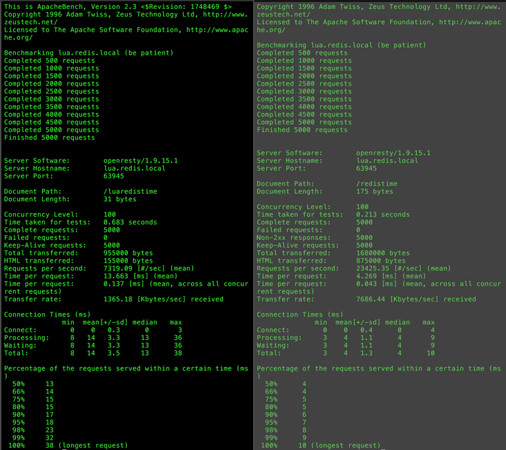

|作者|版本号|时间|
|:-|:-|:-|
|Coordinate35| v1.0.0| 2016-11-27|

# Redis 嵌入式开发

## 目前

目前来说，我们使用Redis的场景大多是仅仅将Redis作为缓存系统来使用。其实，Redis发展到现在，由于Redis的基于内存速度快，同时支持数据持久化等优良特点，业界很多地方，都是直接将Redis做为数据库使用。甚至，对于一些简单的应用，我们可以直接把逻辑写进Redis里面，从而达到更高的效率。

## 为什么是lua

1. lua本身非常小巧，他的解释器体积也非常小
2. 语言运行的效率相对较高，速度也比较快
3. 有一些比较好的语言特性

这里不是重点，不再赘述

## 为什么要在Redis里面进行嵌入式开发

Redis运行的原理是基于C/S模型的，也就是说每次拉取数据就是一次的网络请求。如果在一个接口里面，我们有几个数据需要从Redis里面获取，可能就需要发好几次网络请求，这样的网络开销是相对比较大的。如最左边的图



如果我们把，所有取数据的逻辑，全部放在Redis里面，在Redis里面就打包好，一次性的返回回来，我们就可以只需要一次网络请求，就可以把我们需要的数据都拿回来（如中间的这幅图）。这样，我们的网络消耗就能大幅度的减小。甚至，在一些场合，我们直接就可以用Nginx直接找Redis要数据，不需要经过php-fpm/Uwsgi这个环节，就可以把需要的缓存数据全部返回（如右边的图）。这就是通过在Redis进行嵌入式开发来提高网络效率的原理。

## 内部优化

最主要的Redis提供了EVAL方法来进行，其用法是

> eval ‘要执行的lua脚本代码’  要调用的存在redis里面的数据的个数 他们的key 然后是要穿入的参数

例子：

>eval "return {KEYS[1],KEYS[2],ARGV[1],ARGV[2]}" 2 key1 key2 first second

传入的key是保存在全局变量KEYS这个table里面，传入的参数是保存在全局变量ARGV这个table里面。全局变量是不可更改的。(table是lua中的一种数据类型）

为什么要单独设计要穿入key呢？他的用途有很多。最主要的，是因为Redis是为分布式设计的数据库，提前传入key，就可以分析出存的数据是在哪个server上。


每次都要通过网络传输一次lua脚本，显然这个网络开销是比较大的。那么Redis是怎么解决这个问题的呢？Redis提供了一个叫EVALSHA的方法。只要Redis启动着，每执行一个lua脚本，无论如何，Redis都会将这个脚本缓存下来，通过将脚本进行sha操作来标记。由于其实脚本的变动其实非常的少，而且保存脚本本身并不需要什么空间，这部分的资源消耗基本上可以忽略不计。以后只需要只用EVALSHA方法，带上你的脚本的sha值，Redis就能找到要执行的脚本进行执行。由于sha的值事实上是远远短于你的代码的值，所以这样也能大大提高网络的利用效率。

事实上，EVAL方法中本身就实现了这个策略。他会事先将你的脚本的 sha值传过去，如果server端有这个脚本，他就直接执行，如果发现没有这个脚本，Redis就会重新发送一次这个脚本的完整版，传到server端执行，然后这个脚本就会被缓存下来。


## 什么时候不应该把脚本嵌入到Redis里面

目前Redis的实现，是堵塞的。也就是说，一个Redis server，在同一时候，只能执行一个脚本。试想，如果你写了一个逻辑非常复杂的脚本，这个脚本的执行时间非常长。这样，这个时候如果有别的请求进来，就只能排队，等待这个脚本结束了才能处理下一个请求。在这个时候，就连仅仅是获取数据的命令都会被堵住。这样，这个服务器端的效率就会被大大的拖慢。因此，如果你的脚本执行非常耗时，那么这个时候你是不应该把它放在Redis里面执行的。目前，我想到的，只有数据打包的工作适合放在redis里面执行。


## 接下来我们来做两个实验

接下来的实验环境是：OpenResty来做容器。Nginx配置文件如下

```conf
server {
    listen 63945;
    server_name lua.redis.local;
    set $root_folder /Users/Coordinate35/OI/program/lua/lua-redis;

    lua_code_cache on;

    location /luaredis {
        default_type application/json;
        content_by_lua_file $root_folder/redis_with_lua.lua;
    }

    location /redis {
        default_type application/json;
        content_by_lua_file $root_folder/redis_without_lua.lua;
    }

    location /luaredistime {
        default_type application/json;
        content_by_lua_file $root_folder/redis_with_lua_time.lua;
    }

    location /redistime {
        default_type application/json;
        content_by_lua_file $root_folder/redis_without_lua_time.lua;
    }

    error_log /var/log/nginx/redis-test/error.log debug;
}
```

## 仅仅是数据拼装的情况

我首先在Redis里面存入了10个数据，如图：



然后这个是把数据打包处理放在了Redis里面的代码（redis_with_lua.lua）：

```lua
local json = require "cjson"
local redis = require "resty.redis"

local red = redis:new()
local ok, err = red:connect('127.0.0.1', 6379)

local lua_in_redis = [[
    local response = {}
    local i = 1
    while i <= 10 do
        response[i] = redis.pcall('get', KEYS[i])
        i = i + 1 
    end
    return response
]]

local response = red:eval(lua_in_redis, 10, 'foo1', 'foo2', 'foo3', 'foo4', 'foo5', 'foo6', 'foo7', 'foo8', 'foo9', 'foo10')

ngx.say(response)
```

这个是把数据打包处理放在Nginx里面的代码（redis_without_lua.lua):

```lua
local json = require "cjson"
local redis = require "resty.redis"

local red = redis:new()
local ok, err = red:connect('127.0.0.1', 6379)

local basic = 'foo'
local response = {}
local i = 1

while i <= 10 do 
    local key = basic .. i
    response[i] = red:get(key)
    i = i + 1
end

ngx.say(response)
```

接下来，我们用ab对接口进行压力测试。每次测试前都会重启一次nginx，来避免一些影响。

左图是命令：

> ab -n 5000 -c 100 -k http://lua.redis.local:63945/luaredis  (逻辑在redis)

右图是命令：

>ab -n 5000 -c 100 -k http://lua.redis.local:63945/redis (逻辑在nginx)



显然，这个时候，把逻辑放在Redis里面效率要远远的比放在Nginx里面高

## 当逻辑很复杂的时候

我们使用将i从1自加到10000000来模拟一个耗时的逻辑。

这个是把数据打包处理放在了Redis里面的代码（redis_with_lua_time.lua）：

```lua
local json = require "cjson"
local redis = require "resty.redis"

local red = redis:new()
local ok, err = red:connect('127.0.0.1', 6379)

local lua_in_redis = [[
    local response = {}
    local i = 1
    while i <= 10000000 do
        i = i + 1 
    end
    return response
]]

local response = red:eval(lua_in_redis, 10, 'foo1', 'foo2', 'foo3', 'foo4', 'foo5', 'foo6', 'foo7', 'foo8', 'foo9', 'foo10')

ngx.say(response)
```

这个是把逻辑放在了Nginx里面的代码(redis_without_lua_time.lua):

```lua
local json = require "cjson"
local redis = require "resty.redis"

local red = redis:new()
local ok, err = red:connect('127.0.0.1', 6379)

local basic = 'foo'
local response = {}
local i = 1

while i <= 10000000 do 
    i = i + 1
end

ngx.say(response)
```

同样用ab进行压力测试：

每次测试前都会重启一次Nginx，来避免一些影响。

左图是命令：

>  ab -n 5000 -c 100 -k http://lua.redis.local:63945/luaredistime (逻辑在Redis)

>  右图是命令：ab -n 5000 -c 100 -k http://lua.redis.local:63945/redistime (逻辑在Nginx)

结果：



显然，这个时候，把逻辑放在了Nginx里面，效率要远远高于放在Redis里面

## 结论

合理的把逻辑放在Redis里面，能够大大的提高我们服务器的运行效率。我们应该把数据打包的工作（减少网络请求）放在Redis里面，而把复杂耗时的操作放在外部，通过异步等别的方式，来提高服务器的处理能力。


  [1]: /img/bVF7g9
  [2]: /img/bVF7hb
  [3]: /img/bVF7hd
  [4]: /img/bVF7hm