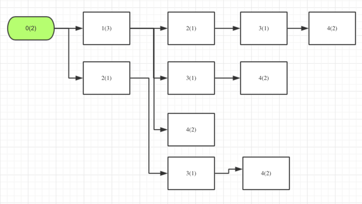
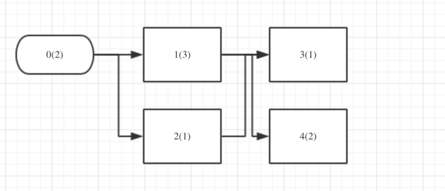

|作者|版本|时间|
|:--|:--|:--|
|Coordinate35|v1.0.0|2016-07-20|

# 递推，搜索，贪心，与动态规划

## 问题

1. 斐波拉契数列
2. （leetcode problem 45）给定一个长度为n非负整数的数列A，你的初始位置是在数列的第一个元素。数列中的第i个元素A[i]表示你可以从第i个位置开始最多往后跳A[i]格。你的目标是跳到最后一个元素。请你计算出从初始位置到达末位的最少步数。例如：给定数列A=[2, 3, 1, 1, 4],从初始位置跳到最后一个位置的最少步数是2（先跳1步到3，然后直接跳到4）。数据保证你总是能跳到最后1格。

## 基本的概念

### 状态

当前存储（存在）的所有数据构成了当前的状态。（所有变量的值）。同一个问题对状态的定义可以是不同的。

以第二个题目为例我们来定义这个问题：

> 给定一个长度为n的数列A
>
> A[i]表示最多能从位置i往后跳A[i]步
>
> 设F[k]为从初始状态移动到第k项的最少步数（1<=k<=n）
>
> 求F[N]的值

在这个问题中F[K]就叫做状态。定义中“从初始状态移动到第k项的最少步数”就是对状态的定义。

下面我们来尝试着重新定义一下这个问题：

> 给定一个长度为n的数列A
>
> A[i]表示最多能从位置i往后跳A[i]步
>
> 设F[i,k]为：
>
> 用k步从初始位置跳到位置i的可能性，如果可能则F[i,k]为1，如果不可能则F[i,k]为0
>
> 求最小的x，使得F[n,x]为1

在这个定义中F[i,k]为状态。显然，这两种对问题的定义是等价的，但是状态状态显然不一致

### 阶段

事物发展过程中根据一定的标准划分的段落。

### 状态与阶段的关系

一个阶段之内可能存在0个，1个或多个状态。同一个状态可能同时存在几个阶段中

以最简单的菲波拉契数列的求解问题举例，1，1，2，3，5...这些数就是这个问题中状态。如果以计算的次数来划分阶段的话，每个阶段里面就只有一个状态，因为没一步的计算会产生一个新的数字.

对于第二个题目，如果按照跳了n步之后停在的位置称为一个状态，同时按跳了n次就是第n个阶段这样来划分的话，第二阶段的状态数就是3

### 状态转移

从一个状态切换到另外一个状态

### 状态转移方程

定义好状态后，状态与状态之间的关系式。如果按照第二个问题的第一个定义，则状态转移方程为(从0开始数起):

> F[0] = 0
>
> F[k] = max(F[i] + 1|A[i] >= k - i, 0 <= i < k)(k > 0)

###  无后效性

某阶段的状态一旦确定，则此后过程的演变不再受此前各种状态及决策的影响，简单的说，就是“未来与过去无关”，当前的状态是此前历史的一个完整总结，此前的历史只能通过当前的状态去影响过程未来的演变.

### 剪枝

就是计算一个状态的时候，不去计算一些不需要计算的（用不上的）或者说重复计算的状态，以节省时间上和空间上的开销。

### 计算机的工作

计算机的的工作本质上是一个状态机，当你在尝试使用计算机来解决问题的时候，就是在思考怎么把一个问题表达成各个状态，思考如何在各个状态之间转移（变量的值的改变），从而到达最终的状态。当然，同一个问题对状态的定义是多种多样的。 时间复杂度就是你解决问题要进行多少次状态转移（中间的的判断应该转移到哪一个状态可以看成划分的更小的状态的转移）。空间复杂度就是需要存储的状态有多少个。(参考问题1)

## 解决问题

### 递推

对于菲波拉契的问题，当前阶段的状态只和前两个阶段的状态有关。同时每个阶段又只有一个状态，以至于我们并不需要选择哪些已经计算出来的旧的状态就可以算出当前的状态。a[i] = a[i - 1] + a[i - 2].这样的做法就是递推

### 暴力搜索

下面我们来考虑第二个跳跃的问题。对于这个问题，一个阶段的状态有好几个，一个阶段中的一个状态可以用于导出后面阶段的好几个状态，亦或当前阶段的一个状态由好几个旧阶段的好几个旧状态决定。这样，我们要算出最终阶段的最终状态旧需要计算之前的阶段。

一种最暴力的办法就是，把所有阶段的所有状态都算出来，通过所有的这些旧状态去得到最终的状态。通俗的说法就是把所有的可能都试一遍，找出最合适的。

在这道题里面，暴力搜索的做法就是，把所有可能出现的跳法都试一次，保存成功的跳跃数最少的。例子：

A=[2, 3, 1, 1, 4]

0->1->2->3->4 (4) √

0->1->3->4 (3) √

0->1->4 (2) √

0->2->3->4(3) √

结果是2

### 贪心

你可能会说上面这种做法真的是太暴力了.....一点都不优雅....有没有什么更好的解决的方案呢？好消息是，有时候并不需要真的计算所有状态。思考同样是走2步，有哪些走法可以让我们走的最远？有时候一个阶段的最优决定了下一个阶段的最优。

回到第二题，如果我们仍以走的步数划分阶段，停在哪里作为一个状态，那么情况是这个样子的:

数据 A =[2,3,1,1,2,4]

可见，我们用第1阶段的最优（可以跳到位置4，对于第一阶段来说是跳的最远），而不需要保存第1阶段由状态2产生的到达阶段2的状态。以达到了我们剪枝的目的

### 动态规划

显然，贪心的做法相比暴力搜索能大大的节省我们的时间开销。但是有的时候，一个阶段的最优是没办法通过前一个阶段的最优的到的。比如我们按照上述对状态这一概念阐述的第一种定义这个视角来看，阶段每一个阶段只有一个状态啊，要用这个状态去跳到下一个阶段那个状态，臣妾做不到啊！这个时候怎么办？这个时候就需要用到之前所有阶段的所有状态。喂，等等，这个怎么听起来这么像暴力搜索啊？仔细看一下暴力搜索的做法，就会发现，暴力搜索其实是做了很多重复的计算。试比较暴力搜索的第一种走法和最后一种走法就会发现即使之前已经走到过了位置2，后面的路还是要在计算一次，这就是重复的计算。同时也会发现，即使后面的走法都一样，前面的走法不一样也会导致最终结果也不一样。这就是有后效性，未来和过去有关，在这里体现出来就是状态是一个多值函数。那么，有没有办法消除这种后效性呢？现在我们尝试以上述第一种定义的视角去看待这个问题。这个时候，每个状态的值都是确定的，当上一个状态的值一经确定之后，就不会再改变了，也就是说，妈妈再也不用担心过去的具体走法会影响我当前（以后）状态的值了。由于这个时候已经没有了后效性，之后的相同的东西我就不需要再重新计算一遍了。在这种情况下,对 F[k]来说，F[1],....F[k - 1]都是他的子问题。像这种一个阶段的最优状态可以直接从之前的某个（某些）状态直接的到的性质是最优子结构。所以实际上，动态规划就是找到一个看待这个问题的视角（对状态的定义和对阶段的划分），使得这个问题从无序到有序（从有后效性，无最优子结构到无后效性，有最优子结构）的过程。这个就是动态规划的核心思想。附加的效果就在于在这个状态的定义过程中，你需要的存储的东西产生了记忆化的效果，省去了重复的计算，实现了剪枝的目的。

搜索： 

动规:

需要注意的是不要忽略状态选取（决策）是所进行的计算。

## 结论

1. 递推，搜索，贪心和动态规划的思想都是通过拆分问题，定义状态和状态之间的关系，从而最初阶段的状态到达最终状态的方式解决问题。
2. 每个阶段只有一个状态－>递推
3. 每个阶段的所有状态都计算出来，从中选取最优的－>搜索
4. 每个阶段的最优状态都是由上一个阶段的最优状态得到的－>贪心
5. 每个阶段的最优状态可以从之前的某个阶段的某个（或某些）状态直接得到－>动态规划
6. 一个问题会有多种状态的定义和阶段的划分，某一种定义有后效性不代表该问题不适合用哪种方法。
7. 贪心，动归这类的问题本质都是对搜索的剪枝 
8. 适用于哪种方法来解决，在于你怎么看待这个世界～